# TEDxAlkawmia — User Flows

> **Version:** 3.3
> **Date:** 2026-07-23
> **Status:** Authoritative for user-facing flows
> **Reads from:** [01 — PRD](./01-PRD.md) · [02 — SRS](./02-SRS.md) · [05 — User Stories](./05-UserStories.md) · [06 — Acceptance Criteria](./06-AcceptanceCriteria.md) · [07 — API Contract](./07-ApiContract.md) · [08 — Decision Log](./08-DecisionLog.md) · [10 — Data Model](./10-DataModel.md)
>
> **v3.1 (2026-07-20):** Aligned with grilling decisions (Q1–Q28) and the consistency audit. Changes: attendance denominator = occurred-and-recorded sessions only (D:Q12); check-in has five named outcomes incl. `TICKET_VOIDED` (D:Q9); paid-order void releases only not-yet-checked-in seats (D:Q6); one active pending order per user per event (D:Q5); enrollment targets an existing account only (D:Q15); QR delivered as a server-rendered image, raw payload never in JSON (D:Q8, audit Issue 3); voided-paid orders identified by a refund entry (audit Issue 7).
>
> **v3.2 (2026-07-21):** **Model-B ticketing** (Decision Log Q1 addendum). An order is for **individual tickets (at the event face price) or an *optional* package** — packages are no longer the only purchasable unit. Publishing an event **no longer requires a package** (§6.1); an event with zero packages still sells individual tickets. Booking flow (§3.1–3.2) reworded for the individual-or-package choice.
>
> **v3.3 (2026-07-23):** Event lifecycle (§6.3) extended per **D:Q56** — `Archived → Cancelled` is now a legal transition (same cancel ripple), so a hidden event holding sold tickets need not be re-published just to cancel it; `Draft → Cancelled` stays blocked (a Draft is disposed of by soft-delete).

---

## How to read this document

Each flow is described **twice**: once in plain steps (the *normal flow* plus *alternate flows* for the things that can go wrong), and once as a **Mermaid diagram** you can render visually. Green nodes are success states, red are errors, amber are informational dead-ends, blue are entry points.

Every flow cites the requirement it enforces (e.g. *FR-ORD-03*), defined in the [SRS §3](./02-SRS.md), and decisions as *(D:Qn)* from the [Decision Log](./08-DecisionLog.md). Terms like **Order**, **Ticket**, **hold**, and **Attendee** carry the exact meaning from the PRD and glossary. Order/ticket enum values (`PendingPayment`, `Paid`, `Cancelled`, `Expired`; `Issued`, `CheckedIn`, `Voided`) are those fixed in the decisions and the [API Contract](./07-ApiContract.md); the **[Data Model (10)](./10-DataModel.md)** is the authoritative schema.

---

## Table of Contents

1. [Authentication](#1-authentication)
2. [Discover & view events](#2-discover--view-events)
3. [The booking flow — quote, reserve, pay, tickets](#3-the-booking-flow) ⭐ *the heart of the platform*
4. [Manage my tickets & orders](#4-manage-my-tickets--orders)
5. [Check-in at the door (Admin)](#5-check-in-at-the-door-admin)
6. [Admin — events, packages, promo codes](#6-admin--events-packages-promo-codes)
7. [Admin — users & roles (the dual-role assignment)](#7-admin--users--roles)
8. [Member — training dashboard](#8-member--training-dashboard)
9. [Board — attendance & evaluation](#9-board--attendance--evaluation)
10. [Profile & account](#10-profile--account)
11. [Notifications inbox](#11-notifications-inbox)
12. [Contact form](#12-contact-form)

> **Phase note.** Flows 1–7 are the paid-events core. Flows 8–9 are the training side. Flows 10–12 are cross-cutting account/communication utilities. Which flow lands in which release is decided in the phasing document (written last) — this document describes *behaviour*, not *timeline*.

---

## 1. Authentication

### 1.1 Register an account

**Normal flow**
1. A **Visitor** (unauthenticated) opens the platform and clicks **Register**.
2. Enters first name, last name, email, password, confirm password.
3. System validates: email format, email uniqueness, password strength (≥ 8 chars, at least one upper, one lower, one digit — server-side), passwords match. *(FR-AUTH-02, FR-AUTH-03)*
4. System creates the account with the **Attendee** global role and **no track assignments**. *(FR-AUTH-01)*
5. System redirects to login.

**Alternate flows**
- **A1 — Email exists:** "An account with this email already exists." → stay on form. *(FR-AUTH-02)*
- **A2 — Weak password:** show the exact unmet requirement. *(FR-AUTH-03)*
- **A3 — Mismatch:** "Passwords do not match."

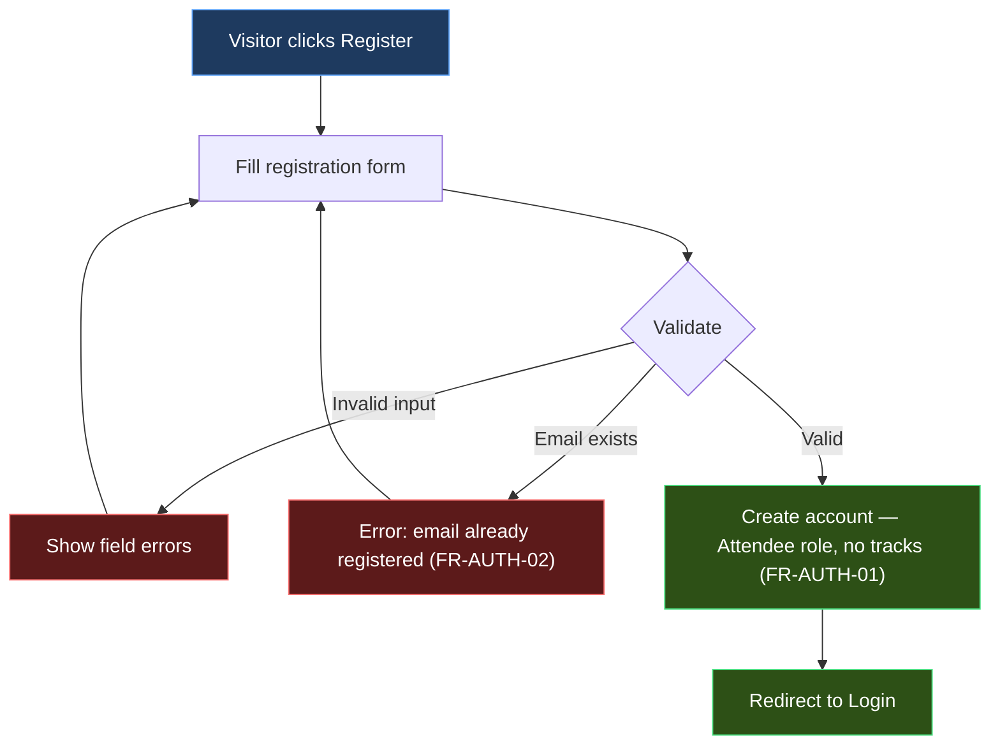

### 1.2 Login, token refresh & logout

**Normal flow**
1. User submits email + password.
2. System verifies credentials and that the account is **active**. *(FR-AUTH-05)*
3. System issues a short-lived **access token (JWT)** and a **refresh token**. The access token carries only account id, email, and **global role** — per-track authority is resolved per request. *(FR-AUTH-04, FR-AUTH-06)*
4. Client stores tokens and calls the API with the access token.
5. When the access token expires, the client exchanges the refresh token for a new pair. Refresh tokens are **single-use and rotated**: the exchange revokes the old token and issues a new one. *(FR-AUTH-08)*
6. On **logout**, the presented refresh token is revoked server-side. *(FR-AUTH-07)*

**Alternate flows**
- **A1 — Bad credentials:** generic "Invalid email or password" for both wrong email and wrong password (no user enumeration). *(FR-AUTH-05)*
- **A2 — Deactivated account:** "This account has been deactivated. Contact an organizer." *(FR-AUTH-05)*
- **A3 — Reused/expired refresh token:** reuse of a revoked token is rejected → force re-login. *(FR-AUTH-08)*

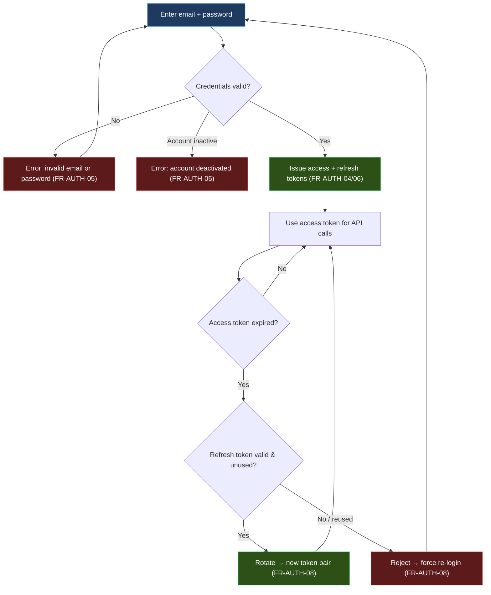

### 1.3 Forgot & reset password

**Normal flow**
1. User clicks **Forgot password**, enters email.
2. System *always* responds identically — "If that email exists, we sent a reset link" — whether or not the account exists (no enumeration); if the account exists, it emails a single-use, time-limited reset token. *(FR-AUTH-10)*
3. User opens the link, enters a new password twice.
4. System validates the token (unexpired, unused) and password strength, then updates the password. *(FR-AUTH-11)*

**Alternate flows**
- **A1 — Expired/used token:** "This reset link is invalid or has expired. Request a new one." *(FR-AUTH-11)*

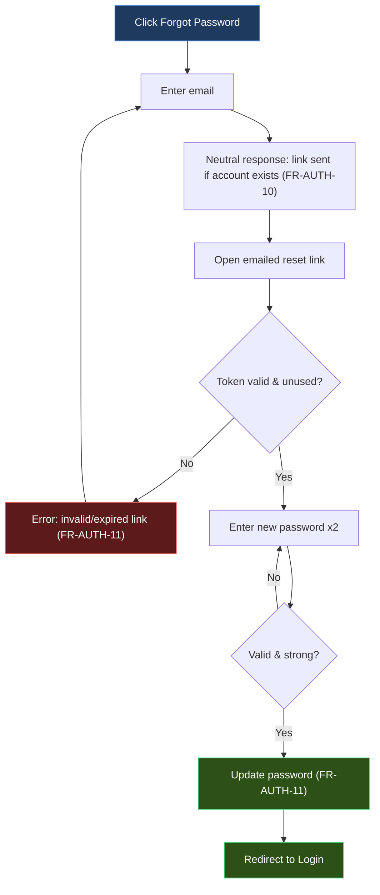

---

## 2. Discover & view events

**Normal flow**
1. Anyone (Visitor or Attendee) opens the **Events** page.
2. System shows a paginated list of **Published** events, filterable by upcoming/past. Draft, Archived, and Cancelled events are never public. *(FR-EVT-04, FR-EVT-05)*
3. Each card shows title, date, location, image, and a live capacity signal (**remaining seats** = `Capacity − seats held by active orders`, computed, never a stored counter). *(FR-EVT-07)*
4. User opens an event to see full details, its **individual-ticket price**, and any **optional ticket packages** with prices. *(FR-EVT-06, FR-PKG-04)*
5. If authenticated → **Choose tickets** is enabled. If a Visitor → **Login to book**.

**Alternate flows**
- **A1 — No events:** friendly empty state.
- **A2 — Sold out (remaining = 0):** show **Sold Out**, disable booking. *(waitlist is out of scope for now)*

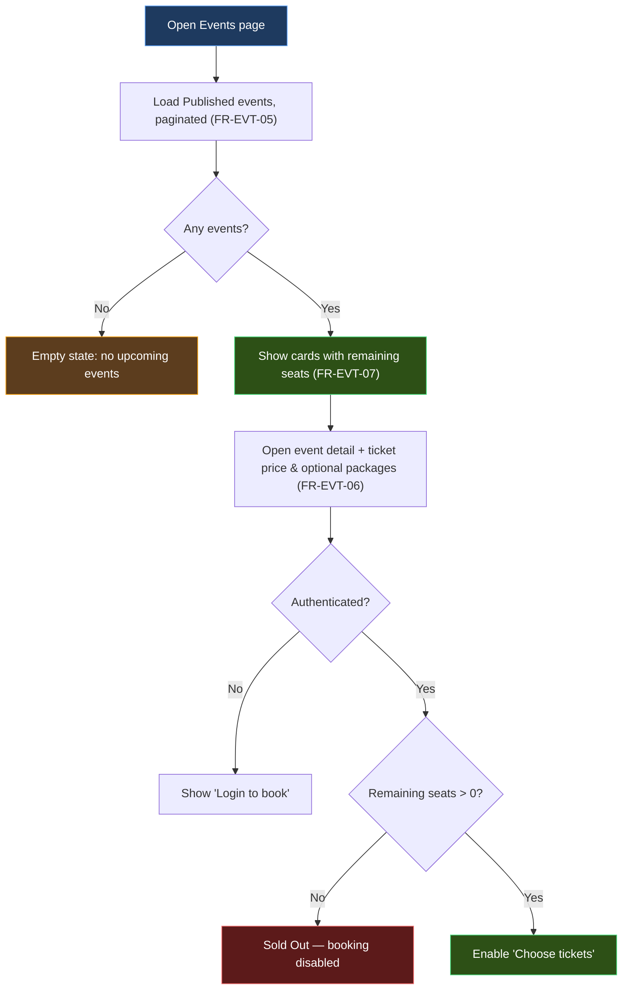

---

## 3. The booking flow

> ⭐ This is the core of the platform and where the most rules apply. It has four stages: **quote → reserve (hold) → pay (Paymob) → tickets issued**. Payment is **online only**; a **free** order (final price 0) skips the gateway.

### 3.1 Choose tickets & see the price (quote)

**Normal flow**
1. Attendee picks **individual tickets** (the default) **or an optional package**, and a quantity (≥ 1, ≤ per-order cap if set — `event.MaxIndividualQtyPerOrder` for individual tickets, `package.MaxQuantityPerOrder` for a package). *(D:Q2, D:Q1 addendum)*
2. Optionally enters a **promo code**.
3. System returns a **quote**: base price = `event.ticketPrice × quantity` for individual tickets, or `package.price × quantity` for a package; discount from the code (if active, within its validity window, under global and per-user limits, and in scope for this event); **final price = max(0, base − discount)**. *(FR-ORD-01, FR-PROMO-03)*
4. No seats are held yet — a quote is read-only. *(FR-ORD-01)*

**Alternate flows**
- **A1 — Promo code rejected (distinct reasons):** *(FR-PROMO-03, D:Q50)*
  - `PROMO_INACTIVE` — code is disabled by the Admin.
  - `PROMO_NOT_YET_VALID` / `PROMO_EXPIRED` — outside the validity window.
  - `PROMO_CAP_REACHED` — global redemption limit hit.
  - `PROMO_USER_LIMIT` — this user has already used it the maximum number of times.
  - `PROMO_WRONG_EVENT` — code is scoped to a different event.
  In all cases: quote the undiscounted price.
- **A2 — Quantity exceeds per-order cap:** "You can buy at most N of this ticket/package per order." Quote is blocked until the quantity is lowered. *(D:Q2, D:Q1 addendum)*

### 3.2 Reserve → hold seats

**Normal flow**
1. Attendee confirms the quote and clicks **Reserve**.
2. System runs a **concurrency-safe capacity check**: seats needed = `quantity` for individual tickets, or `package.seats × quantity` for a package, ≤ remaining seats. Two simultaneous reservations must not oversell the last seats. *(FR-ORD-02, FR-ORD-03)*
3. System creates an **Order** in **PendingPayment**, holds the seats, **snapshots** the unit price, base price, discount, and final price (plus the package name for a package order, or the event title for an individual-ticket order), and starts the **15-minute checkout window**. **No tickets exist yet.** The promo discount amount is **snapshotted** on the order at reserve (D:Q4), but the **PromoRedemption slot is not claimed until payment initiation** (or confirm-free for free orders) — see §3.3. *(FR-ORD-04, FR-ORD-05, FR-TKT-02, D:Q19)*

**Alternate flows**
- **A1 — Not enough seats (incl. a race with another buyer):** "Not enough seats remaining." No order is created; nothing is held. *(FR-ORD-03)*
- **A2 — Event not Published:** reject. *(FR-EVT-04)*
- **A3 — Already has a pending order for this event:** a user may hold **at most one active (PendingPayment, unexpired) order per event**. A second reserve returns the existing pending order (with its `orderId`) so the user resumes or cancels it, rather than creating a duplicate hold. Paid orders don't block a new purchase. *(D:Q5)*
- **A4 — Price changed since the quote:** if the live package price or promo state differs from the advisory quote, the reserve responds with `PRICE_CHANGED` and the new quote for explicit re-confirmation — it never silently charges a different amount. *(D:Q4)*
- **A5 — Quantity exceeds per-order cap (re-checked at reserve):** even if the quote accepted the quantity, the cap is re-validated. If the Admin lowered the cap between quote and reserve, the reserve is rejected with the current limit. *(D:Q2)*

### 3.3 Pay (Paymob) — or skip it if free

**Normal flow (paid order)**
1. System initiates a **Paymob payment** for the final price and returns a checkout URL/session (card/wallet, EGP). *(FR-PAY-01)*
2. Attendee completes payment on Paymob.
3. Paymob calls the platform **webhook**. The system **verifies the HMAC signature** and that the **amount matches the order's final price** before trusting anything. *(FR-PAY-02, FR-PAY-04)*
4. On verified success → Order becomes **Paid**, a **Payment** record is stored, and the system issues **exactly one Ticket per held seat**, each with a unique QR token (a public reference + a 256-bit secret; the DB stores only the reference and a SHA-256 hash of the secret) and a short public reference. The QR itself is delivered as a **server-rendered image** (`GET /tickets/{id}/qr`, `image/png`) — the raw secret is encoded only inside the image bytes and never appears as a readable JSON field. *(FR-PAY-05, FR-TKT-01, FR-TKT-04, D:Q8, Issue 3)*
5. Attendee optionally names individual tickets; a blank name is still a valid credential. *(FR-TKT-03)*

**Free order path**
- If final price = 0 (free package or 100%-off promo), the system **bypasses Paymob** and confirms the order immediately: the **PromoRedemption slot is atomically claimed and confirmed** in a single step, and tickets are issued. *(FR-PAY-06, D:Q19)*

**Alternate flows**
- **A1 — Payment fails/abandoned:** order stays PendingPayment; seats stay held until the window expires.
- **A2 — Window expires before payment:** a background job flips the order to **Expired** and **releases the seats**. *(FR-ORD-05)*
- **A3 — Duplicate/late webhook:** idempotent — an already-Paid order acknowledges but issues no duplicate tickets. *(FR-PAY-03)*
- **A4 — Amount mismatch:** reject the callback, do not issue tickets, flag for review. *(FR-PAY-04)*

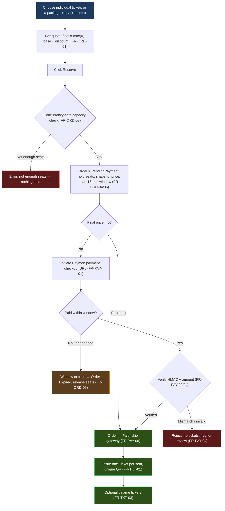

**Sequence view — the happy path**

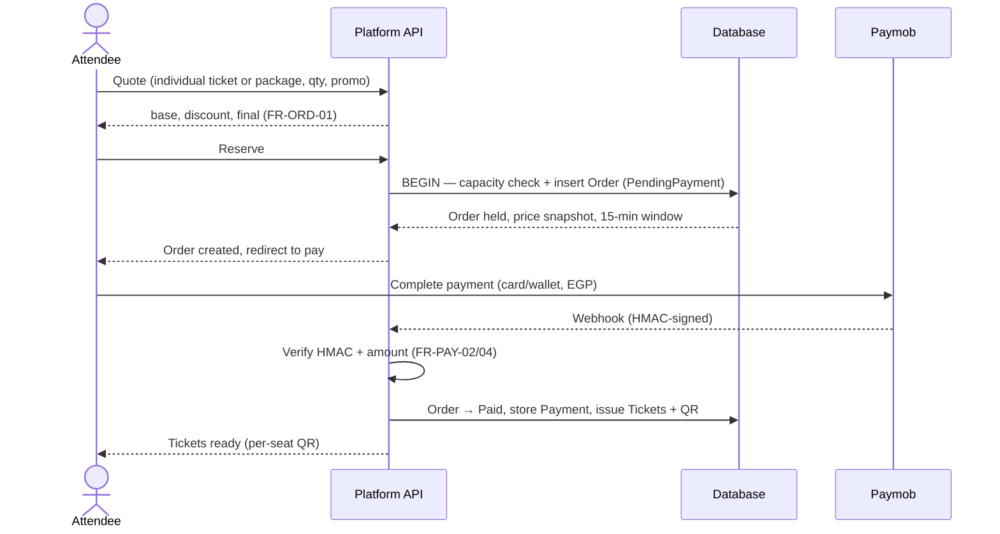

---

## 4. Manage my tickets & orders

**Normal flow**
1. Attendee opens **My Tickets / Orders**.
2. Sees their full order history grouped by status (Paid, PendingPayment, Cancelled, Expired) and, for paid orders, the per-seat QR tickets. *(FR-ORD-07)*
3. Can open any **Issued** ticket to show/download its QR at the door — the QR renders from the server-provided image (`GET /tickets/{id}/qr`), owner-only. *(FR-TKT-01, D:Q8)*
4. Can set/clear the optional guest name on a ticket. *(FR-TKT-03)*

### 4.1 Cancel an unpaid order

**Normal flow**
1. Attendee cancels a **PendingPayment** order they no longer want.
2. System sets the order to **Cancelled** and **releases the held seats immediately** (no waiting for the window to expire). *(FR-ORD-06)*

### 4.2 Cancel a paid order (Admin-assisted refund)

**Normal flow**
1. Attendee requests cancellation of a **Paid** order; an **Admin** performs it (paid-order voiding is Admin-only). *(FR-PAY-07, D:Q6)*
2. Admin voids the order → its **Issued** tickets become **Voided** (QRs no longer admit) and **only the not-yet-checked-in seats are released** back to availability. A ticket already **CheckedIn is non-voidable** and its seat stays consumed. *(FR-PAY-07, D:Q6)*
3. **Refund is manual/offline for now** — a refund entry is recorded (and is what distinguishes a refunded-paid order from a user-cancelled unpaid one; both end in `Cancelled`). No automated gateway refund is called. Orders are never deleted, only re-statused. *(FR-PAY-07, FR-ORD-08, D:Q7)*

**Alternate flows**
- **A1 — All tickets already checked in:** nothing to void or release; the void records the refund entry only. Partially-checked-in orders void the remaining Issued tickets and release just those seats. *(D:Q6)*

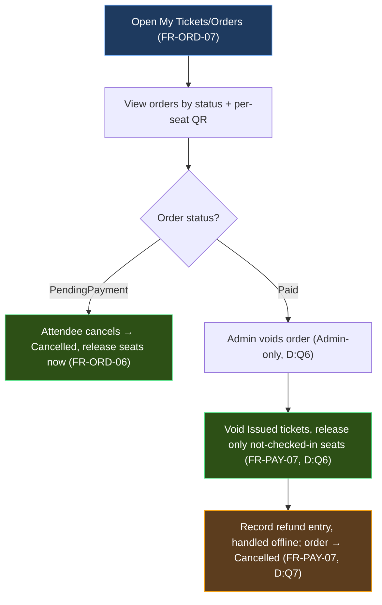

---

## 5. Check-in at the door (Admin)

**Normal flow**
1. **Admin** opens the scanner for a specific event.
2. Scans a ticket's QR.
3. The scanner decodes the QR payload (**public reference + secret**) and sends it to the event-scoped check-in endpoint. The system looks up the ticket by its indexed **public reference**, verifies the **secret against the stored SHA-256 hash**, and validates that it belongs to *this* event and is **Issued**. *(FR-TKT-04, FR-TKT-05, D:Q8, D:Q9)*
4. On success → ticket flips to **CheckedIn**, recording who scanned and when; screen shows a green check with the guest name (if any). *(FR-TKT-05, FR-TKT-06)*

**Alternate flows — the scan yields one of five distinct outcomes (D:Q9); every rejection is logged (FR-TKT-06):**
- **A1 — Already checked in:** `TICKET_ALREADY_CHECKED_IN` — red "Already checked in at HH:MM" (shows original scanner + time). A second scan is rejected and logged. *(FR-TKT-05, FR-TKT-06)*
- **A2 — Wrong event:** `WRONG_EVENT` — "This ticket is for a different event." (valid ticket, wrong door). Logged.
- **A3 — Voided:** `TICKET_VOIDED` — "Ticket is no longer valid" (a *known* ticket whose paid order was voided/refunded — distinct from a garbage token, so staff can tell a refund from a fake). Logged.
- **A4 — Unknown/tampered token:** `TICKET_INVALID` — "Invalid ticket" (no matching reference or the secret fails the hash comparison). Logged. *(FR-TKT-06)*

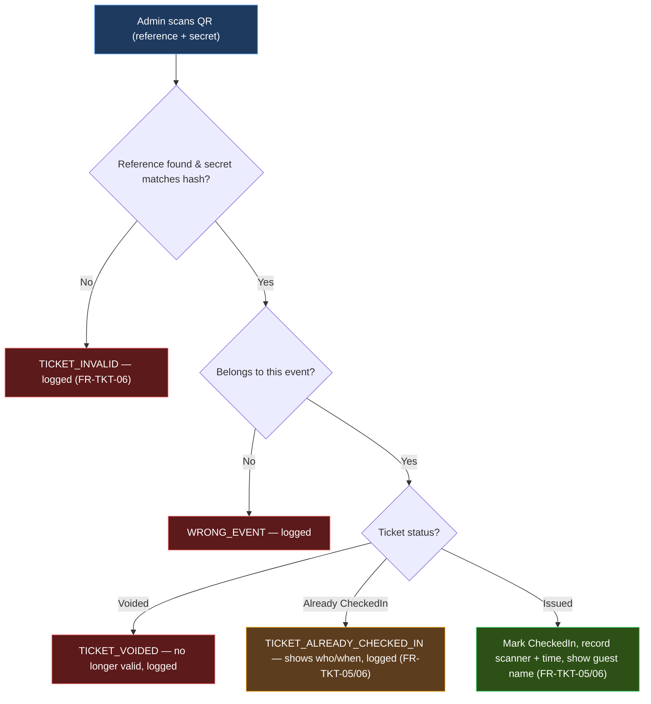

---

## 6. Admin — events, packages, promo codes

### 6.1 Create & publish an event

**Normal flow**
1. Admin creates an event (title, description, date/time in UTC, location, capacity > 0, **individual-ticket price ≥ 0 EGP**, optional image) in **Draft**. *(FR-EVT-01)*
2. Optionally adds one or more **ticket packages** (name, seats-per-package ≥ 1, price ≥ 0 EGP; a free package is allowed). Packages are **optional** — an event sells individual tickets without any. *(FR-PKG-01, FR-PKG-02)*
3. Optionally creates **promo codes** (percentage or fixed amount; optional validity window, global cap, per-user limit, event scope). Codes are unique among live codes. *(FR-PROMO-01, FR-PROMO-02, FR-PROMO-05)*
4. **Publishes** the event → it becomes public and bookable. Publishing has **no package precondition** — an event with zero packages is publishable and sells individual tickets. Concurrent edits are guarded by an optimistic-concurrency token. *(FR-EVT-04, FR-EVT-02)*

**Alternate flows**
- **A1 — Publish with a non-positive ticket price and no packages:** blocked — an event must offer at least one buyable unit, so `ticketPrice` must be ≥ 0 and, when 0 with no packages, the event still validly sells free individual tickets. (There is **no** "must add a package" block.)
- **A2 — Edit capacity:** capacity is **raisable anytime**; **lowerable only to ≥ (held + paid) seats** — otherwise blocked with the current held count. *(D:Q22)*

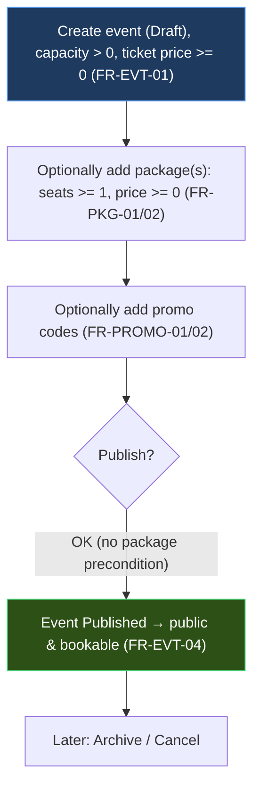

### 6.2 View orders & attendees for an event

**Normal flow**
1. Admin opens an event's **Orders** view.
2. Sees all orders and attendees with status, buyer, seats, amount paid, and promo used. *(FR-EVT-08)*
3. Opens **Check-in** to see checked-in vs. issued counts in real time.

### 6.3 Event lifecycle transitions (D:Q22, D:Q23, D:Q56)

> The event status follows a strict state machine. Transitions that would leave sold tickets or active holds in an inconsistent state are blocked.

**Legal transitions**

| From | To | Condition |
|------|----|-----------|
| Draft | Published | Always allowed (no package precondition — Model B) |
| Published | Draft | **Only if zero orders** (no Paid, no PendingPayment) — otherwise blocked: `EVENT_HAS_ORDERS` |
| Published | Archived | Always allowed — hides the event from public listings; orders/tickets unaffected |
| Published | Cancelled | Always allowed — triggers the **Cancel ripple** (below) |
| Archived | Published | Always allowed — re-lists the event |
| Archived | Cancelled | Always allowed — triggers the **Cancel ripple**; avoids re-exposing a hidden event just to cancel it *(D:Q56)* |
| Draft | Cancelled | **Blocked** — a Draft has no orders and is disposed of by **soft-delete**, not Cancel *(D:Q22, D:Q56)* |
| Cancelled | *(any)* | **Blocked — Cancelled is terminal.** *(D:Q23)* |

**Cancel ripple effects (Published → Cancelled *or* Archived → Cancelled)** *(D:Q22, D:Q56)*
1. All **Issued** tickets → **Voided** (QRs no longer admit).
2. All **PendingPayment** orders → **Cancelled**, held seats released.
3. For **Paid** orders: a **RefundEntry** is recorded per order (refund is offline/manual — FR-PAY-07). The order status becomes **Cancelled**.
4. The event is **hidden from public listings** but **retained** (never hard-deleted when orders exist).

**Soft-delete vs. Cancel** *(D:Q22)*
- An event with **zero orders** (always the case for a Draft) may be soft-deleted outright.
- An event with **any orders** (even Expired) must use **Cancel** instead — soft-delete is blocked.

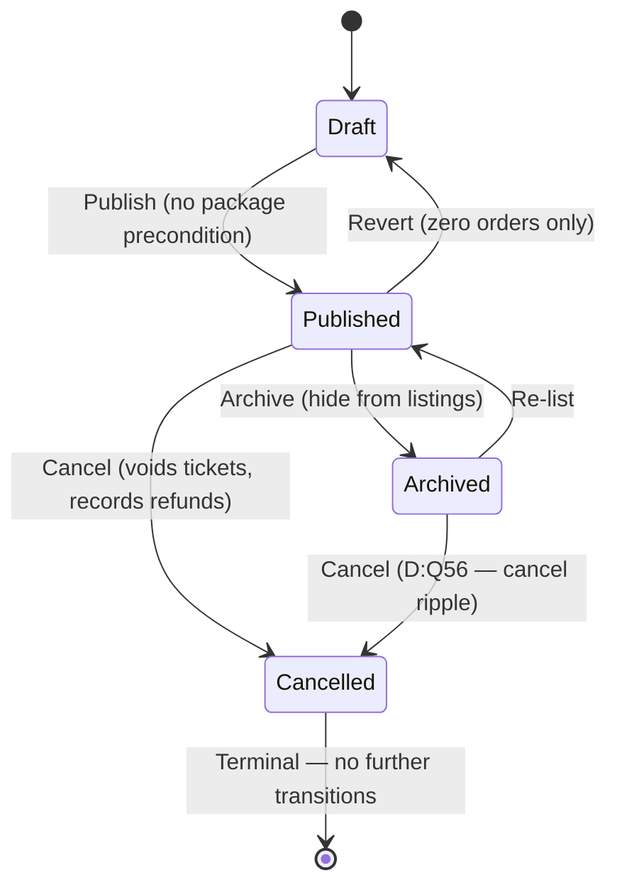

### 6.4 Admin: retire a track (D:Q14)

**Normal flow**
1. Admin selects a track and chooses **Delete / Retire**.
2. System displays a **confirmation prompt** stating the impact: *"This will end N active Member enrollment(s) and 1 Board assignment. All attendance and evaluation history will be retained."* *(D:Q14)*
3. Admin confirms.
4. System **soft-deletes** the track and **auto-ends** all active `TrackAssignment` rows (`EndedAtUtc` set):
   - All **Member enrollments** are ended → those users' Member slot is freed for reassignment.
   - The **Board assignment** is ended → that user's Board slot is freed.
   - All attendance and evaluation records are **retained** (keyed on the ended enrollment, still queryable). *(FR-ROLE-05)*

**Alternate flows**
- **A1 — Admin cancels the confirmation:** no change.

---

## 7. Admin — users & roles

> This flow implements the platform's signature rule: a person can be **Member of one track** and **Board of a *different* track** at the same time, but never both roles on the same track, and never two Member tracks or two Board tracks. *(FR-ROLE-03, FR-ROLE-04)*

**Normal flow — change a global role**
- Only an Admin can change a user's **global role** (Attendee ↔ Admin) and only an Admin can assign/remove the **Board** role on a track. *(FR-ROLE-01, FR-ROLE-02)*

**Normal flow — assign a track role**
1. Admin finds a user (search by name/email, filter by role).
2. Opens **Track assignments**.
3. Assigns **Member @ Track X** or **Board @ Track Y**.
4. System enforces the constraints before saving, and the database enforces them physically:
   - at most **one** active Member enrollment,
   - at most **one** active Board assignment,
   - the two must be **different tracks**. *(FR-ROLE-04)*
5. Ending an assignment later **retains** the historical attendance and evaluation records tied to it. *(FR-ROLE-05)*

> A **Board** may also enroll/remove **Members** in the single track they supervise, without Admin involvement. The enrollment target **must already be a registered Attendee account** (found by email/search) — enrollment never creates an account. It is rejected if the target is already an active Member of any track (`ALREADY_MEMBER_ELSEWHERE`) or would become Member **and** Board of the same track (`MEMBER_BOARD_SAME_TRACK`); it is allowed if they are Board of a *different* track (the sanctioned dual-role case). *(FR-ROLE-03, FR-ROLE-04, D:Q15)*

**Alternate flows**
- **A1 — Second Member track:** blocked — "This user is already a Member of another track." *(FR-ROLE-04)*
- **A2 — Board on their own Member track:** blocked — "A user cannot be Board of the track they train in." *(FR-ROLE-04)*
- **A3 — Deactivate a user (D:Q10):** Admin deactivates an account. The system applies five cascading effects:
  1. **Login/refresh blocked** — the user cannot authenticate or renew tokens. *(FR-AUTH-05)*
  2. **Issued tickets stay valid** — admission is by QR scan, not by login; a deactivated buyer's paid tickets still work at the door.
  3. **Any active PendingPayment order → Cancelled** and its held seats are **released immediately**.
  4. **Track assignments ended** — all active Member enrollments and Board assignments get `EndedAtUtc` set, **freeing the dual-role slots** for reassignment. Attendance and evaluation history is **retained**. Assignments are **not auto-restored on reactivation** — the Admin must re-assign explicitly. *(FR-ROLE-05)*
  5. **Board gap flagged** — if the deactivated user was Board of a track, the track is flagged as **needing a new supervisor** for the Admin.
- **A4 — Reactivate a user:** re-enables login; track roles must be **re-assigned manually** (they were ended, not paused). *(D:Q10)*

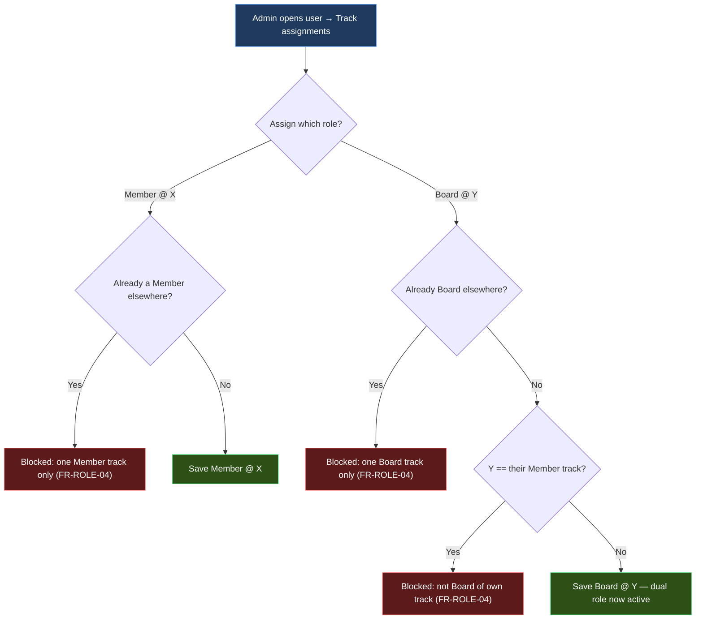

---

## 8. Member — training dashboard

**Normal flow**
1. A user who has a **Member** assignment opens their **Training** dashboard, scoped to their one track.
2. Sees the upcoming and past sessions of their track, their attendance percentage — `(Present + Late) ÷ counted sessions`, where **Late counts as attended** and **counted sessions = only those that have occurred AND have a recorded attendance entry for this enrollment** (future sessions and past sessions with no record for the member are excluded; an Absent must be explicitly recorded to count) — and their own evaluation history (scores + written feedback). The percentage is scoped to the member's **current active enrollment**. *(FR-TRK-03, FR-ATT-03, FR-EVL-03, D:Q11, D:Q12)*
3. Cannot see other members' evaluations. *(FR-EVL-03)*
4. Can still book event tickets exactly like any Attendee (§3) — training and ticketing are independent bounded contexts. *(cross-context rule, NFR-MNT-02)*

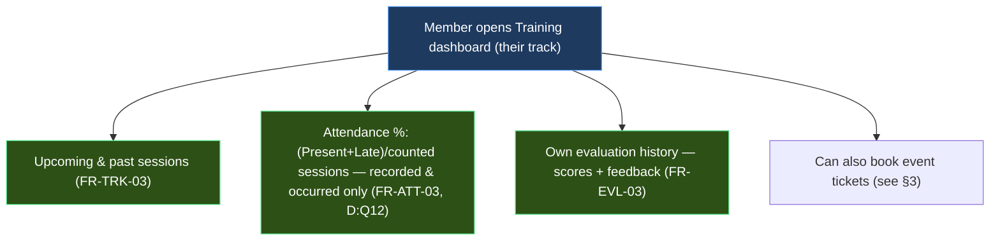

---

## 9. Board — attendance & evaluation

**Normal flow**
1. A user with a **Board** assignment opens the dashboard for **their one track only**. Access to any other track is refused server-side. *(FR-ROLE-03, FR-TRK-04)*
2. Creates/edits a **session** in that track (topic, date, time, location). *(FR-TRK-02)*
3. Records **attendance** per member as **Present / Late / Absent** — manual, no QR for training. At most one record per member per session; re-recording updates it. *(FR-ATT-01, FR-ATT-02)*
4. Writes an **evaluation** per member **for a session that has already occurred** (future sessions cannot be evaluated) and only for members with an **active enrollment** — score 0–100 + optional feedback. Attendance is **not** a prerequisite. At most one per member per session, editable in place. *(FR-EVL-01, FR-EVL-02, D:Q16)*
5. Sends an **in-app notification** to the members of their own track only. *(FR-NTF-02)*

**Alternate flows**
- **A1 — Access another track:** 403 — even if the same person trains as a Member there, Board actions are limited to the assigned track. *(this is the dual-role boundary from §7 — FR-ROLE-03)*
- **A2 — Duplicate attendance/evaluation:** the existing record is updated instead of a second being created. *(FR-ATT-02, FR-EVL-02)*
- **A3 — Delete a session with existing records:** blocked — `SESSION_HAS_RECORDS`. A session that has any attendance or evaluation records **cannot be hard-deleted**; it may be **soft-deleted/cancelled** instead. A session with zero records can be removed outright. *(D:Q13)*
- **A4 — Evaluate a future session:** blocked — `SESSION_NOT_OCCURRED`. The session’s `EndsAtUtc` must be in the past before evaluations are accepted. *(D:Q16)*
- **A5 — Evaluate a departed member:** blocked — `MEMBER_NOT_ENROLLED`. The member must have an **active enrollment** (`EndedAtUtc IS NULL`) at evaluation time. Existing evaluations for a departed member are retained. *(D:Q16)*

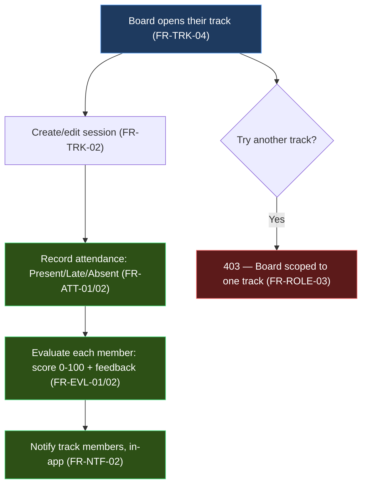

---

## 10. Profile & account

Every authenticated user (Attendee, Member, Board, Admin) manages their own account here — independent of any track or ticketing state.

**Normal flow**
1. User opens **My Profile**. *(FR-USER-01)*
2. Edits **name, phone, bio** and saves. *(FR-USER-02)*
3. Optionally **uploads a profile picture** → stored on Cloudinary, only the URL is persisted. *(FR-USER-03)*
4. **Changes password** by supplying the current password + a new one twice. *(FR-USER-04)*

**Alternate flows**
- **A1 — Weak new password:** show the exact unmet requirement (≥8 chars, upper, lower, digit — FR-AUTH-03).
- **A2 — Wrong current password:** "Your current password is incorrect." — no change made.
- **A3 — Upload too large / wrong type:** reject with the accepted formats and size limit; profile unchanged.
- **A4 — Password changed:** existing refresh tokens are revoked, forcing other sessions to re-login. *(aligns with FR-AUTH-08 rotation model)*

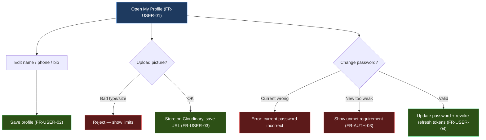

---

## 11. Notifications inbox

Notifications are **in-app only** in current scope (no email/SMS/push beyond the password-reset email). *(FR-NTF-04)* Senders are covered elsewhere — Admin in §6-adjacent tooling *(FR-NTF-01)*, Board to their own track in §9 *(FR-NTF-02)*. This flow is the **recipient** side.

**Normal flow**
1. User opens their **inbox**; each recipient has their own independent read state. *(FR-NTF-03)*
2. Sees notifications newest-first with an unread badge/count.
3. Opens one → it is marked **read** for that user only (others' read state is untouched). *(FR-NTF-03)*
4. May **mark all as read**.

**Alternate flows**
- **A1 — Empty inbox:** friendly empty state.
- **A2 — Already read:** re-opening a read notification changes nothing.

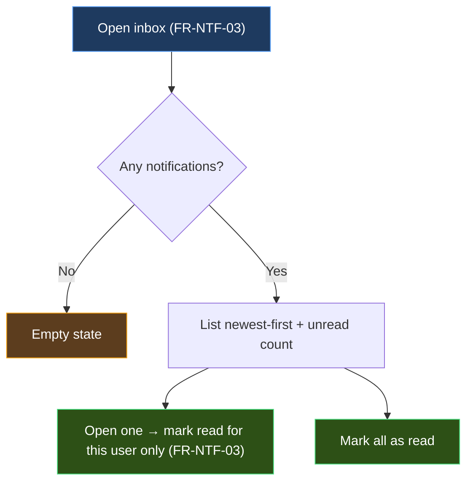

---

## 12. Contact form

Open to anyone, including an unauthenticated **Visitor** — no account required.

**Normal flow**
1. Visitor opens **Contact** and enters **name, email, subject, message**. *(FR-PUB-02)*
2. System validates required fields and email format.
3. Submission is stored for Admin review (as a `ContactMessage`, standalone — no FK to a user account). *(FR-PUB-02)*
4. Visitor sees a confirmation ("Thanks — we'll get back to you").

**Alternate flows**
- **A1 — Missing/invalid fields:** inline field errors; nothing stored.
- **A2 — Anti-abuse (rate limit / spam guard):** throttled submissions are rejected without revealing internal thresholds.

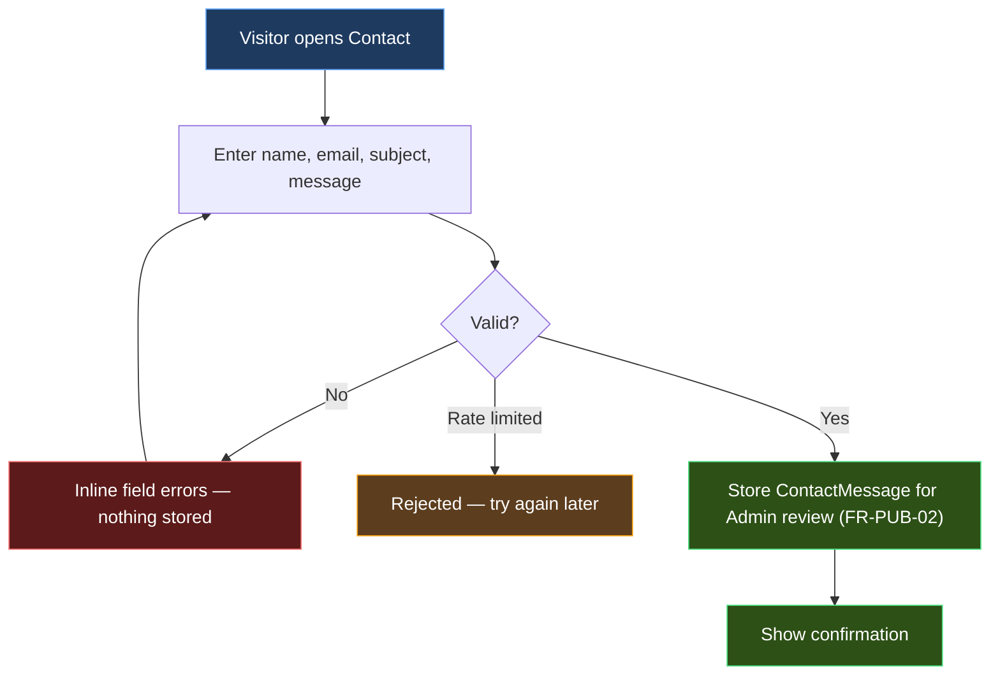

---

## Cross-flow rules quick-reference

| Rule | Requirement | Enforced in flow |
|------|-------------|------------------|
| New account = Attendee, no tracks | FR-AUTH-01 | §1.1 |
| No user enumeration (login / reset) | FR-AUTH-05, FR-AUTH-10 | §1.2, §1.3 |
| Refresh tokens single-use & rotated | FR-AUTH-08 | §1.2 |
| Only Published events are public | FR-EVT-04 | §2, §6.1 |
| Remaining seats computed, not stored | FR-EVT-07 | §2 |
| Quote holds no seats | FR-ORD-01 | §3.1 |
| Seats held = qty (individual) or package.seats × qty (package) | FR-ORD-02 | §3.2 |
| Concurrency-safe capacity check | FR-ORD-03 | §3.2 |
| Price snapshot on reserve | FR-ORD-04 | §3.2 |
| 15-min window; expiry releases seats | FR-ORD-05 | §3.3 |
| Cancel unpaid order releases seats now | FR-ORD-06 | §4.1 |
| Orders are never deleted, only re-statused | FR-ORD-08 | §4.2 |
| Verify Paymob HMAC + amount before Paid | FR-PAY-02, FR-PAY-04 | §3.3 |
| Idempotent webhook (no duplicate tickets) | FR-PAY-03 | §3.3 |
| Free order (final 0) skips gateway | FR-PAY-06 | §3.3 |
| Refunds manual/offline; void tickets | FR-PAY-07 | §4.2 |
| One ticket per seat; hashed QR token | FR-TKT-01, FR-TKT-04 | §3.3 |
| Unpaid order has zero tickets | FR-TKT-02 | §3.2 |
| Optional guest name still valid | FR-TKT-03 | §3.3, §4 |
| Admin-only, event-scoped check-in; five distinct outcomes (success / already-checked-in / wrong-event / voided / invalid), all rejects logged | FR-TKT-05, FR-TKT-06 (D:Q9) | §5 |
| Promo validity/limits/scope | FR-PROMO-03 | §3.1 |
| Dual-role constraints (1 Member + 1 Board, differ) | FR-ROLE-03, FR-ROLE-04 | §7 |
| Track actions scoped to assignment | FR-ROLE-03, FR-TRK-04 | §8, §9 |
| Late counts as attended; denominator = occurred & recorded sessions only | FR-ATT-03, D:Q12 | §8 |
| At most one attendance/evaluation per member per session | FR-ATT-02, FR-EVL-02 | §9 |
| Self-service profile edit & password change | FR-USER-01…04 | §10 |
| Notifications in-app only; per-recipient read state | FR-NTF-03, FR-NTF-04 | §11 |
| Visitor contact form; stored standalone for Admin | FR-PUB-02 | §12 |
| Per-order quantity caps (event/package) | D:Q1, D:Q2 | §3.1, §3.2 |
| Event state machine; Archived→Cancelled allowed, Draft→Cancelled blocked, Cancelled terminal | D:Q22, D:Q23, D:Q56 | §6.3 |
| Track retirement ends active roles; retains history | D:Q14 | §6.4 |
| Deactivation cancels orders, ends roles, flags Board gap | D:Q10 | §7 |
| Cannot hard-delete session with records | D:Q13 | §9 |
| Evaluation requires past session & active enrollment | D:Q16 | §9 |
