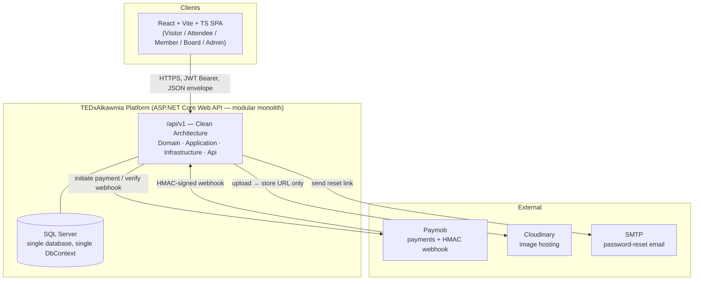
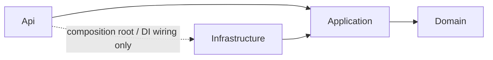
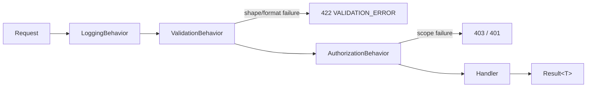
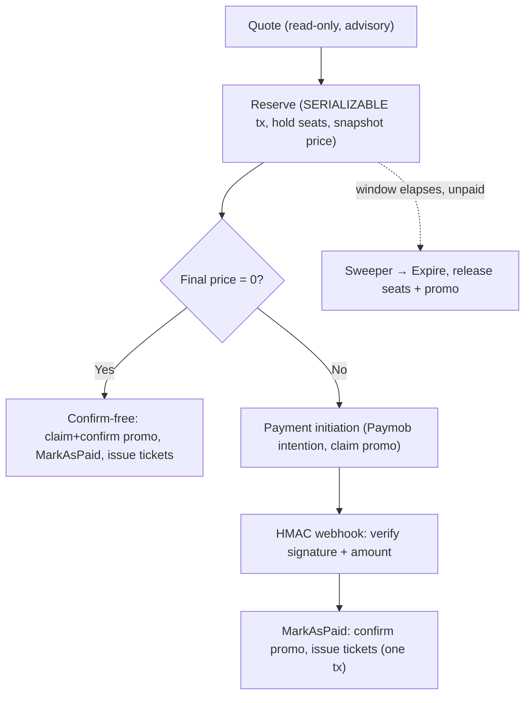
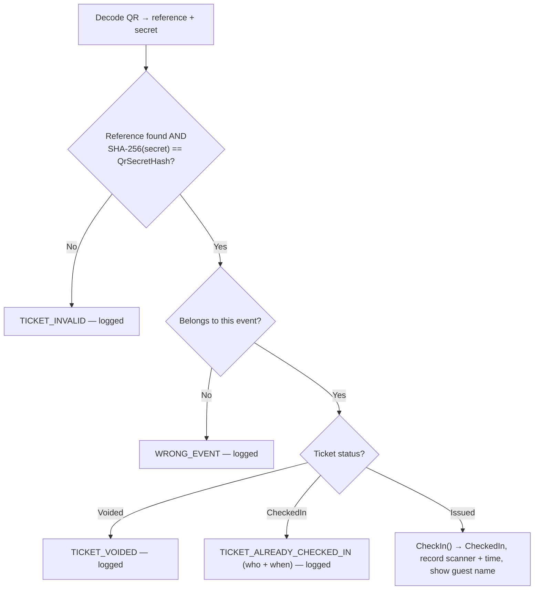
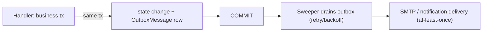

# TEDxAlkawmia Platform — System Design

> **Version:** 1.3
> **Date:** 2026-07-24
> **Status:** Draft — authoritative for the *implementation architecture* (how the system is built)
> **Reads from:** [01 — PRD](./01-PRD.md) · [03 — User Flows](./03-UserFlows.md) · [04 — Personas](./04-Personas.md) · [08 — Decision Log](./08-DecisionLog.md) · [10 — Data Model](./10-DataModel.md)
> **Companion:** [[11-StateMachines|11 — State Machines]] — the single authority for all entity lifecycle diagrams · [[12-SequenceDiagrams|12 — Sequence Diagrams]] — the single authority for all cross-subsystem runtime flow diagrams. This document links to both rather than re-drawing them.
> **Decisions:** requirements grilling (D:Q1–Q28) + architecture grilling (D:Q29–Q56) + the FK revision, cited as **(D:Qn)**.

---

## 1. Introduction & Document Authority

### 1.1 Purpose

This document is the **authoritative implementation guide** for the TEDxAlkawmia Platform: it describes *how* the system is structured and built so a two-developer backend team can implement it without re-deriving decisions. It is the connective tissue between the *what/why* (PRD), the *behavior* (User Flows), the *who* (Personas), the *decisions* (Decision Log), and the *schema* (Data Model).

It does **not** re-decide anything. Every architectural, technological, and design choice recorded here traces to a decision already accepted in **[08 — Decision Log](./08-DecisionLog.md)** (Q1–Q55 + the FK revision) or to a fact stated in the PRD, User Flows, or Data Model. Where this document adds detail, that detail is *mechanical elaboration* of an existing decision (how the pieces are wired together), never a new requirement or a new architectural direction.

### 1.2 Authority boundary — what this document owns vs. defers

| Concern | Owned by | 09's relationship |
|---------|----------|-------------------|
| Product scope, capability areas, role matrix | **01 — PRD** | Referenced for *why* a design exists |
| Requirement-level detail (FR/NFR) | **02 — SRS** | Referenced by ID |
| Step-by-step user-facing behavior + flow diagrams | **03 — User Flows** | Referenced; never reproduced |
| User motivations & role guardrails | **04 — Personas** | Referenced for design rationale |
| Resolved design questions (Q1–Q55) | **08 — Decision Log** | The authoritative basis; synthesized here |
| Persistent schema (tables, columns, indexes, FKs, enums) | **10 — Data Model** | Referenced; **never duplicated** |
| Endpoint catalog & request/response shapes | **07 — API Contract** | Referenced; only the API *shape* is here |
| Release plan / phasing / MVP cut | Deferred planning doc (PRD §12) | Out of scope |
| **Implementation architecture: layers, pipeline, aggregate behavior, transaction boundaries, concurrency mechanics, cross-cutting wiring, background processing, integration boundaries, migration/seed process, behavioral diagrams** | **09 — this document** | **Owned** |

**Conflict rule (inherited from the PRD authority note):** on *scope* the PRD wins; on *requirement detail* the SRS wins; on a *resolved design question* the Decision Log wins; on *schema* the Data Model wins. This document never overrides any of them — if a discrepancy is found, the source doc prevails and this document is corrected.

### 1.3 Governing principle — proportional design

Every choice below is kept **proportional to a problem this project actually has** (D:Q29–Q55 preamble): a modular monolith on a single SQL Server, built by a two-developer team, under 100 concurrent users initially (PRD §9), with no external API consumers and no planned microservice split. Enterprise patterns are adopted **only** where they solve a concrete problem here (held-seat oversell, promo-cap races, double-scan, token reuse, crash-safe side-effects); they are declined where their only payoff is a hypothetical the project has decided not to build toward.

### 1.4 How to read this document

- Section 2–3 give the big picture and the code layout.
- Sections 4–6 describe the horizontal layers (domain, application, auth).
- Sections 7–9 describe the three vertical subsystems that carry real invariants (booking/payment, check-in, training).
- Sections 10–14 describe cross-cutting mechanics, reliability, API shape, integrations, and persistence process.
- Section 15 records the (deferred) testing plan; Section 16 is the traceability matrix.

**State machines** are owned by [[11-StateMachines|11 — State Machines]] and linked from §4.3, §6.3, §7.9. **Cross-subsystem runtime flows (sequence diagrams)** — request pipeline, reserve, payment initiation/confirmation, free-order, outbox drain, refresh rotation, check-in, cancellation ripples — are owned by [[12-SequenceDiagrams|12 — Sequence Diagrams]] and linked from §5.1, §6.3, §7.6, §7.10, §8.1. This document describes the *structure* those flows run through; 12 draws the *ordering of steps*.

### 1.5 Non-goals

This document does **not** contain: the feature list, FR/NFR text, persona narratives, step-by-step flows, the full DB schema, the endpoint catalog, the release timeline, or the glossary. Each is owned by the document named in §1.2 and is only referenced.

---

## 2. Architectural Overview

### 2.1 Architecture style

**Modular monolith + Clean Architecture** (D:Q29). A single deployable ASP.NET Core Web API, internally divided into four layers and, orthogonally, into bounded-context folders. This is the proportional fit for one team, one database, and no microservice roadmap; the clean internal boundaries preserve the option to split later without paying for it now.

**No microservice split is planned** (D:Q29). Contexts are separated by folder and by a code rule (§2.3), not by assembly or process.

```
┌─────────────────────────────────────────────┐
│                     Api                     │  Controllers, middleware, DI, Program.cs
│   (depends on Application + Infrastructure) │
├─────────────────────────────────────────────┤
│                Infrastructure               │  EF Core, Identity, Paymob/Cloudinary/SMTP
│        (depends on Application + Domain)    │  clients, Serilog sinks, outbox drain
├─────────────────────────────────────────────┤
│                 Application                 │  MediatR handlers, DTOs, validators,
│           (depends on Domain only)          │  IApplicationDbContext, ICurrentUser, IClock
├─────────────────────────────────────────────┤
│                    Domain                   │  Entities/aggregates, enums, domain rules,
│              (depends on nothing)           │  invariants — pure POCO, no EF/framework
└─────────────────────────────────────────────┘
```

### 2.2 System context

The platform is one API serving a React SPA and integrating with three external services. All actors and roles are defined in the PRD (§4–5) and Personas (04); the integration boundaries are detailed in §13.



### 2.3 Bounded contexts

Three business contexts named in the Decision Log (Identity, Eventing/Ticketing, Training) plus two support groupings the Data Model makes explicit (Communications, Cross-cutting). Each is a **folder inside every layer** (D:Q29a), not a separate assembly.

| Context | Owns | Key aggregates / tables (schema → 10) |
|---------|------|----------------------------------------|
| **Identity** | Accounts, auth, tokens, global role | `ApplicationUser`, `RefreshToken` |
| **Eventing / Ticketing** | Events, packages, orders, tickets, payments, refunds, promos | `Event`, `Package`, `Order`, `Ticket`, `Payment`, `RefundEntry`, `PromoCode`, `PromoRedemption` |
| **Training** | Tracks, assignments/enrollment, sessions, attendance, evaluations | `Track`, `TrackAssignment`, `Session`, `Attendance`, `Evaluation` |
| **Communications** | In-app notifications, contact form | `Notification`, `NotificationRecipient`, `ContactMessage` |
| **Cross-cutting** | Reliable side-effect delivery | `OutboxMessage` |

#### Cross-context coupling — the code rule (FK revision, D:Q51 addendum)

Although the system is implemented as a Modular Monolith with a single database, bounded contexts remain isolated at the code level.

- Real database foreign keys are allowed across contexts and use `DeleteBehavior.Restrict` to preserve referential integrity.
- Cross-context EF Core navigation properties are forbidden. A context references another context only by its identifier (e.g. `AccountId`, `TrackId`).
- Communication between contexts happens through queries/services, never by traversing object graphs (`order.Account.Email`, `Include(...)`, etc.).
- Intra-context navigation properties remain fully supported.

This approach keeps the codebase loosely coupled while allowing the database to enforce integrity. If the system is ever split into separate services or databases, removing the cross-context foreign keys becomes a database migration rather than a domain-model redesign.

### 2.4 Technology stack

Stack facts are fixed by the Decision Log (Q29–Q55 preamble) and PRD constraints (§9). This document adds no technology not already chosen.

| Concern            | Choice                                                 | Source             |
| ------------------ | ------------------------------------------------------ | ------------------ |
| Runtime / language | ASP.NET Core Web API, .NET 8, C#                       | D:Q29–Q55 preamble |
| Client             | React + Vite + TypeScript SPA (API consumer only)      | D:Q29–Q55 preamble |
| Persistence        | SQL Server + EF Core, single `DbContext`               | D:Q29b             |
| Mediation          | MediatR (commands/queries + pipeline behaviors)        | D:Q30              |
| Identity/crypto    | ASP.NET Core Identity (`AddIdentityCore`) + custom JWT | D:Q36, Q46         |
| Validation         | FluentValidation                                       | D:Q39              |
| Resilience         | Polly (deadlock/serialization retry)                   | D:Q33              |
| Logging            | Serilog, structured JSON                               | D:Q41              |
| Background work    | in-process `BackgroundService` + `sp_getapplock`       | D:Q34              |
| Payments           | Paymob (cards + wallets, EGP)                          | PRD ORD-04; D:Q18  |
| Images             | Cloudinary (URL stored, bytes never)                   | PRD USER-03        |
| Email              | SMTP (password-reset only)                             | PRD §9; D:Q28c     |
| Data access        | `IApplicationDbContext`, no generic repos              | D:Q31              |
| Validation         | FluentValidation                                       | D:Q39              |
| Result/errors      | typed `Result<T>` + `Errors` catalog + mapper          | D:Q37              |
| Mapping            | manual                                                 | D:Q38              |
| Concurrency        | SERIALIZABLE reserve + Polly retry; `RowVersion`       | D:Q33, Q54         |
| Side-effects       | explicit orchestration + transactional outbox          | D:Q45, Q53         |
| Config/secrets     | `IOptions<T>` + User Secrets/env + fail-fast           | D:Q40              |
| Migrations         | code-first, explicit bundle, seeder + first-Admin      | D:Q42              |
| API versioning     | none now; `/api/v1` literal prefix                     | D:Q44              |
| Testing            | risk-weighted pyramid — **deferred authoring**         | D:Q43              |

---

## 3. Solution & Project Structure

### 3.1 The four layers and the dependency rule

Clean Architecture with strict inward-only dependencies (D:Q29). Nothing in an inner layer references an outer one.



| Project | Responsibility | Depends on | Never contains |
|---------|----------------|-----------|----------------|
| **Domain** | Pure-POCO entities, enums, aggregate behavior (transition methods), domain invariants | *(nothing)* | EF, MediatR, ASP.NET, any framework |
| **Application** | Commands/queries + handlers, pipeline behaviors, `IApplicationDbContext`, DTOs + manual mapping, FluentValidators, `Result<T>`, `Errors` catalog, abstractions (`ICurrentUser`, `IClock`, gateway/email/image interfaces) | Domain | Concrete EF, concrete external clients |
| **Infrastructure** | `AppDbContext` (implements `IApplicationDbContext`), EF configurations, migrations, Identity setup, JWT/refresh services, Paymob/Cloudinary/SMTP clients, Serilog, `BackgroundService`, audit interceptor | Application, Domain | Controllers |
| **Api** | Controllers, `Result→ActionResult` mapper, exception middleware, DI composition root, Swagger, auth middleware | Application, Infrastructure (wiring only) | Business logic |

The Domain layer stays **pure POCO** (D:Q31): no persistence concern leaks in. Data access is exposed to Application through the **`IApplicationDbContext`** interface (D:Q31) — **no generic repositories**; invariant-heavy writes go through **targeted aggregate methods** on the entities themselves.

### 3.2 Context-as-folder layout

Each layer contains the same context folders (D:Q29a). Illustrative tree (names follow the contexts in §2.3 and the entities in Data Model 10):

```
src/
  Domain/
    Identity/            (ApplicationUser behavior, GlobalRole enum, ...)
    Ticketing/           (Order, Ticket, Event, Package, Promo* — aggregates + transitions)
    Training/            (Track, TrackAssignment, Session, Attendance, Evaluation)
    Communications/      (Notification, ContactMessage)
    Common/              (base markers: IAuditable, ISoftDeletable, value helpers)
  Application/
    Identity/            (Login/Refresh/Register handlers, validators, DTOs)
    Ticketing/           (Quote/Reserve/Pay/Checkin handlers, ...)
    Training/            (...)
    Communications/      (...)
    Common/              (Result<T>, Errors catalog, pipeline behaviors, abstractions)
  Infrastructure/
    Persistence/         (AppDbContext, IEntityTypeConfiguration<T> per entity, interceptors, migrations)
    Identity/            (Identity setup, JWT + refresh services)
    Payments/            (Paymob client + HMAC verifier)
    Media/               (Cloudinary client)
    Email/               (SMTP client)
    BackgroundJobs/      (sweeper BackgroundService)
    Logging/             (Serilog config + scrubbing)
  Api/
    Controllers/         (context-grouped)
    Middleware/          (ExceptionHandlingMiddleware)
    Mapping/             (Result → ActionResult)
    Program.cs           (composition root)
tests/                   (Domain.UnitTests, Application.UnitTests, Integration.Tests, Api.SmokeTests — authoring deferred, §15)
```

### 3.3 Class-placement conventions

- One `IEntityTypeConfiguration<T>` per entity, in the matching Infrastructure context folder (D:Q54, DataModel §11).
- One command/query + one handler + one validator per use case, in the matching Application context folder.
- DTO ↔ entity mapping is **manual** (`ToDto()`/`ToResponse()` methods) in the Application layer — **no mapper library** (D:Q38). This structurally prevents leaking QR secrets, password hashes, or cross-context fields: nothing maps unless a line is written.

---

## 4. Domain Layer Design

### 4.1 Rich vs. CRUD-simple (the proportional split)

Rich domain modeling is applied **only** to the invariant-bearing aggregates; everything else is CRUD-simple (D:Q32). This is deliberate — not a full DDD showcase.

| Entity | Modeling | Why |
|--------|----------|-----|
| **Order** | Rich aggregate | Money + seat-hold + price-snapshot + lifecycle invariants |
| **Ticket** | Rich aggregate | Single-use admission, void rules, idempotent check-in |
| **Event** | Rich aggregate | Publish/cancel/archive lifecycle, capacity floor rule |
| **TrackAssignment** | Rich (invariant methods) | Dual-role legality, enrollment lifecycle |
| Package, PromoCode | CRUD-simple + guarded fields | Bounded values, no lifecycle |
| Session, Attendance, Evaluation | CRUD-simple (one invariant each) | Record-keeping; single simple rule per table (D:Q52) |
| Notification, ContactMessage | CRUD-simple | Fan-out/status only |

### 4.2 Transition methods are the only way status changes

For the three lifecycle aggregates, the enum status is **never set directly from a handler** — every change goes through an explicit method on the aggregate (D:Q55). This makes an illegal status value unreachable by an illegal path, and puts idempotency guarantees in the domain.

| Aggregate | Method | Guard / effect | Idempotency |
|-----------|--------|----------------|-------------|
| **Order** | `MarkAsPaid()` | Only from `PendingPayment` within hold → `Paid`; stamps write-once `PaidAtUtc`; fans out one `Ticket` per seat | **Re-call on already-Paid = no-op success** — the HMAC/webhook guarantee at domain level (D:Q55) |
| | `Cancel()` | → `Cancelled`; stamps `CancelledAtUtc` | |
| | `Expire()` | Sweeper only; → `Expired`; stamps `ExpiredAtUtc` | |
| **Ticket** | `CheckIn()` | Only from `Issued` → `CheckedIn`; stamps `CheckedInAtUtc/By`; second call → `TICKET_ALREADY_CHECKED_IN` | Guarded by `RowVersion` |
| | `Void()` | → `Voided`; check-in of a voided ticket → `TICKET_VOIDED` | |
| **Event** | `Publish()` | Allowed with **zero packages** (Model B); `Published→Draft` blocked once orders exist (D:Q23) | |
| | `Cancel()` | Terminal; triggers cancel ripple (§7.9) | |
| | `Archive()` / re-`Publish()` | Manual hide / re-list | |

Illegal transitions are rejected in-domain and mapped by the handler to the correct flat error code (§10.1). Lifecycle timestamps (`PaidAtUtc`/`CancelledAtUtc`/`ExpiredAtUtc`) are stamped **inside the guarded method**, never by the audit interceptor, so revenue reporting stays stable against later row touches (DataModel §2.3).

### 4.3 State machines — deferred to [[11-StateMachines|11 — State Machines]]

The full state diagrams for **Order**, **Ticket**, **Event**, **PromoRedemption**, **TrackAssignment**, **Session**, **Payment**, **RefreshToken**, and **OutboxMessage** are owned by [[11-StateMachines|11 — State Machines]], the single authoritative source for lifecycle transitions. Key points:

- **Order** (§11.1): `PendingPayment` → `Paid` (HMAC webhook / free) / `Cancelled` (unpaid user-cancel **or** paid Admin void) / `Expired` (hold lapsed). A voided-paid order and a user-cancelled unpaid order **both** land in `Cancelled` and are distinguished by the presence of a `RefundEntry`, never by status (DataModel §2.3, Issue 7). `Paid → Cancelled` is legal (Admin void).
- **Ticket** (§11.2): `Issued` → `CheckedIn` / `Voided`. Tickets are created **only** by `Order.MarkAsPaid` (D:Q49) — never independently. No-show is **derived** (`Issued ∧ event.date < now`), never stored (D:Q7).
- **Event** (§11.3): `Draft` ⇄ `Published` (revert only if zero orders, else `EVENT_HAS_ORDERS`) → `Archived` (manual hide) / `Cancelled` (terminal, triggers cancel ripple §7.9). `Archived` may re-`Publish` **or** `Cancel` directly (D:Q56). `Draft → Cancelled` is blocked (Draft is soft-deleted). No package precondition (Model B).

### 4.6 Invariant enforcement matrix (domain vs. database)

Concurrency-critical invariants are enforced at **both** the domain and the database (D:Q32); the DB is the race-proof backstop, the domain is the readable rule.

| Invariant | Domain enforcement | DB enforcement | Source |
|-----------|--------------------|----------------|--------|
| No oversell of seats | held-seat check inside `Reserve` | SERIALIZABLE tx + retry (§7.4) | D:Q3, Q33 |
| One active pending order per user per event | check in reserve handler | `IX_Order_Account_Event_Status` | D:Q5 |
| Idempotent payment | `MarkAsPaid` no-op on Paid | `UQ_Payment_PaymobTransactionId` (filtered) | D:Q55, DataModel §2.5 |
| Single-use check-in | `CheckIn` guard | `Ticket.RowVersion` | D:Q9 |
| Promo caps never exceeded | count in serializable tx | `PromoRedemption` ledger + indexes | D:Q19, Q50 |
| ≤1 active Member / ≤1 active Board per user | dual-role check | two filtered unique indexes | D:Q51 |
| Different-track rule (no Member@X + Board@X) | **domain invariant in-tx** | *(not expressible as filtered index)* | D:Q51 |
| QR forgery resistance | hash compare in `CheckIn` | `UQ_Ticket_QrSecretHash` | D:Q8 |
| Numeric bounds (capacity, price, score, qty, total) | FluentValidation (primary) | CHECK constraints (backstop → logged 500) | D:Q54, DataModel §11.1 |

Domain-invariant throws are a **last-line safety net** (D:Q39): an invariant violation means a handler bug (→ 500), never a user-facing 422. The clean 422 for real user input is owned by the FluentValidation tier (§10.2).

---

## 5. Application Layer & Request Pipeline

### 5.1 Request lifecycle

```
HTTP → [Api] Controller (/api/v1, [Authorize] global role)
     → MediatR Send(command/query)
        → LoggingBehavior      (correlationId, structured log)
        → ValidationBehavior   (FluentValidation → 422 VALIDATION_ERROR)
        → AuthorizationBehavior (ICurrentUser + marker ifaces → per-track scope, 403)
        → Handler              (explicit tx where needed; returns Result<T>)
            → IApplicationDbContext / Domain aggregate methods
     ← Result<T>
     → Result→ActionResult mapper (Error.type → 422/409/404/401/403; success → 200/201)
     ← JSON { success, data, error }
```

The runtime sequence of this pipeline (middleware → controller → the four behaviors → handler → envelope), with each short-circuit outcome, is drawn in [[12-SequenceDiagrams#1. Request pipeline (every authenticated call) (D:Q25, Q30, Q35, Q39, Q41)|12 — Sequence Diagrams §1]].

Unexpected exceptions bypass all four steps and are caught by `ExceptionHandlingMiddleware` → **500 + correlationId**. Expected business failures are typed `Result` codes, never exceptions (§10.1).

### 5.2 CQRS-lite with MediatR

Commands and queries are MediatR requests handled by dedicated handlers (D:Q30). **CQRS-lite**: queries read the **same EF model** — there is no separate read store (over-engineering at this scale, D:Q30).

### 5.3 Pipeline behavior order

Cross-cutting concerns are centralized in four MediatR pipeline behaviors. The order is load-bearing — cheap structural rejections happen before expensive work, and logging wraps everything so every request gets a trace regardless of outcome.



1. **`LoggingBehavior`** — wraps the entire pipeline; assigns/propagates the request-scoped `correlationId` and emits structured start/finish logs via Serilog. Runs first so rejected requests are always traced. Never logs secret-bearing payloads (secret-scrubbing destructuring policy, D:Q41).

2. **`ValidationBehavior`** — runs all registered FluentValidation validators for the request. Shape/format failures **short-circuit here** — the handler never runs — and return `422 VALIDATION_ERROR` with per-field detail (D:Q30, Q39).

3. **`AuthorizationBehavior`** — resolves the caller via `ICurrentUser`, reads marker interfaces (`IRequireAdmin`, `ITrackScopedRequest`, …), and checks per-track scope against **current DB state** (D:Q35). Hits the database, so it runs after the free in-memory validation step. Global role was already gated at the controller by `[Authorize]`; this behavior handles finer-grained scope. Per-track authorization is never baked into the JWT (§6.4).

4. **Handler** — the use-case itself. Opens an explicit transaction where state changes (always for reserve/pay, D:Q30). Invokes domain aggregate methods for invariant-bearing writes (D:Q32). Reads/writes via `IApplicationDbContext` (D:Q31). Maps to DTO manually on the way out (D:Q38). Returns `Result<T>` (D:Q37).

### 5.4 Data access from handlers

Handlers depend on **`IApplicationDbContext`** (D:Q31), not a repository. For invariant-heavy writes they load the aggregate and call its transition method (§4.2); for CRUD-simple reads/writes they query the context directly. Manual `ToDto()` mapping keeps Application free of Infrastructure and prevents field leakage (D:Q38).

### 5.5 Transaction placement

Transactions are **explicit in handlers** (D:Q30), not hidden in a decorator, so the money path stays readable. The critical rule (D:Q45): **external side-effects fire *after* DB commit, via the outbox — never inside the money transaction** (§11). Handler transaction responsibilities are detailed per-subsystem in §7–9.

---

## 6. Authentication & Authorization Design

### 6.1 Identity store

ASP.NET Core Identity is used for the **user/password store, hashing, lockout, and the reset-token provider only** (D:Q36). Its cookie stack is **disabled**; sessions use **custom JWT + refresh tokens**. Configured via **`AddIdentityCore<ApplicationUser>` with a `Guid` key and no roles/claims/external-login/user-token tables** (D:Q46). The account entity is `ApplicationUser : IdentityUser<Guid>` (schema → DataModel §1.1).

**Global role is a plain `GlobalRole` column** (Attendee | Admin), *not* Identity roles (D:Q36). **Member/Board are relational `TrackAssignment` rows**, never Identity roles.

### 6.2 Token model

All lifetimes are config-overridable defaults (D:Q24):

| Token | Lifetime | Storage | Rules |
|-------|----------|---------|-------|
| Access JWT | 15 min | client-held | Claims: account id, email, **global role** only (no track scope) |
| Refresh | 7 days | **hashed** (`RefreshToken.TokenHash`, raw never stored) | Single-use, **rotated**, family-revoke on reuse |
| Reset | 1 hour | Identity `SecurityStamp`-backed provider (no table) | Single-use, expiring |
| Email confirmation | 24 hours | Identity `SecurityStamp`-backed provider (no table) | Expiring; **not** single-use (confirm does not rotate the stamp) — replay is idempotent; blocks login until consumed (D:Q57) |

Both the reset and confirmation tokens come from Identity's `SecurityStamp`-backed provider family, which requires `.AddDefaultTokenProviders()`. Because they need **different lifetimes** (1 h vs 24 h) and `TokenLifespan` is a property of the *provider*, not the call site, the confirmation token MUST use its own registered provider — a `DataProtectorTokenProvider` with a 24-hour `TokenLifespan` registered under a distinct name and selected by name when generating. Setting `DataProtectionTokenProviderOptions.TokenLifespan` globally would silently stretch the password-reset window to 24 hours too, weakening NFR-SEC-02.

The refresh token travels in the **JSON body** (uniform for web + future mobile), not an httpOnly cookie (D:Q24).

### 6.3 Refresh rotation & reuse detection

On refresh, the presented token is revoked and a new pair issued; the old row links forward via `ReplacedByTokenHash` (D:Q47). Presenting an **already-revoked** token triggers a **family revoke** of the whole rotation chain → `TOKEN_REUSED` (D:Q24, Q47). The token *state* lifecycle (Active → Revoked{Rotated|Logout|Expired|Reuse|PasswordReset|PasswordChange}) is owned by [[11-StateMachines#8. RefreshToken (D:Q24, Q47)|11 — State Machines §8]]; the refresh *interaction* (lookup by hash, rotate vs. family-revoke) is drawn in [[12-SequenceDiagrams#7. Refresh-token rotation + reuse detection (D:Q24, Q47)|12 — Sequence Diagrams §7]].

Related behaviors owned by other docs: login/logout/no-enumeration (User Flows §1.2), forgot/reset (§1.3), password-change revokes refresh tokens (§10.A4). Deactivation blocks login/refresh only (D:Q10, §9.4).

### 6.4 Authorization mechanism

Two-tier (D:Q35):

1. **Global role** — gated at the controller with `[Authorize]` roles from the JWT claim (Attendee/Admin).
2. **Per-track Member/Board scope** — resolved **per request** in the `AuthorizationBehavior` against **current DB state** (`TrackAssignment` rows), never from the token. This is the only correct approach because assignments change at runtime (a Board can be removed mid-session).

Requests declare their needs with **marker interfaces** (D:Q35): e.g. `IRequireAdmin`, `ITrackScopedRequest` (carries the target `TrackId`; the behavior confirms the caller has an active Board assignment on exactly that track). `ICurrentUser` abstracts the authenticated principal for handlers and behaviors.

The **dual-role legality invariant** (≤1 Member, ≤1 Board, must differ) is *not* an authorization concern — it is enforced at assignment time in the domain + DB (§9.2). Authorization only answers "may this caller act on this track now?"

This directly realizes the Personas guardrails: Yousef (Board@Y + Member@X) is refused any action on Track X's supervision endpoints with a 403, even though he trains there (Persona 04 §4; User Flows §9 A1).

---

## 7. Booking & Payment Subsystem ⭐

> The highest-risk path in the platform (money + concurrency). This section is the authoritative *implementation* design for the quote → reserve → pay → issue lifecycle. The user-facing behavior is User Flows §3; the schema is Data Model §2. This section describes *how the code enforces it*.

### 7.1 Lifecycle overview



### 7.2 Quote (advisory, holds nothing)

The quote endpoint computes `base = unitPrice × quantity` (event `TicketPrice` for individual, `Package.Price` for a package) and `final = max(0, base − discount)` with half-up 2dp rounding (D:Q18). Promo validity is checked and reported with distinct codes (§7.7). **No seats are held; the quote is advisory and the client never sends a price** (D:Q1, Q4). Quantity is validated against the per-order cap (`event.MaxIndividualQtyPerOrder` or `package.MaxQuantityPerOrder`, nullable = no cap) (D:Q2).

### 7.3 Reserve — the concurrency-critical write

The reserve handler runs a **`SERIALIZABLE` transaction** (D:Q33) that:

1. Re-validates the event is `Published` and the quantity is within the (re-read) cap (D:Q2 — cap re-checked at reserve).
2. **Re-prices** against live catalog/promo state. On mismatch → `PRICE_CHANGED` (409) with the new quote for explicit re-confirmation — **never a silent charge** (D:Q4).
3. Enforces **one active pending order per user per event**: a second reserve returns the existing pending order rather than creating a duplicate hold (D:Q5).
4. Computes **held seats** clock-aware and checks capacity:
   `held = SUM(Quantity) over orders WHERE Paid OR (PendingPayment AND HoldExpiresAtUtc > now)`; seats needed ≤ `Capacity − held` (D:Q3, Q49). Held seats are **computed, never stored**.
5. Creates the `Order` in `PendingPayment`, **snapshots** unit name, unit price, subtotal, discount, total (D:Q4), and starts the **15-minute** hold window.

**Retry:** a **mandatory Polly retry** wraps the transaction, catching SQL deadlock (1205) and serialization failures and re-running (D:Q33). This is the correct, simplest oversell guarantee on a single SQL Server.

**Availability is correct even if the sweeper is delayed** — a lapsed hold stops counting the instant `HoldExpiresAtUtc` passes because the predicate is clock-aware (D:Q3). The sweeper (§11) is cleanup, not a correctness dependency.

### 7.4 Concurrency mechanics summary

| Mechanism | Role | Source |
|-----------|------|--------|
| `SERIALIZABLE` isolation on reserve | prevents phantom oversell between two buyers grabbing the last seats | D:Q33 |
| Polly retry on 1205/serialization | turns the serialization abort into a correct re-run | D:Q33 |
| Clock-aware held-seat predicate | availability independent of sweeper timing | D:Q3 |
| `IX_Order_Account_Event_Status` | one-active-pending-order rule | D:Q5 |
| `RowVersion` on Order/Ticket | optimistic concurrency → `409 CONCURRENCY_CONFLICT` | D:Q54, DataModel §11 |

### 7.5 Payment initiation (paid orders)

For a non-zero final price, the handler initiates a Paymob payment for the snapshotted total and returns a checkout URL/session (§13.1). At this point the **promo slot is atomically claimed** (`PromoRedemption` row inserted `Claimed`) (D:Q19). An optional **`Idempotency-Key`** header makes a repeated initiation resolve to the **same** checkout session — no duplicate Paymob intention (D:Q28a; `UQ_Payment_IdempotencyKey`).

Money crosses the gateway boundary as **integer piastres (×100)**; internally it is always `decimal(18,2)` EGP (D:Q18). Piastres never appear outside the Paymob boundary.

### 7.6 Webhook, verification & ticket issuance (one transaction)

Paymob calls the platform webhook. The handler:

1. **Verifies the HMAC signature** and that the **amount matches the order's `TotalSnapshot`** before trusting anything (D:Q18; FR-PAY-02/04). Amount mismatch → reject, issue no tickets, flag for review.
2. In **one transaction**: `Order.MarkAsPaid()` → status `Paid` + write-once `PaidAtUtc`, `Payment` row recorded, `PromoRedemption` → `Confirmed`, and **one `Ticket` per held seat** fanned out (D:Q45, Q49, Q55).
3. **Idempotent:** a duplicate/late webhook for an already-Paid order acknowledges but issues **no** duplicate tickets (`MarkAsPaid` no-op; `UQ_Payment_PaymobTransactionId` filtered unique) (D:Q55; FR-PAY-03).

**Firm rule:** the money mutation (HMAC verify → mark Paid → issue tickets) stays inside this one transaction; any email/notification side-effect is written to the **outbox** in the same transaction and delivered *after* commit (D:Q45, §11).

The end-to-end sequence — reserve, payment initiation with `Idempotency-Key`, and the signature-verified webhook that issues tickets in one transaction — is drawn in [[12-SequenceDiagrams#2. Reserve → hold — the concurrency-critical write (D:Q2, Q3, Q4, Q5, Q33, Q49, Q50)|12 §2]] (reserve), [[12-SequenceDiagrams#3. Payment initiation (paid orders) (D:Q18, Q19, Q28a)|12 §3]] (initiation), and [[12-SequenceDiagrams#4. Payment confirmation — the only ticket-issuing path (D:Q45, Q49, Q53, Q55)|12 §4]] (confirmation). The free-order bypass is [[12-SequenceDiagrams#5. Free-order path — gateway bypass (D:Q18, Q19)|12 §5]].

### 7.7 Free-order path

If final price = 0 (free package, `event.TicketPrice = 0`, or a 100%-off promo), the gateway is **bypassed**: the order is confirmed immediately, the promo slot is **claimed and confirmed in a single step**, and tickets are issued (D:Q18, Q19; FR-PAY-06).

### 7.8 QR token design (issuance side)

Each issued ticket carries a QR encoding a **public reference** (indexed, non-secret, e.g. `TKT-7F3A9C`) **+ a 256-bit random secret** (D:Q8). The DB stores only the reference and a **SHA-256 hash** of the secret (`QrSecretHash`) — the **raw secret is never persisted**. The QR is delivered as a **server-rendered image** (`GET /tickets/{id}/qr`, `image/png`, owner-only); the raw secret lives only in the image bytes, never as a readable JSON field (D:Q8; User Flows §3.3, §4). Scan-side validation is §8.

### 7.9 Promo redemption lifecycle

The `PromoRedemption` ledger is a **status ledger, never deleted** — `Claimed → Confirmed | Released` (D:Q19, Q50; schema DataModel §2.8). The full state machine is owned by [[11-StateMachines#4. PromoRedemption (D:Q19, Q50)|11 — State Machines §4]].

Both caps (`MaxTotalRedemptions`, `MaxPerUser`) are counted **inside the SERIALIZABLE tx** over rows `WHERE Status IN (Claimed, Confirmed)` — a stored counter cannot be made race-safe; row-counting in the serializable tx can (D:Q50). Unpaid holds never permanently burn a limited promo, and the cap is never exceeded. The `Claimed→Confirmed` vs `Claimed→Released` race is arbitrated on the owning `Order` aggregate's `RowVersion` (DataModel §2.8).

### 7.10 Cancellation & offline refund

- **Unpaid order:** the Attendee self-cancels → `Cancel()` releases held seats immediately (D:Q6; User Flows §4.1).
- **Paid order:** **Admin-only** void → Issued tickets become `Voided`, **only not-yet-checked-in seats are released**, checked-in tickets are **non-voidable** (seat stays consumed), and a `RefundEntry` is recorded (refund is **offline/manual** — no gateway refund in scope) (D:Q6; FR-PAY-07; User Flows §4.2). Orders are never deleted, only re-statused.
- **Event cancel ripple** (Published → Cancelled, or Archived → Cancelled per D:Q56): voids all Issued tickets, cancels PendingPayment orders (release seats), records a `RefundEntry` per Paid order, hides but retains the event (D:Q22, Q56; User Flows §6.3). `Draft → Cancelled` is blocked (Draft is soft-deleted).

Both ripples are drawn in [[12-SequenceDiagrams#9. Cancellation ripples (D:Q6, Q22, Q56)|12 — Sequence Diagrams §9]].

---

## 8. Check-in Subsystem

> User-facing behavior: User Flows §5. Authority: Admin-only (D:Q9). This section is the scan-validation algorithm.

### 8.1 Scan validation algorithm

The check-in endpoint is **event-scoped** and **Admin-only** (D:Q9). On scan, the decoded payload (public reference + secret) is validated in order:



### 8.2 Five distinct outcomes

Door staff get actionable, distinct feedback; **every rejection is logged** (D:Q9; FR-TKT-06):

| Outcome | Code | Meaning |
|---------|------|---------|
| Success | — | `Issued` → `CheckedIn`, scanner + timestamp recorded |
| Already checked in | `TICKET_ALREADY_CHECKED_IN` | returns original scanner + time |
| Wrong event | `WRONG_EVENT` | valid ticket, wrong door |
| Voided | `TICKET_VOIDED` | known ticket whose paid order was voided/refunded — distinct from a forgery |
| Unknown/tampered | `TICKET_INVALID` | no matching reference, or secret fails the hash comparison |

The lookup uses `IX_Ticket_Event_Status`; the hash comparison against the stored `QrSecretHash` means forgery is resisted even if the DB leaks (D:Q8). `CheckIn()` is idempotent-guarded by `RowVersion` (§4.2). A delegated-scanner role is deferred (D:Q9).

---

## 9. Training Subsystem Design

> User-facing behavior: User Flows §7–9. Schema: Data Model §3. This section is the enrollment/authorization/computation design.

### 9.1 Enrollment is collapsed into `TrackAssignment`

There is **no separate `Enrollment` table** (D:Q52). A `TrackAssignment` row with `TrackRole = Member` **is** the enrollment; its `Id` is the API's `enrollmentId`, and `StartedAtUtc` is the attendance-% denominator start. Attendance and evaluations key on **`EnrollmentId`** (the Member row), not the raw account, so a re-enrolled member gets a **clean attendance %** on the new enrollment (D:Q11).

Lifecycle is via `EndedAtUtc` (`null` = active), never a delete: un-enroll, board-removal, deactivation ripple (D:Q10), and track-retirement ripple (D:Q14) all set `EndedAtUtc` and **retain history** (DataModel §3.2).

### 9.2 Dual-role invariants — enforcement split

The platform's signature rule (a person may be Member of one track and Board of a *different* track, never both on the same track, never two of either) is enforced in two places (D:Q51):

| Part of the rule | Enforced by | Mechanism |
|------------------|-------------|-----------|
| ≤1 **active** Member track/user | **DB** | `UQ_Assignment_OneActiveMember` (filtered `WHERE Member AND EndedAtUtc IS NULL`) |
| ≤1 **active** Board track/user | **DB** | `UQ_Assignment_OneActiveBoard` (filtered) |
| Member@X + Board@X forbidden (different-track rule) | **Domain, in-tx** | cross-row same-track comparison — not expressible as a filtered index without a trigger/indexed view; the concurrency-dangerous part is already the DB's job |

The `EndedAtUtc IS NULL` predicate is essential so a re-enrollment doesn't collide with an ended row (D:Q51). Enroll-time rejections carry machine-readable codes: `ALREADY_MEMBER_ELSEWHERE`, `MEMBER_BOARD_SAME_TRACK` (D:Q15; User Flows §7). Enrollment **adds an existing Attendee account** (found by email/search) — it never creates an account (D:Q15).

### 9.3 Attendance percentage computation

**Computed, never stored** (mirrors computed seats). Formula (D:Q12):

```
attendance% = (Present + Late) / (sessions that have OCCURRED and have a RECORDED entry for this enrollment)
```

- **Late counts as attended.**
- Future sessions are excluded; a past session with **no** record is excluded (an `Absent` must be **explicitly recorded**, never inferred by omission).
- Scoped to the **current active enrollment** (D:Q11).

Attendance is keyed by `(SessionId, EnrollmentId)` unique — re-recording updates in place (upsert), never duplicates (D:Q52; DataModel §3.4).

### 9.4 Evaluation preconditions

An evaluation requires (D:Q16; DataModel §3.5):
- the session's `EndsAtUtc` is in the **past** → else `SESSION_NOT_OCCURRED`;
- the enrollment is **active** (`EndedAtUtc IS NULL`) → else `MEMBER_NOT_ENROLLED`.
- **Attendance is not a prerequisite** — evaluation and attendance are independent.

Score is an integer **0–100** (D:Q17); edits **overwrite in place** with audit columns, no version history. Evaluation is unique per `(SessionId, EnrollmentId)`. Existing evaluations for a departed member are retained.

### 9.5 Per-track authorization scoping

All Board write actions are constrained to the **one track they supervise**, resolved per request (§6.4). A Board acting on any other track — even one they train in as a Member — is refused server-side (403) (D:Q13; User Flows §9 A1). Session edit/delete: a session with any records is **editable but not hard-deletable** (soft-delete/cancel only → `SESSION_HAS_RECORDS`); a records-free session may be removed outright (D:Q13).

### 9.6 Deactivation ripple (Identity ↔ Training ↔ Ticketing)

When an Admin deactivates an account (D:Q10; User Flows §7 A3), the handler applies five effects in order, spanning contexts by GUID reference only:
1. Login/refresh blocked (`IsActive = false`).
2. Issued tickets stay valid (admission is by QR, not login).
3. Any active `PendingPayment` order → `Cancelled`, seats released.
4. All active `TrackAssignment` rows → `EndedAtUtc` set (frees the dual-role slots; history retained; **not** auto-restored on reactivation).
5. If the user was a Board, the track is **flagged as needing a new supervisor** for the Admin.

---

## 10. Cross-Cutting Concerns

### 10.1 Failure signalling — Result pattern + one HTTP mapper

Handlers return a typed **`Result<T>`** carrying either data or a structured `Error { code, message, type }`, where `type ∈ { Validation, NotFound, Conflict, Business, Unauthorized }` (D:Q37). Expected business outcomes (seats gone, price changed, hold expired) are **values, not exceptions**.

A **single `Result → ActionResult` mapper** (Api layer) translates `type` → HTTP status (D:Q37):

| `type` | HTTP |
|--------|------|
| Business / Validation | 422 |
| Conflict | 409 |
| NotFound | 404 |
| Unauthorized | 401 / 403 |

A static **`Errors` catalog** (Application layer) holds every `code` + `type` — making the error taxonomy (D:Q25) greppable and enforceable. The wire envelope is `{ success, data, error }` with a stable machine `code` the client maps to i18n, an English `message` fallback, and `fieldErrors` only for validation (D:Q25, §12.2).

A central **`ExceptionHandlingMiddleware`** handles **only unexpected faults** → 500 + correlationId + Serilog error (D:Q37). Fired CHECK constraints (SQL 547 → `DbUpdateException`) are **logged 500s**, deliberately **not** mapped to 422 (a breached invariant is an incident, not user error) (DataModel §11.1).

### 10.2 Validation — three tiers, no overlap

Exactly one tier owns each kind of check (D:Q39):

| Tier | Owns | Failure |
|------|------|---------|
| **FluentValidation** (in `ValidationBehavior`) | shape/format, cross-field rules (individual-vs-package XOR, qty cap) | `422 VALIDATION_ERROR` + per-field |
| **Handler** (`Result` codes, in-tx where needed) | state-dependent business rules (seats, price, promo, hold) | flat business code |
| **Domain invariant** (aggregate) | last-line safety net | throw = handler bug = 500 |

**No DataAnnotations** anywhere (D:Q39). DB CHECK constraints back the numeric bounds as defense-in-depth only (DataModel §11.1).

### 10.3 Logging & observability

**Serilog**, **structured JSON**, **request-scoped correlationId** shared with the error envelope, **console sink now** (config-swappable) (D:Q41). A **destructuring/scrubbing policy** makes secret / QR-secret / PAN leakage structurally hard. Team rules: log **codes + ids, never secret-bearing payloads**; correlationId end-to-end. Handlers inject `ILogger<T>` (no call-site lock-in).

### 10.4 Configuration & secrets

Layered **`IOptions<T>`** (D:Q40): `appsettings.json` for non-secret defaults (placeholders only, committed); **.NET User Secrets** locally; **environment variables in production** for all secrets. Every secret area is a typed options class **validated at startup (`ValidateOnStart`) — fail-fast** if a required secret is missing (surfaces at boot, not on the first webhook). A cloud secret manager is a deferred, zero-consumer-change `IConfiguration` provider. Required env-var names documented in `appsettings.example` / README.

### 10.5 Cross-cutting column conventions (wiring)

Applied **by category**, not blanket (D:Q54; DataModel §0, §11). This is the *how it's wired* — the per-table matrix is DataModel §0.1.

| Marker | Wiring | Applies to |
|--------|--------|-----------|
| `IAuditable` (`CreatedAt/By`, `UpdatedAt/By`) | `SaveChanges` **interceptor** from `ICurrentUser` + `IClock`; handlers never set these; null `CreatedBy` = system/anonymous | admin/money/training-write tables |
| `ISoftDeletable` (`IsDeleted` + `DeletedAtUtc`) | **global query filter**; admin "archived" views call `IgnoreQueryFilters()` | catalog/identity tables only |
| `RowVersion` | `.IsRowVersion()`; `DbUpdateConcurrencyException` → `409 CONCURRENCY_CONFLICT` | Event, Order, Ticket, PromoCode, TrackAssignment |

Lifecycle timestamps on `Order` (`PaidAtUtc`/`CancelledAtUtc`/`ExpiredAtUtc`) are stamped by the **transition methods**, not the interceptor (§4.2).

---

## 11. Background Processing & Reliability

### 11.1 The single sweeper

One in-process **`BackgroundService` timer** guarded by **`sp_getapplock`** for single-instance execution even if more than one app instance runs (D:Q34). Hangfire/external scheduler is deferred. It has three cleanup responsibilities, all correctness-independent (the live paths never depend on it):

| Responsibility | Action | Source |
|----------------|--------|--------|
| Hold expiry | orders past `HoldExpiresAtUtc` still `PendingPayment` → `Expire()`, release seats | D:Q3, Q34 |
| Promo release | those orders' `PromoRedemption` → `Released` | D:Q19 |
| Outbox drain | deliver unprocessed `OutboxMessage` rows with retry/backoff | D:Q45, Q53 |

Scans use the filtered indexes `IX_Order_HoldExpiry` and `IX_Outbox_Pending` (DataModel §9).

### 11.2 Transactional outbox

Crash-safe side-effect delivery (D:Q45, Q53). An `OutboxMessage` (**ids + non-secret fields only** — log-hygiene) is written **inside the business transaction**, atomic with the state change, and **drained after commit** by the sweeper → **at-least-once** delivery. Consumers are idempotent; the money path stays idempotent via the HMAC webhook.

**Firm rule (D:Q45):** external side-effects fire **after DB commit via the outbox, never inside the money transaction**. There is no domain-event bus; handlers orchestrate side-effects explicitly. MediatR `INotification` is the deferred seam if multi-reaction fan-out ever appears.



---

## 12. API Surface & Conventions

> The **endpoint catalog and request/response bodies are owned by [07 — API Contract](./07-ApiContract.md)**. This section fixes only the API *shape* the SPA relies on.

### 12.1 Versioning & wire formats

- **`/api/v1`** literal path prefix; **no versioning machinery** (no library/negotiation/per-version Swagger) — adding real versioning later is non-breaking since v1 is already the path (D:Q44, Q27).
- Dates: **ISO 8601 UTC with `Z`**. Money: **JSON number, 2dp, EGP**, paired with `currency: "EGP"`; **piastres never exposed**. IDs: **GUID strings** + a separate short human ticket reference. Enums: **PascalCase strings**, never raw integers (D:Q27; enum values frozen in DataModel §10).

### 12.2 Response envelope

Uniform `{ success, data, error }` (D:Q25). `error = { code, message, fieldErrors? }`; `code` is a stable machine string mapped to i18n by the client; `message` is the English fallback; `fieldErrors` appears only for validation failures. Correct HTTP status is still used; internals logged with a `traceId` (may echo as `error.traceId`).

### 12.3 Pagination, sorting, filtering

**Offset pagination** — `?page=1&pageSize=20&sort=field:dir&<named filters>` (D:Q26). `pageSize` default **20**, cap **100**. List responses add a sibling `meta { page, pageSize, totalItems, totalPages }`. Sortable fields are **whitelisted per endpoint** (unknown → rejected); filters are explicit named params.

### 12.4 Idempotency & rate limiting

- **`Idempotency-Key`** header on payment initiation → same key returns the same checkout session (D:Q28a; §7.5).
- Exceeding a limit → **HTTP 429** with the standard envelope, `error.code = "RATE_LIMITED"`, and a `Retry-After` header (D:Q28b). Limits are config-driven, documented per endpoint group as "SHOULD" targets. The contact form is the only unauthenticated write, rate-limited by IP at the edge (D:Q20).

---

## 13. External Integrations

### 13.1 Paymob (payments)

- **Initiation:** the payment handler creates a Paymob intention for the order's `TotalSnapshot`, converted to **integer piastres (×100) only at this boundary** (D:Q18); returns checkout URL/session. `Idempotency-Key` dedupes retried initiations (§7.5).
- **Webhook:** HMAC signature **and** amount validated before any state change (§7.6); idempotent via `UQ_Payment_PaymobTransactionId` (filtered). The verified payload is stored **scrubbed** (no PAN/secrets) in `Payment.RawPayloadJson` for reconciliation (FR-PAY-05; D:Q41).
- **Refunds:** **offline/manual** — a `RefundEntry` row, not a gateway call (D:Q6; FR-PAY-07). Automated gateway refunds are out of scope (PRD §10, PAY-01).
- **Config/failure:** Paymob keys are fail-fast validated options (§10.4); an amount mismatch or invalid signature rejects the callback and flags for review, issuing no tickets.

### 13.2 Cloudinary (images)

Profile pictures (USER-03) and event images (EVT-01): the image is uploaded to Cloudinary and **only the URL is persisted** (`ApplicationUser.ProfilePictureUrl`, `Event.ImageUrl`) — **image bytes are never stored** in the DB (PRD USER-03; DataModel §1.1, §2.1). Type/size rejection is handled at the boundary (User Flows §10 A3).

### 13.3 SMTP (email)

Email is used for the **password-reset link only** in current scope (PRD §9; D:Q28c). Delivery goes through the **outbox** (§11.2) so a transient SMTP failure self-heals via retry/backoff without blocking the request. No other email/SMS/push is in scope (D:Q28c; PRD §10); real-time SignalR and broader notifications are deferred (PRD §6.17).

---

## 14. Data Persistence Strategy

> The **schema itself is owned by [10 — Data Model](./10-DataModel.md)** (every table, column, index, FK, enum, CHECK). This section owns only the persistence *process and strategy*.

### 14.1 Single DbContext

**One `AppDbContext`** implementing `IApplicationDbContext` now (D:Q29b, Q31), with one set of `IEntityTypeConfiguration<T>` classes organized into the same context folders (D:Q29a). A three-way `DbContext` split is a deferred future migration — premature splitting buys nothing on one database with one team.

### 14.2 EF mapping intent

Realizes DataModel §11: `Guid` PKs (sequential where locality matters); `.HasPrecision(18,2)` on every decimal; `.HasConversion<int>()` on enums; `.IsRowVersion()` where concurrent writers exist; `.HasQueryFilter(e => !e.IsDeleted)` on soft-deletables; `.HasFilter(...)` for the load-bearing filtered/partial indexes; explicit `.OnDelete(...)` per §14.4; **explicit FK property but NO navigation property** for cross-context FKs (D:Q51 revision); `Identity` via `AddIdentityCore<ApplicationUser>` with a `Guid` key and no roles/claims/logins/tokens tables (D:Q46).

### 14.3 Migrations & seeding

- **Code-first migrations** applied as an **explicit, auditable deploy step** (migration **bundle** preferred); **no auto-migrate on production boot** (avoids multi-instance migration races); dev may migrate by hand/guarded (D:Q42).
- An **idempotent seeder** inserts fixed reference data and **bootstraps the first Admin create-if-none** — email from config, **password from a one-time env secret**, Identity-hashed, **never committed** (D:Q42; PRD §9 assumption; NFR-SEC-08).

### 14.4 Delete-behavior strategy

Rule (SRS §5; FK revision): **financial/training history → `Restrict`; pure dependents → `Cascade`; catalog/identity → soft-delete** (so a physical cascade never fires). Full FK-by-FK table is DataModel §6. The only `Cascade` edges are `RefreshToken → User` and `NotificationRecipient → Notification`; every cross-context FK (to `ApplicationUser` and `Track`) is `Restrict` with **no navigation property** (D:Q51 revision). Because principals are soft-deleted, the `Restrict` edges are a safety net that in practice never blocks a delete.

### 14.5 Three "not gone" mechanisms

Kept distinct (DataModel §7): **soft-delete** (catalog/identity), **append-only** (financial/audit ledgers — Order, Ticket, Payment, RefundEntry, PromoRedemption, Notification*, Outbox), **lifecycle status/date** (Order/Ticket/PromoRedemption/Session status, `TrackAssignment.EndedAtUtc`, `ContactMessage.Status`). Financial records are **never** deleted — a refund is a `RefundEntry` row, not a mutation of the order.

---

## 15. Testing Strategy (target — deferred)

> ⚠️ **No test suite is authored until the stakeholder explicitly green-lights it** (D:Q43). Early development delivers core features and stabilizes the architecture first. The following is the *target design*, not a signal to write tests now.

**Risk-weighted pyramid** (D:Q43):

| Layer | Focus |
|-------|-------|
| **Unit** (heavy) | Domain aggregates + handlers |
| **Integration** (targeted, **real SQL Server via Testcontainers**) | the concurrency/money/unique-index paths: SERIALIZABLE reserve/hold, Paymob HMAC webhook idempotency, dual-role filtered unique indexes, QR-hash index, promo cap/user-limit races, hold-expiry sweeper |
| **E2E smoke** (thin) | `WebApplicationFactory` |

Coverage gate **80%**, focused on Domain + critical handlers. Test projects: `Domain.UnitTests`, `Application.UnitTests`, `Integration.Tests`, `Api.SmokeTests`. Rationale: the test budget belongs on oversell/double-charge/double-check-in, tested against a *real* engine (EF InMemory cannot model SERIALIZABLE, filtered indexes, or `rowversion`). Deferring authoring avoids tests written against a still-moving design.

---

## 16. Traceability Matrix

| §  | System-design topic | Decision(s) | Also derives from |
|----|---------------------|-------------|-------------------|
| 2  | Modular monolith + Clean Architecture; contexts; stack | Q29, Q29a, Q29b | PRD §9 |
| 3  | Four projects, dependency rule, context-as-folder, manual mapping | Q29, Q29a, Q30, Q31, Q38 | — |
| 4  | Rich vs CRUD-simple; transition methods; state machines ([[11-StateMachines|11]]); invariant matrix | Q32, Q51, Q55, Q3, Q7, Q23 | User Flows §6.3; DataModel §2; **11 — State Machines** |
| 5  | CQRS-lite; MediatR pipeline order; `IApplicationDbContext`; tx placement | Q30, Q31, Q35, Q38, Q39, Q45 | — |
| 6  | Identity + JWT/refresh; rotation/reuse; two-tier authZ | Q24, Q35, Q36, Q46, Q47 | User Flows §1,§7; Personas §4 |
| 7  | Booking/payment: SERIALIZABLE reserve, Polly, snapshot, webhook, promo lifecycle, refunds | Q1–Q6, Q8, Q18, Q19, Q33, Q45, Q49, Q55 | User Flows §3,§4; DataModel §2 |
| 8  | Check-in scan algorithm; five outcomes | Q8, Q9 | User Flows §5 |
| 9  | Enrollment-as-assignment; dual-role split; attendance %; eval preconditions; deactivation ripple | Q10–Q17, Q51, Q52 | User Flows §7–9 |
| 10 | Result + mapper + Errors catalog; three-tier validation; Serilog; secrets; column conventions | Q25, Q37, Q39, Q40, Q41, Q54 | DataModel §0,§11.1 |
| 11 | Sweeper + `sp_getapplock`; transactional outbox; side-effects-after-commit | Q34, Q45, Q53 | DataModel §5,§9 |
| 12 | `/api/v1`; envelope; pagination; wire formats; idempotency; rate limit | Q25, Q26, Q27, Q28, Q44 | API Contract 07 |
| 13 | Paymob / Cloudinary / SMTP boundaries | Q18, Q40, Q28c, Q6 | PRD USER-03, ORD-04; User Flows §3,§10 |
| 14 | Single DbContext; migrations/seeding; delete behavior; "not gone" mechanisms | Q29b, Q42, Q46, Q51, Q54 | SRS §5; DataModel §6,§7,§11 |
| 15 | Risk-weighted test pyramid — authoring deferred | Q43 | — |

---

## 17. The load-bearing rules

These are the rules the whole design leans on. If one is violated, an invariant breaks — so they're stated once, here, and referenced everywhere.

1. **One order = one unit-type × quantity** (D:Q1). Individual ticket *or* one package, never mixed. This is why `Order` has **no line-item table** (D:Q49).
2. **Model B** (D:Q1 addendum): every event sells **individual tickets at `Event.TicketPrice`**; packages are **optional** bundles; **`Order.PackageId` is nullable** (null ⇒ individual); a **zero-package event is publishable and sellable**.
3. **Held seats are computed, never stored** (D:Q3, Q33): `SUM(Quantity)` over `Paid OR (PendingPayment AND HoldExpiresAtUtc > now)`. Availability is correct even if the sweeper is late.
4. **The reserve path is `SERIALIZABLE` + Polly retry** (D:Q33). This is the single guarantee against oversell.
5. **Money is snapshotted at reserve** (D:Q4, Q49): the order stores unit/subtotal/discount/total; the server re-prices and returns `PRICE_CHANGED` (409) on mismatch. The client never sends a price.
6. **Tickets issue only on a signature-verified Paymob webhook** (D:Q49, [[12-SequenceDiagrams#4. Payment confirmation — the only ticket-issuing path (D:Q45, Q49, Q53, Q55)|12 §4]]), inside one transaction; the webhook is **idempotent** (re-`MarkAsPaid()` is a no-op success, D:Q55).
7. **Financial records are append-only** (D:Q49): orders/tickets/redemptions are never deleted; cancel is a **status**.
8. **QR secret is stored hashed** (SHA-256), raw never persisted (D:Q8, Q49).
9. **Dual-role legality** (D:Q51): ≤1 Member track and ≤1 Board track per user (two filtered unique indexes), and they must be **different tracks** (domain invariant).
10. **Secrets never in code or logs** (D:Q40, Q41): config/env only, fail-fast at startup, scrubbing policy on logs.

---

*System Design v1.3 — 2026-07-24. Authoritative for the implementation architecture; defers scope to the PRD, requirement detail to the SRS, resolved design questions to the Decision Log, the persistent schema to the Data Model, entity lifecycles to [[11-StateMachines]], and cross-subsystem runtime flows to [[12-SequenceDiagrams]]. Adds no new decision — every element traces to §16.*

**Changelog**
- **v1.3 (2026-07-24):** Cross-doc consistency pass — corrected the header **Decisions** line from `D:Q29–Q55` to `D:Q29–Q56` (the Q56 Archived→Cancelled ripple was already reflected in the body at §4.3/§7.10; only the header was stale). No architectural change.
- **v1.2 (2026-07-23):** Extracted the three inline sequence diagrams (request pipeline §5.1, refresh rotation §6.3, reserve/webhook §7.6) into the new canonical [[12-SequenceDiagrams]]; replaced them with wikilinks. Updated §1.2/§1.4 authority boundary to name 12 as the owner of runtime flows. Wired §7.10 cancellation and the §16 traceability note to 12. Reflected the Archived→Cancelled cancel ripple (D:Q56) in §7.10.
- **v1.1 (2026-07-23):** State machines extracted to [[11-StateMachines]]; §4.3/§6.3/§7.9 deferred there. Q56 (Archived→Cancelled) reflected in §4.3.
