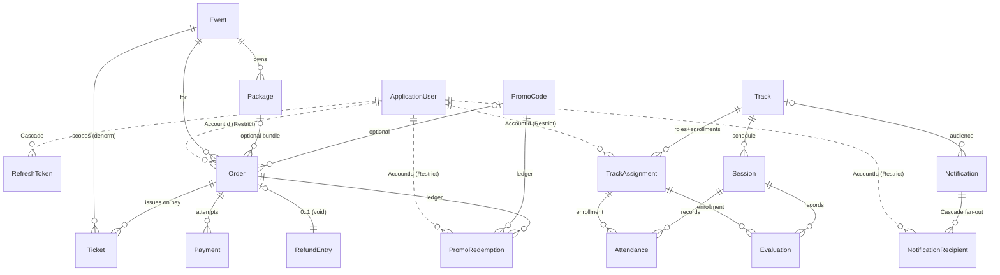

# TEDxAlkawmia — Data Model

> **Version:** 1.0
> **Date:** 2026-07-22
> **Status:** Draft — authoritative for the database layer (SRS §5 defers here)
> **Reads from:** [01 — PRD](./01-PRD.md) · [02 — SRS](./02-SRS.md) · [07 — API Contract](./07-ApiContract.md) · [08 — Decision Log](./08-DecisionLog.md)
> **Decisions:** grilling sessions (D:Q1–Q28) + architecture pass (D:Q29–Q55) + the FK revision, cited as **(D:Qn)**.
> **Design companion:** [architecture/Database.md](./architecture/Database.md) (in-context view) · [architecture/ERD.md](./architecture/ERD.md) (relationship rules) · [architecture/ClassDiagrams.md](./architecture/ClassDiagrams.md) (aggregate behavior) · [architecture/StateMachines.md](./architecture/StateMachines.md) (lifecycles).

---

## Purpose & authority

This document is the **single source of truth for the persistent schema**: every table, column, type, constraint, index, and delete behavior. The SRS (§5), API Contract, and architecture set all defer to it. Where the architecture companion ([architecture/Database.md](./architecture/Database.md)) shows the same tables from a bounded-context angle, **this document is authoritative** on any difference; the deltas are called out in [§13 Refinements](#13-refinements-over-the-architecture-companion).

It is a **specification**, not code — no migrations, no EF `OnModelCreating` bodies. EF Core mapping *intent* is captured in [§11](#11-ef-core-mapping-notes) so the eventual configuration is unambiguous.

**Proportional design (D:Q51).** The schema is sized to this project's real problems — a modular monolith on a single SQL Server, two backend developers, no external API consumers, no microservice split. Enterprise patterns appear only where an actual invariant or concurrency hazard demands them (held-seat oversell, promo caps, double-scan, token reuse). It is not a DDD showcase; it is also not a bag of anemic CRUD tables.

---

## 0. Conventions (apply to every table)

| Convention | Rule | Decision |
|-----------|------|----------|
| **Primary keys** | `Guid` (`uniqueidentifier`); sequential (`NEWSEQUENTIALID()`-style) where index locality matters | project-wide |
| **Money** | `decimal(18,2)`, EGP; converted to Paymob piastres (`× 100`) **only at the gateway boundary** | D:Q18, Q48, NFR-CMP-03 |
| **Timestamps** | `datetime2`, **UTC**, always suffixed `...Utc` | D:Q27 |
| **Enums** | stored as `int`; exposed on the wire as **PascalCase strings**. Values are frozen in [§10](#10-enum-reference) | D:Q27 |
| **i18n text** | `...En` / `...Ar` column pairs for **admin-curated catalog copy** (events, packages, tracks, sessions). Free-form operator input (evaluation feedback, notification title/body, contact message) is **single-column** — it is not translated | scope |
| **Audit** (`IAuditable`) | `CreatedAtUtc`, `CreatedBy`, `UpdatedAtUtc?`, `UpdatedBy?` — set by a `SaveChanges` **interceptor** from `ICurrentUser` + `IClock`; handlers never write them | D:Q54 |
| **Soft-delete** (`ISoftDeletable`) | `IsDeleted` (bit) + `DeletedAtUtc` (datetime2?), enforced by a **global query filter**; **catalog/identity tables only** — financial and history rows are never deleted | D:Q54, SRS §5 |
| **Concurrency** | `RowVersion` (`rowversion`) only where concurrent writers race for the same row | D:Q54 |
| **Actor / audit stamps** | `CreatedBy`, `UpdatedBy`, `CheckedInBy`, `RecordedBy`, `EvaluatedBy`, `AssignedBy`, `EndedBy`, `RefundedBy`, `SentBy` are **plain `Guid` account references, NOT FK-constrained** — they are immutable historical stamps that must survive a soft-deleted or reassigned actor | [§13](#13-refinements-over-the-architecture-companion) |
| **Cross-context relational FK** | a **real** FK to `ApplicationUser.Id` with **`DeleteBehavior.Restrict`** and **no navigation property in code** (reference by `AccountId` value only) | D:Q51 revision |

**FK revision vs. NFR-MNT-02.** NFR-MNT-02 (read literally as "no FK across contexts") is **superseded** by the D:Q51 addendum: cross-context relationships keep a real database FK with `Restrict`, and the decoupling is a **code rule** — no cross-context EF navigation properties. This gives referential integrity at the DB while keeping the contexts independently reasoned-about in code. See [architecture/ERD.md](./architecture/ERD.md).

### 0.1 Cross-cutting column matrix

| Table | Context | Audit | Soft-delete | RowVersion |
|-------|---------|:----:|:----------:|:---------:|
| `ApplicationUser` | Identity | ✅ | ✅ | Identity `ConcurrencyStamp` |
| `RefreshToken` | Identity | `CreatedAtUtc` only | — | — |
| `Event` | Ticketing | ✅ | ✅ | ✅ |
| `Package` | Ticketing | ✅ | ✅ | ✅ |
| `Order` | Ticketing | ✅ | — (append-only) | ✅ |
| `Ticket` | Ticketing | ✅ | — (append-only) | ✅ |
| `Payment` | Ticketing | ✅ | — (append-only) | — |
| `RefundEntry` | Ticketing | ✅ | — (append-only) | — |
| `PromoCode` | Ticketing | ✅ | ✅ | ✅ |
| `PromoRedemption` | Ticketing | `CreatedAtUtc` only | — (append-only) | — |
| `Track` | Training | ✅ | ✅ | ✅ |
| `TrackAssignment` | Training | ✅ | — (lifecycle via `EndedAtUtc`) | ✅ |
| `Session` | Training | ✅ | ✅ | ✅ |
| `Attendance` | Training | ✅ | — (update to correct) | ✅ |
| `Evaluation` | Training | ✅ | — (update to correct) | ✅ |
| `Notification` | Communications | `CreatedAtUtc`+`SentBy` | — | — |
| `NotificationRecipient` | Communications | `CreatedAtUtc` only | — | — |
| `ContactMessage` | Communications | ✅ | — (lifecycle via `Status`) | — |
| `OutboxMessage` | Cross-cutting | `CreatedAtUtc` only | — | — |

---

## 1. Identity context

### 1.1 `ApplicationUser` — `: IdentityUser<Guid>` (D:Q46)

Inherits the full `IdentityUser<Guid>` column set. The table below lists **every** persisted column: the inherited Identity columns (kept explicit so this doc is self-contained) **plus** the app-specific profile columns.

| Column | Type | Null | Source | Notes |
|--------|------|:---:|:------:|-------|
| `Id` | `uniqueidentifier` PK | | Identity | **The account id every other context references by value.** |
| `UserName`, `NormalizedUserName` | `nvarchar(256)` | | Identity | **set equal to `Email`** — login is by email, but Identity requires a username; `NormalizedUserName` **unique** |
| `Email`, `NormalizedEmail` | `nvarchar(256)` | | Identity | `NormalizedEmail` **unique** |
| `EmailConfirmed` | `bit` | | Identity | |
| `PasswordHash`, `SecurityStamp`, `ConcurrencyStamp` | `nvarchar(max)` | | Identity | crypto; `SecurityStamp` backs password-reset tokens (§1.2); `ConcurrencyStamp` is the optimistic token |
| `PhoneNumber` | `nvarchar(32)` | ✔ | Identity | the API's `phone` (FR-USER-01/02) — reuses Identity's built-in column, not a custom one |
| `PhoneNumberConfirmed`, `TwoFactorEnabled` | `bit` | | Identity | present on the base type; unused features, left at defaults |
| `LockoutEnd` | `datetimeoffset` | ✔ | Identity | |
| `LockoutEnabled`, `AccessFailedCount` | `bit` / `int` | | Identity | lockout policy |
| `FirstName` | `nvarchar(100)` | | app | editable (FR-USER-02) |
| `LastName` | `nvarchar(100)` | | app | editable (FR-USER-02); `sort` whitelist key (API §3) |
| `Bio` | `nvarchar(1000)` | ✔ | app | editable free-text (FR-USER-01/02) |
| `ProfilePictureUrl` | `nvarchar(500)` | ✔ | app | Cloudinary URL only; image bytes never stored (FR-USER-03, EIR-02) |
| `GlobalRole` | `int` enum | | app | **Attendee \| Admin**, default `Attendee` — a **column, not Identity roles** (D:Q36) |
| `IsActive` | `bit` | | app | `false` blocks login + refresh (D:Q10, FR-USER-06) |
| audit + `IsDeleted` + `DeletedAtUtc` | | | app | soft-deletable identity entity (FR-USER-07) |

- Configured via **`AddIdentityCore`** with **no roles store, no claims/external-login/user-token tables** (D:Q46). Per-track roles are `TrackAssignment` rows, not Identity roles.
- `UserName`/`NormalizedUserName` are **populated = the email** at registration (there is no separate username concept in the product); the SPA never surfaces a username. Display name is `FirstName + LastName` (no stored `FullName` column).
- **Unique indexes** `UQ_User_NormalizedEmail`, `UQ_User_NormalizedUserName` (Identity default; effectively the same value as email).

### 1.2 `RefreshToken` (D:Q47)

| Column | Type | Null | Notes |
|--------|------|:---:|-------|
| `Id` | `uniqueidentifier` PK | | |
| `AccountId` | `uniqueidentifier` FK → `ApplicationUser` | | **intra-Identity; `DeleteBehavior.Cascade`** (pure dependent, SRS §5) |
| `TokenHash` | `nvarchar(88)` | | **SHA-256 of the raw token — raw never stored** |
| `ExpiresAtUtc` | `datetime2` | | 7-day default (D:Q24) |
| `CreatedAtUtc` | `datetime2` | | |
| `CreatedByIp` | `nvarchar(45)` | ✔ | optional |
| `RevokedAtUtc` | `datetime2` | ✔ | `null` = active |
| `ReplacedByTokenHash` | `nvarchar(88)` | ✔ | rotation-chain link |
| `ReasonRevoked` | `int` enum | ✔ | Rotated \| Reuse \| Logout \| Expired |

- **Unique index** `UQ_RefreshToken_TokenHash`; **index** `IX_RefreshToken_AccountId` (revoke-all-on-logout / reuse).
- **Reuse detection:** presenting a token whose row is already revoked ⇒ walk `ReplacedByTokenHash` and revoke the whole family ⇒ `TOKEN_REUSED` (D:Q24, Q47). See [architecture/SequenceDiagrams §4](./architecture/SequenceDiagrams.md).
- **Password reset** uses Identity's built-in `SecurityStamp`-backed provider — **no table**; `RESET_TOKEN_INVALID` = a failed `ResetPasswordAsync`.

---

## 2. Eventing / Ticketing context

### 2.1 `Event` (D:Q48)

| Column | Type | Null | Notes |
|--------|------|:---:|-------|
| `Id` | `uniqueidentifier` PK | | |
| `TitleEn`, `TitleAr` | `nvarchar(200)` | | i18n |
| `DescriptionEn`, `DescriptionAr` | `nvarchar(max)` | | i18n. The list endpoint's `summary` is a **server-side truncation/projection of `Description`**, not a separate stored column |
| `TrackId` | `uniqueidentifier` | ✔ | owning track, **value reference** (no nav prop) |
| `Venue` | `nvarchar(300)` | | |
| `StartsAtUtc`, `EndsAtUtc` | `datetime2` | | |
| `Capacity` | `int` | | total seats (> 0) |
| `TicketPrice` | `decimal(18,2)` | | **≥ 0 face price** (Model B). `0` ⇒ free individual ticket → confirm-free path. Negative ⇒ `422 INVALID_TICKET_PRICE` (D:Q1, Q48) |
| `MaxIndividualQtyPerOrder` | `int` | ✔ | **`null` = no cap** (mirrors package cap, D:Q1) |
| `Status` | `int` enum | | Draft \| Published \| Archived \| Cancelled (D:Q23) |
| `ImageUrl` | `nvarchar(500)` | ✔ | Cloudinary URL |
| audit + `IsDeleted` + `DeletedAtUtc` + `RowVersion` | | | |

- **Remaining seats is computed, never stored** (D:Q3, FR-EVT-07): `Capacity − (held pending seats + issued/checked-in seats)`.
- **Zero packages is valid and publishable** — the event still sells individual tickets (Model B).

### 2.2 `Package` — optional child of `Event` (D:Q48)

| Column | Type | Null | Notes |
|--------|------|:---:|-------|
| `Id` | `uniqueidentifier` PK | | |
| `EventId` | `uniqueidentifier` FK → `Event` | | **intra-context**, `DeleteBehavior.Cascade` within the aggregate (moot — events are soft-deleted) |
| `NameEn`, `NameAr` | `nvarchar(200)` | | |
| `Price` | `decimal(18,2)` | | bundle unit price (≥ 0) |
| `SeatsPerPackage` | `int` | | seats this bundle grants (> 0) |
| `MaxQuantityPerOrder` | `int` | ✔ | `null` = no cap (D:Q2) |
| `IsActive` | `bit` | | |
| audit + `IsDeleted` + `DeletedAtUtc` + `RowVersion` | | | |

### 2.3 `Order` — flat, append-only; **no `OrderItem` table** (D:Q49)

| Column | Type | Null | Notes |
|--------|------|:---:|-------|
| `Id` | `uniqueidentifier` PK | | |
| `OrderReference` | `nvarchar(20)` | | public code, **unique** |
| `AccountId` | `uniqueidentifier` FK → `ApplicationUser` | | buyer; **cross-context, `Restrict`** |
| `EventId` | `uniqueidentifier` FK → `Event` | | `Restrict` |
| `PackageId` | `uniqueidentifier` FK → `Package` | ✔ | **`null` ⇒ individual-ticket order** (Model B); `Restrict` |
| `UnitType` | `int` enum | | Individual \| Package (explicit alongside `PackageId`) |
| `UnitNameSnapshot` | `nvarchar(200)` | | **event title** (individual order) or **package name** (package order) captured **at reserve** (FR-ORD-04) — so an order/receipt renders correctly even after the event or package is renamed |
| `Quantity` | `int` | | seats in this order (≥ 1; ≤ event/package cap) |
| `UnitPriceSnapshot` | `decimal(18,2)` | | event `TicketPrice` **or** package `Price` **at reserve** |
| `SubtotalSnapshot` | `decimal(18,2)` | | `UnitPriceSnapshot × Quantity` |
| `DiscountSnapshot` | `decimal(18,2)` | | from promo, else `0` |
| `TotalSnapshot` | `decimal(18,2)` | | `max(Subtotal − Discount, 0)` (D:Q18) |
| `PromoCodeId` | `uniqueidentifier` FK → `PromoCode` | ✔ | `Restrict` |
| `PromoCodeSnapshot` | `nvarchar(40)` | ✔ | the code string, for audit |
| `Status` | `int` enum | | PendingPayment \| Paid \| Cancelled \| Expired |
| `HoldExpiresAtUtc` | `datetime2` | ✔ | 15-min hold; `null` once Paid (D:Q3) |
| `PaymobOrderId` | `nvarchar(64)` | ✔ | `null` until payment initiated |
| audit + `RowVersion` | | | **no soft-delete** — cancel/expire are *statuses* (append-only) |

- **Indexes:** `UQ_Order_OrderReference`; `IX_Order_Event_Status (EventId, Status)` (held-seats scan); `IX_Order_Account_Event_Status (AccountId, EventId, Status)` — the **one-active-pending-order-per-event** rule (D:Q5, `ACTIVE_ORDER_EXISTS`).
- **Anti-tamper:** the server re-prices at reserve against `UnitPriceSnapshot` → `PRICE_CHANGED` (409) on mismatch (D:Q4).
- **Cancelled identity (Issue 7):** a voided-paid order and a user-cancelled unpaid order **both** land in `Cancelled`. They are distinguished by the presence of a [`RefundEntry`](#26-refundentry--issue-7-appended-here), never by status. Reports MUST join `RefundEntry`/`Payment`, not read `Status` alone.

### 2.4 `Ticket` — one row per seat, issued on payment confirmation (D:Q49)

| Column | Type | Null | Notes |
|--------|------|:---:|-------|
| `Id` | `uniqueidentifier` PK | | |
| `OrderId` | `uniqueidentifier` FK → `Order` | | `Restrict` (financial history — orders never hard-delete) |
| `EventId` | `uniqueidentifier` FK → `Event` | | **denormalized** for the event-scoped scan; `Restrict` |
| `TicketReference` | `nvarchar(20)` | | public, e.g. `TKT-7F3A9C`, **unique** |
| `QrSecretHash` | `nvarchar(88)` | | **SHA-256 of the 256-bit secret — raw never stored** (D:Q8) |
| `GuestName` | `nvarchar(200)` | ✔ | optional holder name; a nameless ticket is still valid (Persona: Kareem) |
| `Status` | `int` enum | | Issued \| CheckedIn \| Voided (D:Q7) |
| `CheckedInAtUtc` | `datetime2` | ✔ | |
| `CheckedInBy` | `uniqueidentifier` | ✔ | Admin scanner (**stamp, not FK**) |
| audit + `RowVersion` | | | append-only; `RowVersion` guards idempotent check-in |

- **Indexes:** `UQ_Ticket_QrSecretHash`, `UQ_Ticket_TicketReference`, `IX_Ticket_Event_Status (EventId, Status)` (scan path).
- Tickets are created **only** by `Order.MarkAsPaid` (D:Q49) — never independently. Lifecycle in [architecture/StateMachines §2](./architecture/StateMachines.md).

### 2.5 `Payment` — payment-attempt ledger (FR-PAY-05, appended here)

> Omitted from the architecture companion; **authoritative here.** Backs `GET /api/v1/admin/payments` (reconciliation) and webhook idempotency.

| Column | Type | Null | Notes |
|--------|------|:---:|-------|
| `Id` | `uniqueidentifier` PK | | |
| `OrderId` | `uniqueidentifier` FK → `Order` | | `Restrict`; one order may have several attempts |
| `PaymobOrderId` | `nvarchar(64)` | ✔ | Paymob's order id |
| `PaymobTransactionId` | `nvarchar(64)` | ✔ | Paymob txn id; **unique when present** — enforces webhook idempotency (SRS §5) |
| `PaymentSessionId` | `nvarchar(128)` | ✔ | checkout/intention id (D:Q28a) |
| `IdempotencyKey` | `nvarchar(64)` | ✔ | client-supplied `Idempotency-Key` (D:Q28a) |
| `Status` | `int` enum | | Initiated \| Succeeded \| Failed |
| `Amount` | `decimal(18,2)` | | EGP; validated == order `TotalSnapshot` (FR-PAY-04) |
| `Currency` | `nvarchar(3)` | | `EGP` |
| `RawPayloadJson` | `nvarchar(max)` | ✔ | **verified** webhook payload for reconciliation (FR-PAY-05). **No card PAN / secrets** — scrubbed before store (NFR-SEC log-hygiene, D:Q41) |
| audit (`CreatedAtUtc`, `UpdatedAtUtc?`) | | | attempt created at initiation; updated by the verified webhook |

- **Indexes:** `UQ_Payment_PaymobTransactionId` (**filtered** `WHERE PaymobTransactionId IS NOT NULL`) — a second verified webhook for the same txn is a no-op (D:Q28); `IX_Payment_OrderId`; `IX_Payment_Status`.
- Never deleted; a failed attempt stays for support/reconciliation.

### 2.6 `RefundEntry` — Issue 7 (appended here)

> The API Contract (§12, Issue 7) requires the data model to expose "paid-then-refunded" vs. "never-paid" cleanly. Chosen shape: a **queryable table keyed by order** (append-only ledger) rather than a nullable `Order.RefundEntryId` — it keeps `Order` free of a back-pointer and matches the append-only financial convention.

| Column | Type | Null | Notes |
|--------|------|:---:|-------|
| `Id` | `uniqueidentifier` PK | | |
| `OrderId` | `uniqueidentifier` FK → `Order` | | `Restrict`, **unique** (one refund per voided-paid order) |
| `Reason` | `nvarchar(500)` | | admin-supplied void reason |
| `VoidedTicketCount` | `int` | | tickets set to `Voided` |
| `SeatsReleased` | `int` | | not-yet-checked-in seats released (D:Q6) |
| `CheckedInTicketsRetained` | `int` | | non-voidable, seat stays consumed (D:Q6) |
| `RefundedBy` | `uniqueidentifier` | | admin (**stamp, not FK**) |
| `CreatedAtUtc` | `datetime2` | | refund is **offline/manual** (FR-PAY-07) — this row is the record, not a gateway call |

- **Index:** `UQ_RefundEntry_OrderId`. Its existence on a `Cancelled` order marks it as *paid-then-refunded* for reports (§19 of the contract).

### 2.7 `PromoCode` — columns map 1:1 to the flat `422` codes (D:Q50)

| Column | Type | Null | Maps to error |
|--------|------|:---:|---------------|
| `Id` | `uniqueidentifier` PK | | |
| `Code` | `nvarchar(40)` | | normalized upper, **unique** |
| `EventId` | `uniqueidentifier` FK → `Event` | ✔ | `null` = any event; set = scoped → `PROMO_WRONG_EVENT`; `Restrict` |
| `DiscountType` | `int` enum | | Percentage \| FixedAmount |
| `DiscountValue` | `decimal(18,2)` | | percent (0–100) or fixed EGP |
| `IsActive` | `bit` | | → `PROMO_INACTIVE` |
| `ValidFromUtc` | `datetime2` | | → `PROMO_NOT_YET_VALID` |
| `ValidUntilUtc` | `datetime2` | | → `PROMO_EXPIRED` |
| `MaxTotalRedemptions` | `int` | ✔ | → `PROMO_CAP_REACHED` |
| `MaxPerUser` | `int` | ✔ | → `PROMO_USER_LIMIT` |
| audit + `IsDeleted` + `DeletedAtUtc` + `RowVersion` | | | |

### 2.8 `PromoRedemption` — append-only ledger (D:Q50)

| Column | Type | Null | Notes |
|--------|------|:---:|-------|
| `Id` | `uniqueidentifier` PK | | |
| `PromoCodeId` | `uniqueidentifier` FK → `PromoCode` | | `Restrict` |
| `AccountId` | `uniqueidentifier` FK → `ApplicationUser` | | **cross-context, `Restrict`** |
| `OrderId` | `uniqueidentifier` FK → `Order` | | `Restrict` |
| `RedeemedAtUtc` | `datetime2` | | |

- **Indexes:** `IX_PromoRedemption_PromoCode (PromoCodeId)` (global cap count), `IX_PromoRedemption_PromoCode_Account (PromoCodeId, AccountId)` (per-user count).
- Both caps are counted **inside the SERIALIZABLE reserve/pay transaction** (D:Q33, Q50) so concurrent redemptions can't both slip under the limit. Recorded at reserve; **released** by the sweeper on hold-expiry or verified payment failure (D:Q19).

---

## 3. Training context

### 3.1 `Track` (D:Q51)

| Column | Type | Null | Notes |
|--------|------|:---:|-------|
| `Id` | `uniqueidentifier` PK | | |
| `NameEn`, `NameAr` | `nvarchar(200)` | | |
| `Slug` | `nvarchar(120)` | | URL slug |
| `DescriptionEn`, `DescriptionAr` | `nvarchar(max)` | ✔ | |
| `Schedule` | `nvarchar(500)` | ✔ | human-readable cadence text, e.g. "Tuesdays 6–8pm" (FR-TRK-01 — tracks carry name, description, **schedule**). The authoritative per-meeting calendar is the `Session` rows; this is descriptive copy for the track page |
| `IsActive` | `bit` | | |
| audit + `IsDeleted` + `DeletedAtUtc` + `RowVersion` | | | soft-delete **ripples** to end assignments (D:Q14) |

- **Unique** `UQ_Track_Name_Live`: `NameEn` (or `Slug`) **filtered** `WHERE IsDeleted = 0` — names unique **among live tracks** only (FR-TRK-01).

### 3.2 `TrackAssignment` — Member/Board role **and** the enrollment (D:Q51, Q52)

> A **Member** row *is* the enrollment: `enrollmentId` in the API = `TrackAssignment.Id`. There is no separate `Enrollment` table (D:Q52).

| Column | Type | Null | Notes |
|--------|------|:---:|-------|
| `Id` | `uniqueidentifier` PK | | = the API's `enrollmentId` for Member rows |
| `AccountId` | `uniqueidentifier` FK → `ApplicationUser` | | **cross-context, `Restrict`** |
| `TrackId` | `uniqueidentifier` FK → `Track` | | intra-context, `Restrict` |
| `TrackRole` | `int` enum | | **Member \| Board** |
| `StartedAtUtc` | `datetime2` | | assign/enroll date = attendance-% denominator start (API `startedAt`, D:Q52) |
| `EndedAtUtc` | `datetime2` | ✔ | **`null` = active**; set on un-enroll / board-removal / track-delete ripple — **row retained, never deleted** (D:Q11, Q14, FR-ROLE-05) |
| `AssignedBy` | `uniqueidentifier` | | stamp, not FK |
| `EndedBy` | `uniqueidentifier` | ✔ | stamp, not FK |
| audit + `RowVersion` | | | |

**Dual-role invariants as physical constraints (D:Q51) — the `EndedAtUtc IS NULL` predicate is essential** (a re-enrollment after ending must not collide with the ended row):

- `UQ_Assignment_OneActiveMember`: **`UNIQUE(AccountId) WHERE TrackRole = Member AND EndedAtUtc IS NULL`** → ≤ 1 *active* Member track per user (`ALREADY_MEMBER_ELSEWHERE`, race-proof).
- `UQ_Assignment_OneActiveBoard`: **`UNIQUE(AccountId) WHERE TrackRole = Board AND EndedAtUtc IS NULL`** → ≤ 1 *active* Board track per user.
- `IX_Assignment_Track_Role (TrackId, TrackRole, EndedAtUtc)` → roster queries ("active Board / Members of track X").
- **Different-track rule** (no active Member@X + Board@X; Member@X + Board@Y is the sanctioned dual role) → **domain invariant** checked in the same transaction (`MEMBER_BOARD_SAME_TRACK`). A filtered index can't express the cross-row same-track comparison without a trigger/indexed view; the concurrency-dangerous "one active per role" part is already covered by the two filtered indexes above.

### 3.3 `Session` (D:Q52)

| Column | Type | Null | Notes |
|--------|------|:---:|-------|
| `Id` | `uniqueidentifier` PK | | |
| `TrackId` | `uniqueidentifier` FK → `Track` | | intra-context, `Restrict` |
| `TitleEn`, `TitleAr` | `nvarchar(200)` | | |
| `Description` | `nvarchar(max)` | ✔ | operator free-text (single column) |
| `StartsAtUtc`, `EndsAtUtc` | `datetime2` | | past `EndsAtUtc` = "occurred" for attendance/eval preconditions (D:Q16) |
| `Location` | `nvarchar(300)` | | |
| `Status` | `int` enum | | Scheduled \| Held \| Cancelled |
| audit + `IsDeleted` + `DeletedAtUtc` + `RowVersion` | | | a session **with records** cannot hard-delete → soft-delete/cancel only (`SESSION_HAS_RECORDS`, D:Q13) |

### 3.4 `Attendance` (D:Q52) — keyed by **enrollment**

| Column | Type | Null | Notes |
|--------|------|:---:|-------|
| `Id` | `uniqueidentifier` PK | | |
| `SessionId` | `uniqueidentifier` FK → `Session` | | `Restrict` |
| `EnrollmentId` | `uniqueidentifier` FK → `TrackAssignment` | | **intra-Training** (the Member row) → no cross-context FK here; `Restrict` |
| `Status` | `int` enum | | Present \| Late \| Absent |
| `RecordedAtUtc` | `datetime2` | | |
| `RecordedBy` | `uniqueidentifier` | | Board member (stamp, not FK) |
| audit + `RowVersion` | | | |

- **Unique** `UQ_Attendance_Session_Enrollment (SessionId, EnrollmentId)` — one record per member **per enrollment** per session (re-record = update, not duplicate; matches API upsert + `ENROLLMENT_NOT_IN_TRACK`). Keying on the enrollment (not the account) gives a re-enrolled member a **clean attendance %** on the new enrollment (D:Q11).
- **Attendance % is computed, never stored:** `(Present + Late) / recorded-occurred sessions` — **Late counts as attended** (D:Q12); an `Absent` must be explicitly recorded.

### 3.5 `Evaluation` (D:Q52) — session-scoped, keyed by **enrollment**

| Column | Type | Null | Notes |
|--------|------|:---:|-------|
| `Id` | `uniqueidentifier` PK | | |
| `SessionId` | `uniqueidentifier` FK → `Session` | | `Restrict` — every evaluation is written on a session (`PUT /sessions/{id}/evaluations`) |
| `EnrollmentId` | `uniqueidentifier` FK → `TrackAssignment` | | intra-Training (the Member row); `Restrict` |
| `Score` | `int` | | **0–100 inclusive** (D:Q17); reject `<0`/`>100`/non-integer → `INVALID_SCORE` |
| `Feedback` | `nvarchar(max)` | ✔ | operator free-text, **single column** (API `feedback`), optional |
| `EvaluatedBy` | `uniqueidentifier` | | Board (stamp, not FK) |
| audit + `RowVersion` | | | overwrite-in-place, no version history (D:Q17) |

- **Unique** `UQ_Evaluation_Session_Enrollment (SessionId, EnrollmentId)` — one per (session, enrollment).
- **Preconditions (D:Q16):** session `EndsAtUtc` in the **past** → else `SESSION_NOT_OCCURRED`; enrollment **active** (`EndedAtUtc IS NULL`) → else `MEMBER_NOT_ENROLLED`. Attendance is **not** a prerequisite.
- **Visibility** (member sees own; Board sees their track) is enforced in the handler, not the schema (D:Q52).

---

## 4. Communications context

### 4.1 `Notification` (D:Q21)

| Column | Type | Null | Notes |
|--------|------|:---:|-------|
| `Id` | `uniqueidentifier` PK | | |
| `Title` | `nvarchar(200)` | | operator free-text (single column) |
| `Body` | `nvarchar(max)` | | operator free-text |
| `AudienceType` | `int` enum | | PlatformWide \| GlobalRole \| Track |
| `AudienceRole` | `int` enum | ✔ | set when `AudienceType = GlobalRole` (Attendee \| Admin) |
| `TrackId` | `uniqueidentifier` FK → `Track` | ✔ | set when `AudienceType = Track`; `Restrict` |
| `SentBy` | `uniqueidentifier` | | Admin or Board sender (stamp, not FK) |
| `CreatedAtUtc` | `datetime2` | | |

- **Fan-out at send time:** recipients are resolved and materialized into `NotificationRecipient` rows immediately (D:Q21); the API returns `recipientsCreated`.

### 4.2 `NotificationRecipient` — per-recipient row, per-row read state (D:Q21)

| Column | Type | Null | Notes |
|--------|------|:---:|-------|
| `Id` | `uniqueidentifier` PK | | |
| `NotificationId` | `uniqueidentifier` FK → `Notification` | | **`DeleteBehavior.Cascade`** (pure dependent, SRS §5) |
| `AccountId` | `uniqueidentifier` FK → `ApplicationUser` | | **cross-context, `Restrict`** |
| `IsRead` | `bit` | | default `false` |
| `ReadAtUtc` | `datetime2` | ✔ | |
| `CreatedAtUtc` | `datetime2` | | |

- **Unique** `UQ_NotifRecipient_Notif_Account (NotificationId, AccountId)`; **index** `IX_NotifRecipient_Account_IsRead (AccountId, IsRead)` (the inbox + `unreadOnly` filter, FR-NTF-03).
- The two FKs carry **different** delete behaviors on purpose: cascade from the notification (SRS §5 "notification recipients CASCADE"), restrict on the account (cross-context rule). See [§6](#6-referential-integrity--delete-behavior).

### 4.3 `ContactMessage` (D:Q20)

| Column | Type | Null | Notes |
|--------|------|:---:|-------|
| `Id` | `uniqueidentifier` PK | | |
| `Name` | `nvarchar(200)` | | |
| `Email` | `nvarchar(256)` | | format-validated; **not** an account FK (public, unauthenticated) |
| `Subject` | `nvarchar(200)` | | ≤ 200 chars (D:Q20) |
| `Message` | `nvarchar(2000)` | | ≤ 2000 chars |
| `Status` | `int` enum | | New \| Read \| Archived (lifecycle, no soft-delete) |
| audit (`CreatedAtUtc`; `UpdatedAtUtc?`/`UpdatedBy?` = admin who triaged) | | | |

- The **only unauthenticated write** in the system (D:Q20); **rate-limited by IP** at the edge (NFR-SEC-10) — not a schema concern.

---

## 5. Cross-cutting: `OutboxMessage` (D:Q53)

| Column | Type | Null | Notes |
|--------|------|:---:|-------|
| `Id` | `uniqueidentifier` PK | | |
| `Type` | `nvarchar(100)` | | e.g. `OrderConfirmationEmail`, `TicketIssuedNotification` |
| `PayloadJson` | `nvarchar(max)` | | **ids + non-secret fields only** (log-hygiene, D:Q41) |
| `CreatedAtUtc` | `datetime2` | | |
| `ProcessedAtUtc` | `datetime2` | ✔ | `null` = pending |
| `Attempts` | `int` | | |
| `LastError` | `nvarchar(max)` | ✔ | |
| `NextAttemptAtUtc` | `datetime2` | ✔ | backoff |

- **Filtered index** `IX_Outbox_Pending`: `WHERE ProcessedAtUtc IS NULL` (+ `NextAttemptAtUtc`) — cheap "due, unprocessed" sweep.
- Written **inside the business transaction**; drained **after commit** by the sweeper; **at-least-once** (consumers idempotent). See [architecture/SequenceDiagrams §2–3](./architecture/SequenceDiagrams.md). Has **no FK** (deliberately decoupled) — hence omitted from the ERD.

---

## 6. Referential integrity & delete behavior

Rule (SRS §5): **financial and training history → `RESTRICT`; pure dependents → `CASCADE`; catalog/identity → soft-delete (no physical cascade fires).**

| FK | From → To | Context | Behavior | Rationale |
|----|-----------|---------|:--------:|-----------|
| `RefreshToken.AccountId` | RefreshToken → ApplicationUser | intra-Identity | **Cascade** | pure dependent (SRS §5) |
| `NotificationRecipient.NotificationId` | Recipient → Notification | intra-Comms | **Cascade** | pure dependent (SRS §5) |
| `Package.EventId` | Package → Event | intra-Ticketing | Cascade | aggregate child (moot — events soft-delete) |
| `Order.AccountId` | Order → ApplicationUser | **cross** | **Restrict** | financial history; no nav prop |
| `Order.EventId` / `Order.PackageId` / `Order.PromoCodeId` | Order → Event/Package/PromoCode | intra-Ticketing | Restrict | financial history |
| `Ticket.OrderId` / `Ticket.EventId` | Ticket → Order/Event | intra-Ticketing | Restrict | financial history |
| `Payment.OrderId` | Payment → Order | intra-Ticketing | Restrict | financial history |
| `RefundEntry.OrderId` | RefundEntry → Order | intra-Ticketing | Restrict | financial history |
| `PromoRedemption.*` | Redemption → PromoCode/Account/Order | mixed | Restrict | financial ledger (`Account` cross-context) |
| `TrackAssignment.AccountId` | Assignment → ApplicationUser | **cross** | **Restrict** | training history; no nav prop |
| `TrackAssignment.TrackId` | Assignment → Track | intra-Training | Restrict | history |
| `Session.TrackId` | Session → Track | intra-Training | Restrict | history |
| `Attendance.*` / `Evaluation.*` | → Session/Enrollment | intra-Training | Restrict | training history |
| `NotificationRecipient.AccountId` | Recipient → ApplicationUser | **cross** | **Restrict** | cross-context rule (the *notification* cascade is the other FK) |
| `Notification.TrackId` | Notification → Track | intra-Comms→Training ref | Restrict | value-scoped audience |

**No cross-context navigation properties exist in code** (D:Q51 revision) — the `Restrict` cross-context FKs above are DB-level only; contexts reference `ApplicationUser` by `AccountId` value. Because users, events, tracks, and sessions are **soft-deleted, never hard-deleted**, the `Restrict` edges are a safety net that in practice never blocks a delete.

---

## 7. Soft-delete vs. append-only vs. lifecycle-status

Three distinct "not gone" mechanisms — do not conflate them:

| Mechanism | Tables | Mechanism detail |
|-----------|--------|------------------|
| **Soft-delete** (`IsDeleted` + `DeletedAtUtc`, global query filter) | ApplicationUser, Event, Package, PromoCode, Track, Session | catalog/identity; hidden from normal reads, restorable |
| **Append-only** (no delete, ever) | Order, Ticket, Payment, RefundEntry, PromoRedemption, Notification, NotificationRecipient, OutboxMessage | financial / audit ledgers |
| **Lifecycle status/date** (not a delete flag) | Order.`Status`, Ticket.`Status`, TrackAssignment.`EndedAtUtc`, ContactMessage.`Status`, Session.`Status` | state transitions, retained |

Financial records are **never** deleted (NFR-REL-03) — a refund is a `RefundEntry` row, not a mutation or removal of the `Order`/`Ticket`.

---

## 8. ERD

Solid edges = intra-context FK **with** a navigation property. Dashed edges = **cross-context** FK to `ApplicationUser` (real FK, `Restrict`, **no nav property**). `OutboxMessage` has no FK and is omitted. Full relationship rules: [architecture/ERD.md](./architecture/ERD.md).

---

## 9. Index & uniqueness summary (invariant-critical)

| Index | Table | Kind | Enforces |
|-------|-------|------|----------|
| `UQ_User_NormalizedEmail` | ApplicationUser | unique | one account per email |
| `UQ_RefreshToken_TokenHash` | RefreshToken | unique | token lookup / no dupes |
| `UQ_Order_OrderReference` | Order | unique | unambiguous public code |
| `IX_Order_Event_Status` | Order | `(EventId, Status)` | held-seats computation |
| `IX_Order_Account_Event_Status` | Order | `(AccountId, EventId, Status)` | one active pending order **per event** (D:Q5) |
| `UQ_Ticket_QrSecretHash` | Ticket | unique | no shared QR; scan lookup |
| `UQ_Ticket_TicketReference` | Ticket | unique | unambiguous public code |
| `IX_Ticket_Event_Status` | Ticket | `(EventId, Status)` | event-scoped check-in scan |
| `UQ_Payment_PaymobTransactionId` | Payment | unique **filtered** `WHERE txn IS NOT NULL` | webhook idempotency; unique Paymob txn (SRS §5) |
| `UQ_RefundEntry_OrderId` | RefundEntry | unique | ≤ 1 refund per voided-paid order |
| `UQ_PromoCode_Code` | PromoCode | unique | unique code |
| `IX_PromoRedemption_PromoCode` | PromoRedemption | `(PromoCodeId)` | global cap count |
| `IX_PromoRedemption_PromoCode_Account` | PromoRedemption | `(PromoCodeId, AccountId)` | per-user promo limit |
| `UQ_Track_Name_Live` | Track | unique **filtered** `WHERE IsDeleted = 0` | unique name among live tracks |
| `UQ_Assignment_OneActiveMember` | TrackAssignment | unique **filtered** `WHERE Member AND EndedAtUtc IS NULL` | ≤ 1 active Member track/user |
| `UQ_Assignment_OneActiveBoard` | TrackAssignment | unique **filtered** `WHERE Board AND EndedAtUtc IS NULL` | ≤ 1 active Board track/user |
| `IX_Assignment_Track_Role` | TrackAssignment | `(TrackId, TrackRole, EndedAtUtc)` | roster queries |
| `UQ_Attendance_Session_Enrollment` | Attendance | `(SessionId, EnrollmentId)` | one attendance per (session, enrollment) |
| `UQ_Evaluation_Session_Enrollment` | Evaluation | `(SessionId, EnrollmentId)` | one evaluation per (session, enrollment) |
| `UQ_NotifRecipient_Notif_Account` | NotificationRecipient | `(NotificationId, AccountId)` | no duplicate delivery |
| `IX_NotifRecipient_Account_IsRead` | NotificationRecipient | `(AccountId, IsRead)` | inbox + `unreadOnly` |
| `IX_Outbox_Pending` | OutboxMessage | filtered `WHERE ProcessedAtUtc IS NULL` | cheap pending sweep |

---

## 10. Enum reference (frozen `int` values)

Wire form is the PascalCase name; DB form is the `int`. Never renumber — append only.

| Enum | 0 | 1 | 2 | 3 |
|------|---|---|---|---|
| `GlobalRole` | Attendee | Admin | | |
| `ReasonRevoked` | Rotated | Reuse | Logout | Expired |
| `EventStatus` | Draft | Published | Archived | Cancelled |
| `OrderStatus` | PendingPayment | Paid | Cancelled | Expired |
| `OrderUnitType` | Individual | Package | | |
| `TicketStatus` | Issued | CheckedIn | Voided | |
| `PaymentStatus` | Initiated | Succeeded | Failed | |
| `DiscountType` | Percentage | FixedAmount | | |
| `TrackRole` | Member | Board | | |
| `SessionStatus` | Scheduled | Held | Cancelled | |
| `AttendanceStatus` | Present | Late | Absent | |
| `NotificationAudienceType` | PlatformWide | GlobalRole | Track | |
| `ContactStatus` | New | Read | Archived | |

---

## 11. EF Core mapping notes

Single `AppDbContext` implementing `IApplicationDbContext` (D:Q31); one context, three context **folders** of `IEntityTypeConfiguration<T>` classes (D:Q29a). Intent, not code:

- **Keys / Guid:** `Guid` PKs; sequential default where locality matters. No client-side identity.
- **Money:** `.HasPrecision(18, 2)` on every `decimal`. Piastre conversion is application code at the Paymob boundary, never a stored column.
- **Enums:** `.HasConversion<int>()` — stored as `int`, per [§10](#10-enum-reference).
- **RowVersion:** `.IsRowVersion()` on `RowVersion` columns; `DbUpdateConcurrencyException` → `409 CONCURRENCY_CONFLICT`.
- **Audit interceptor:** a `SaveChangesInterceptor` stamps `IAuditable` from `ICurrentUser` + `IClock` (D:Q54). Handlers never set audit columns.
- **Soft-delete:** `.HasQueryFilter(e => !e.IsDeleted)` on every `ISoftDeletable`. Cross-FK query-filter mismatch warnings are acknowledged/suppressed intentionally (child filters mirror parents).
- **Filtered unique indexes:** `.HasFilter("...")` for the Member/Board caps, live-track name, Paymob txn, and outbox-pending indexes — the filters in [§9](#9-index--uniqueness-summary-invariant-critical) are load-bearing, not optional.
- **Delete behavior:** explicit `.OnDelete(...)` per [§6](#6-referential-integrity--delete-behavior) — `Restrict` for financial/training/cross-context, `Cascade` only for `RefreshToken → User` and `NotificationRecipient → Notification`.
- **Cross-context decoupling:** cross-context FKs are configured with **`.HasPrincipalKey`/explicit FK property but NO navigation property** (D:Q51 revision) — code references `AccountId` values, never `order.Account`.
- **Raw payloads:** `Payment.RawPayloadJson`, `OutboxMessage.PayloadJson` are `nvarchar(max)` (plain JSON strings, not owned/JSON-column types — kept simple; queried rarely, by admin only).
- **Identity:** `AddIdentityCore<ApplicationUser>()` with a **`Guid` key**, no roles/claims/logins/tokens tables (D:Q46).

---

## 12. Traceability

| Decision | Where in this doc |
|----------|-------------------|
| D:Q1/Q48 Model B (face price, nullable package) | §2.1 `Event.TicketPrice`, §2.3 `Order.PackageId` nullable + `UnitType` |
| D:Q3 clock-aware holds | §2.3 `HoldExpiresAtUtc`; §2.1 seats computed |
| D:Q5 one active order per event | `IX_Order_Account_Event_Status` (§2.3, §9) |
| D:Q6 void keeps checked-in seats | §2.6 `RefundEntry` |
| D:Q7/Q8 ticket status + hashed QR | §2.4 |
| D:Q11/Q14 enrollment retained via `EndedAtUtc` | §3.2 |
| D:Q12 Late = attended, % computed | §3.4 |
| D:Q16/Q17 eval preconditions + 0–100 | §3.5 |
| D:Q19/Q50 promo caps in-tx, released on fail | §2.8 |
| D:Q20 contact message | §4.3 |
| D:Q21 notification fan-out + per-row read | §4.1–4.2 |
| D:Q24/Q47 refresh rotation + reuse | §1.2 |
| D:Q46 IdentityCore, Guid, role-as-column | §1.1 |
| D:Q51 revision cross-context FK + Restrict | §0, §6, §11 |
| D:Q52 assignment = enrollment, no Enrollment table | §3.2 |
| D:Q53 outbox | §5 |
| D:Q54 audit / soft-delete / rowversion matrix | §0.1 |
| FR-PAY-05 payment-attempt ledger | §2.5 |
| Issue 7 refund-vs-cancel identity | §2.3 note, §2.6 |
| SRS §5 delete/soft-delete/uniqueness | §6, §7, §9 |

---

## 13. Refinements over the architecture companion

[architecture/Database.md](./architecture/Database.md) is the in-context design view; **this document is authoritative**. A reviewer diffing the two will find these deliberate deltas — each sharpens correctness against the API Contract and SRS §5:

1. **Added tables** the companion omitted: `Payment` (§2.5), `RefundEntry` (§2.6), `Notification`/`NotificationRecipient` (§4.1–4.2), `ContactMessage` (§4.3).
2. **`TrackAssignment` gains `StartedAtUtc`/`EndedAtUtc`** (§3.2); the two filtered unique indexes now include **`AND EndedAtUtc IS NULL`** so a re-enrollment can't collide with an ended row. The companion's `AssignedAtUtc`-only shape could not express enrollment lifecycle.
3. **`Attendance`/`Evaluation` key on `EnrollmentId`**, not `AccountId` (§3.4–3.5) — matching the API's `enrollmentId` upsert and giving a re-enrolled member a clean attendance %. This also removes a cross-context FK from the Training context (they now reference `TrackAssignment` intra-context).
4. **`Evaluation.SessionId` is required** and `Feedback` is a single column (not `CommentEn/Ar`) — the only evaluation write path is session-scoped with single-language `feedback`.
5. **`RefreshToken.AccountId` and `NotificationRecipient.NotificationId` are `Cascade`** (§6), per SRS §5's "pure dependents CASCADE," refining the companion's blanket `Restrict`.
6. **Actor/audit `*By` columns are unconstrained `Guid` stamps** (§0), not FKs — so a soft-deleted admin still resolves in history.

---

*Data model v1.0 — 2026-07-22. Authoritative for the database layer; SRS §5 defers here. Aggregate behavior: [architecture/ClassDiagrams.md](./architecture/ClassDiagrams.md) · lifecycles: [architecture/StateMachines.md](./architecture/StateMachines.md) · flows: [architecture/SequenceDiagrams.md](./architecture/SequenceDiagrams.md).*
