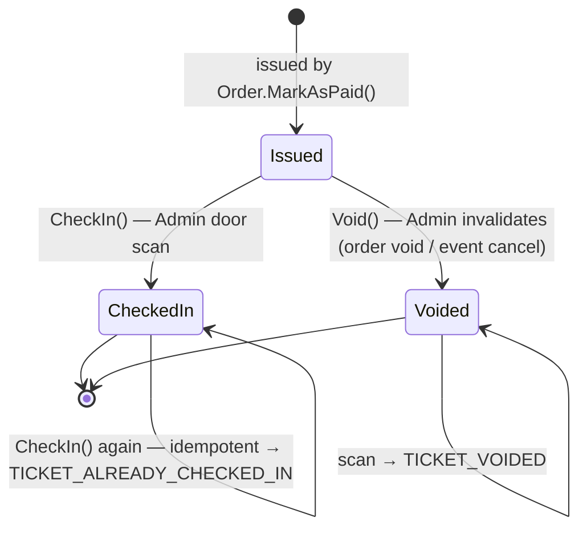
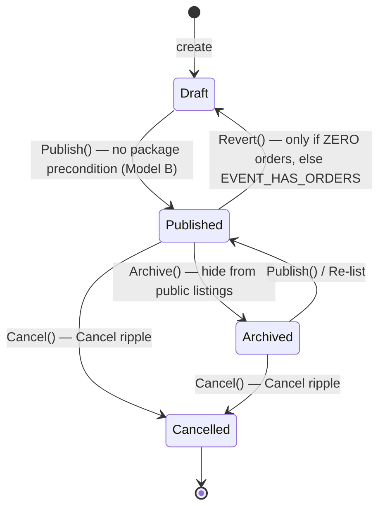
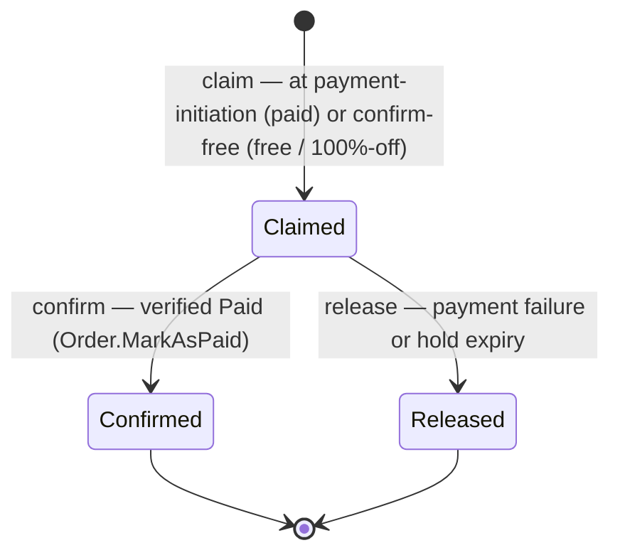
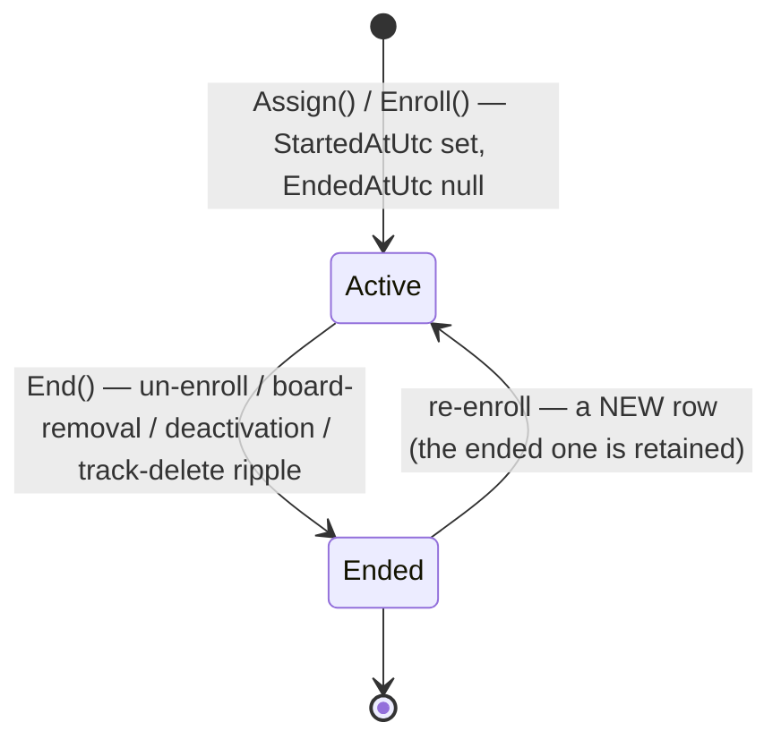
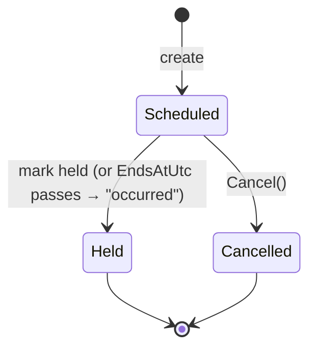
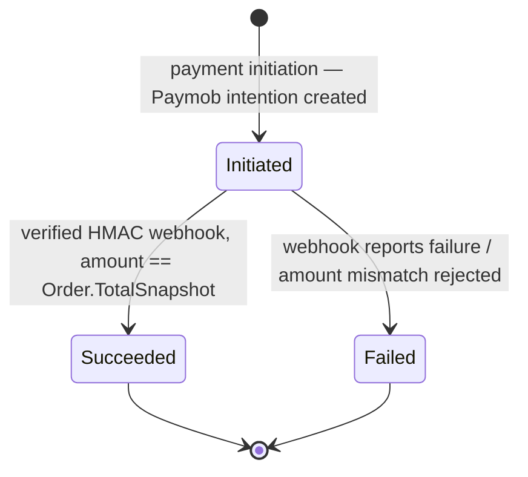
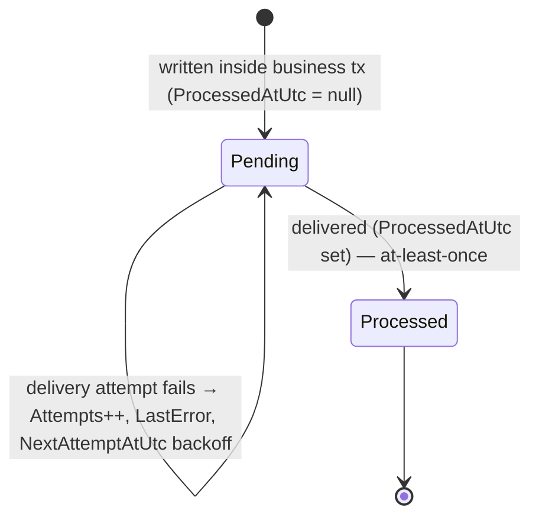

# State Machines — Entity Lifecycles

> **Version:** 1.3 · **Date:** 2026-07-23 · Companion to [[09-SystemDesign#4. Domain Layer Design|09 — System Design §4 (Domain Layer)]]
> **Decisions:** D:Q3, Q6, Q7, Q11, Q13, Q14, Q16, Q19, Q22, Q23, Q24, Q47, Q50, Q53, Q55, Q56 · **Reads from:** [[10-DataModel|10 — Data Model]], [[08-DecisionLog|08 — Decision Log]]

---

## Purpose

The legal state transitions for **every lifecycle-bearing entity** in the platform, and the rule that each transition is an **explicit named method on the aggregate** (D:Q55), never a raw `entity.Status = X` assignment. Illegal transitions are rejected in the method, not caught later.

This document is the **single authority for lifecycle transitions**; [[09-SystemDesign|09 — System Design]] links here rather than re-drawing them, and [[10-DataModel|10 — Data Model]] owns the columns those states persist to. Three families of lifecycle live here (per [[10-DataModel#7. Soft-delete vs. append-only vs. lifecycle-status|10 — Data Model §7]]):

- **Invariant-bearing lifecycles worth a state machine** — `Order`, `Ticket`, `Event` (rich aggregates with guarded transition methods), plus `PromoRedemption`, `TrackAssignment`, `Session`, `Payment`, `RefreshToken`, `OutboxMessage`, whose status/lifecycle-date carries concurrency, precondition, or reliability significance. Several of these (`PromoRedemption`, `Session`, `Payment`, `OutboxMessage`) are **CRUD-simple in code** — their transitions are arbitrated on an owning aggregate or are status-setting guarded by a single rule, not full rich-aggregate methods; the diagrams below document the *legal states*, not a claim that each owns a behavior-heavy aggregate.
- **Trivial linear status** — `ContactMessage` (`New → Read → Archived`) is a guardless admin-triage flow with no side effects or concurrency; it is **noted, not drawn** (§10), matching the "no abstraction without an invariant to protect" rule (D:Q32).

**Legend:** every table below reads *Method | From → To | Guard / effect*. A "write-once" timestamp is stamped **exactly once, inside the guarded method** — never by the audit interceptor (D:Q55).

---

## 1. Order (D:Q3, Q6, Q55)

```mermaid
stateDiagram-v2
    [*] --> PendingPayment : Reserve() — seats held, HoldExpiresAtUtc set
    PendingPayment --> Paid : MarkAsPaid() — verified Paymob webhook / free path; tickets issued
    PendingPayment --> Cancelled : Cancel() — user abandons unpaid order
    PendingPayment --> Expired : Expire() — hold lapsed (sweeper or clock-aware read)
    Paid --> Cancelled : Cancel() — Admin void of a PAID order → RefundEntry recorded
    Paid --> Paid : MarkAsPaid() again — idempotent no-op 
    Cancelled --> [*]
    Expired --> [*]
```

| Method | From → To | Guard / effect |
|--------|-----------|----------------|
| `Reserve` | (new) → PendingPayment | SERIALIZABLE seat check; sets `HoldExpiresAtUtc = now + 15m`; the promo slot is validated (advisory) — it is **claimed** later at pay-init, not here (D:Q3, Q19, Q33). |
| `MarkAsPaid` | PendingPayment → Paid | Only from a **verified HMAC webhook** (or the free / 100%-off path) (D:Q49); issues one `Ticket` per seat; clears `HoldExpiresAtUtc`; stamps **`PaidAtUtc`** (write-once); confirms the promo redemption (`Claimed → Confirmed`). **Idempotent:** a second call on an already-Paid order is a **no-op success** (D:Q55) — Paymob may redeliver. |
| `Cancel` (unpaid) | PendingPayment → Cancelled | **User-initiated** self-cancel of an unpaid order (D:Q6); releases held seats; releases the promo redemption (`Claimed → Released`); stamps **`CancelledAtUtc`** (write-once). Carries **no** `RefundEntry`. |
| `Cancel` (paid void) | Paid → Cancelled | **Admin-only** void of a **paid** order (D:Q6). Voids Issued tickets (`Ticket.Void`), releases **only not-yet-checked-in** seats, retains checked-in tickets (seat stays consumed), and records a **`RefundEntry`** (refund is offline/manual, FR-PAY-07). Stamps **`CancelledAtUtc`** (write-once). |
| `Expire` | PendingPayment → Expired | Hold lapsed. **Held-seats are clock-aware** (D:Q3) so correctness never depends on the sweeper firing — the sweeper just tidies the row. Releases the promo redemption (`Claimed → Released`); stamps **`ExpiredAtUtc`** (write-once). |

- **`Cancelled` is a merge state, not terminal-by-status.** A **paid-then-voided** order and a **user-cancelled unpaid** order **both** land in `Cancelled`; they are distinguished by the presence of a [`RefundEntry`](#2-ticket-dq6-q7-q55), **never** by `Status` (Issue 7). Reports MUST join `RefundEntry`/`Payment`, not read `Status` alone. See [[10-DataModel#2.3 `Order` — flat, append-only; **no `OrderItem` table** (D:Q49)|10 — Data Model §2.3]].
- **Terminal states** (Cancelled/Expired) reject every transition; `Paid` accepts only the idempotent `MarkAsPaid`-on-Paid and the Admin `Cancel`-void.
- Append-only: cancellation is a **status**, not a delete (no `IsDeleted` on Order, D:Q54).
- **Write-once lifecycle timestamps (D:Q55):** `PaidAtUtc`/`CancelledAtUtc`/`ExpiredAtUtc` are set exactly once inside the guarded method — never by the audit interceptor — keeping RPT-03's date-ranged revenue (`WHERE Status = Paid AND PaidAtUtc IN [from,to)`) immutable against any later touch.

## 2. Ticket (D:Q6, Q7, Q55)

| Method | From → To | Guard / effect |
|--------|-----------|----------------|
| `CheckIn` | Issued → CheckedIn | Admin-only door scan; sets `CheckedInAtUtc`, `CheckedInBy`. **`RowVersion` guards concurrent scans** so a double-scan can't double-count. A second scan of an already-checked-in ticket returns `TICKET_ALREADY_CHECKED_IN` with the original scanner + time (D:Q7, Q9). |
| `Void` | Issued → Voided | Admin invalidates a ticket. Driven by the order-level **void/refund** (offline/manual, FR-PAY-07, D:Q6) or the **event Cancel ripple** (§3): a `RefundEntry` records the void; not-yet-checked-in seats are **released**, while **checked-in tickets are retained** (non-voidable, seat stays consumed). A scan of a voided ticket → `TICKET_VOIDED`. See [[10-DataModel#2.6 `RefundEntry` — Issue 7 (appended here)|10 — Data Model §2.6]]. |

- Tickets are created **only** by `Order.MarkAsPaid` — never independently (D:Q49). No `Expired` ticket state; **no-show is derived** (`Issued ∧ event.date < now`), never stored (D:Q7).
- Full scan-validation algorithm (five outcomes) is [[09-SystemDesign#8. Check-in Subsystem|09 — System Design §8]].

## 3. Event (D:Q22, Q23, Q55, Q56)

| Method | From → To | Guard / effect |
|--------|-----------|----------------|
| `Publish` | Draft → Published | Requires `TicketPrice ≥ 0` and `Capacity > 0`. **No "must have a package" precondition** — an event with zero packages sells individual tickets and is publishable (Model B, D:Q1/Q48). |
| `Revert` | Published → Draft | **Only while zero orders exist** (no Paid, no PendingPayment) — otherwise blocked with `EVENT_HAS_ORDERS`. Prevents un-publishing an event that already sold seats (D:Q23). |
| `Archive` | Published → Archived | Manual hide from public listings; **orders/tickets unaffected** and still valid (D:Q23). |
| `Publish` (re-list) | Archived → Published | Re-lists an archived event (D:Q23). |
| `Cancel` | Published → Cancelled | Triggers the **Cancel ripple** (below). Stops new sales; event is **hidden but retained** (D:Q22). |
| `Cancel` | Archived → Cancelled | **(D:Q56)** Same **Cancel ripple**. An archived event may still hold sold tickets/paid orders (its orders are unaffected by archiving) — cancelling directly avoids re-publishing a hidden event just to cancel it. |

- **`Draft → Cancelled` is *not* legal (D:Q56):** a Draft can never have orders, so it is disposed of by **soft-delete**, not Cancel — cancelling it would add nothing (no tickets/refunds/holds) and would pollute the `Cancelled` state (which reports read as "an event that could have sold seats and was called off").

**Cancel ripple (Published → Cancelled *or* Archived → Cancelled), D:Q22, Q56:** voids all `Issued` tickets (`Ticket.Void`), cancels `PendingPayment` orders (release held seats), records a `RefundEntry` per Paid order (offline refund), and hides-but-retains the event. Behavioral detail: [[03-UserFlows|03 — User Flows §6.3]].

- **`Cancelled` is terminal** (D:Q23); **`Archived` is not terminal** — it re-lists to `Published` or cancels directly. Public **upcoming/past** is date-derived among `Published` events; `Draft`/`Cancelled` are never public; `Archived` is a manual hide (kept, off listings).
- **Soft-delete only when zero orders exist** (always true for a Draft), otherwise `Cancel` (D:Q22) — `Event` carries `IsDeleted` for the zero-order case only.

## 4. PromoRedemption (D:Q19, Q50)

The promo-cap correctness engine: a limited code's slot is a **row**, and the row's `Status` decides whether it counts against the cap. Caps are counted over `Status IN (Claimed, Confirmed)` **inside the SERIALIZABLE pay-init/confirm transaction** — a `Released` row stops counting but is **retained** (release is a status transition, never a delete). This is why an unpaid hold can never permanently burn a limited promo.

| Transition | From → To | Guard / effect |
|-----------|-----------|----------------|
| claim | (new) → Claimed | Row inserted at **payment initiation** (or at confirm for free / 100%-off orders); sets `ClaimedAtUtc`. The cap is re-counted in the same SERIALIZABLE tx — a concurrent claim can't slip a second row under a `MaxTotalRedemptions`/`MaxPerUser` limit. |
| confirm | Claimed → Confirmed | Follows the owning order's `MarkAsPaid`; sets `ConfirmedAtUtc`. |
| release | Claimed → Released | Follows the owning order's `Expire`/payment-fail; sets `ReleasedAtUtc`. Row **retained**. |

- **No own `RowVersion`:** the `Claimed → Confirmed` vs `Claimed → Released` race (payment succeeds exactly as the hold lapses) is arbitrated on the **`Order`** aggregate (which carries `RowVersion`); the redemption follows its owning order's guarded transition in the same transaction. See [[10-DataModel#2.8 `PromoRedemption` — lifecycle-status ledger, never deleted (D:Q19, Q50)|10 — Data Model §2.8]].

## 5. TrackAssignment (D:Q11, Q14, Q51, Q52)

An assignment (Member or Board) is a **lifecycle-dated** row, never deleted. `EndedAtUtc IS NULL` **is** the active predicate — it appears in the two filtered unique indexes so a re-enrollment after ending can't collide with the ended row. Keying attendance/evaluations on the enrollment row (not the account) gives a re-enrolled member a clean attendance % on the new row.

| Transition | From → To | Guard / effect |
|-----------|-----------|----------------|
| `Assign` / `Enroll` | (new) → Active | Inserts the row; `StartedAtUtc` = enroll date = attendance-% denominator start. Guarded by the filtered unique indexes (`ALREADY_MEMBER_ELSEWHERE` / one active Board) **and** the same-track domain check (`MEMBER_BOARD_SAME_TRACK`). Adds an **existing** Attendee account — never creates one (D:Q15). |
| `End` | Active → Ended | Sets `EndedAtUtc` + `EndedBy`; **row retained, never deleted** (D:Q11, Q14, FR-ROLE-05). Fires on explicit un-enroll, board-removal, the **deactivation ripple** (D:Q10), or the `Track` soft-delete **ripple** (D:Q14). |
| re-enroll | Ended → Active (new row) | A **new** Active row; the ended row stays for history. The `AND EndedAtUtc IS NULL` filter is what lets both rows coexist. |

- Dual-role enforcement split (DB filtered indexes + in-tx domain rule) is [[09-SystemDesign#9. Training Subsystem Design|09 — System Design §9.2]]. See [[10-DataModel#3.2 `TrackAssignment` — Member/Board role **and** the enrollment (D:Q51, Q52)|10 — Data Model §3.2]].

## 6. Session (D:Q13, Q16)

A session's status gates the attendance/evaluation preconditions, and a session that already bears records cannot be hard-deleted.

| Transition | From → To | Guard / effect |
|-----------|-----------|----------------|
| create | (new) → Scheduled | Track-scoped; `StartsAtUtc`/`EndsAtUtc` set. |
| mark Held | Scheduled → Held | A past `EndsAtUtc` means the session **"occurred"** — the precondition for attendance and evaluation (`SESSION_NOT_OCCURRED` otherwise, D:Q16). |
| `Cancel` | Scheduled → Cancelled | Stops it counting toward the attendance denominator. |

- **Records guard (D:Q13):** a session **with** attendance/evaluation records **cannot hard-delete** → soft-delete/cancel only (`SESSION_HAS_RECORDS`); a records-free session may be removed outright. Board edits are own-track only. See [[10-DataModel#3.3 `Session` (D:Q52)|10 — Data Model §3.3]].

## 7. Payment (D:Q18, Q28a)

The payment-attempt ledger (one order may have several attempts). Its status is not a rich aggregate — it is set by the initiation handler and the verified webhook — but it is a genuine lifecycle worth documenting because idempotency and reconciliation depend on it.

| Transition | From → To | Guard / effect |
|-----------|-----------|----------------|
| initiate | (new) → Initiated | Created when the order's checkout is initiated; records `PaymobOrderId`/`PaymentSessionId`/`IdempotencyKey`. A retried initiation with the **same `Idempotency-Key`** resolves to the **same** attempt (`UQ_Payment_IdempotencyKey`, filtered), not a new row (D:Q28a). |
| succeed | Initiated → Succeeded | Set by the **HMAC-verified** webhook whose `Amount == Order.TotalSnapshot` (FR-PAY-04); drives the owning `Order.MarkAsPaid`. **Idempotent:** a duplicate verified webhook for the same txn is a no-op (`UQ_Payment_PaymobTransactionId`, filtered, D:Q28). |
| fail | Initiated → Failed | Webhook reports failure, or amount/signature verification fails (payload rejected, no tickets issued, flagged for review). |

- Never deleted; a failed attempt stays for support/reconciliation (append-only). See [[10-DataModel#2.5 `Payment` — payment-attempt ledger (FR-PAY-05, appended here)|10 — Data Model §2.5]]. Webhook sequence: [[09-SystemDesign#7. Booking & Payment Subsystem ⭐|09 — System Design §7.6]].

## 8. RefreshToken (D:Q24, Q47)

A refresh token is a single-use, rotating credential. Its lifecycle is captured by `RevokedAtUtc` (`null` = active) plus a `ReasonRevoked`, and the rotation chain (`ReplacedByTokenHash`) is what makes **reuse detection** possible.

```mermaid
stateDiagram-v2
    [*] --> Active : issued (login or rotation) — TokenHash stored, raw never persisted
    Active --> Revoked_Rotated : refresh — single-use; new token issued, chain linked
    Active --> Revoked_Logout : logout — explicit revoke
    Active --> Revoked_Expired : ExpiresAtUtc passes
    Revoked_Rotated --> Revoked_Reuse : presented AGAIN → family revoke → TOKEN_REUSED
    Revoked_Rotated --> [*]
    Revoked_Logout --> [*]
    Revoked_Expired --> [*]
    Revoke_Reuse --> [*]
    state "Revoked (Rotated)" as Revoked_Rotated
    state "Revoked (Logout)" as Revoked_Logout
    state "Revoked (Expired)" as Revoked_Expired
    state "Revoked (Reuse)" as Revoked_Reuse
```

| Transition | From → To | Guard / effect |
|-----------|-----------|----------------|
| issue | (new) → Active | On login or rotation; stores `TokenHash` = SHA-256(raw), `ExpiresAtUtc` = now + 7d (D:Q24). Raw token never persisted. |
| rotate | Active → Revoked (`Rotated`) | On `/auth/refresh`: the presented token is **single-use** — revoked, a new pair issued, `ReplacedByTokenHash` links the chain (D:Q47). |
| logout | Active → Revoked (`Logout`) | Explicit sign-out; a password change revokes all of a user's active refresh tokens. |
| expire | Active → Revoked (`Expired`) | `ExpiresAtUtc` elapsed. |
| **reuse detect** | Revoked (`Rotated`) → Revoked (`Reuse`) | Presenting an **already-revoked** token walks `ReplacedByTokenHash` and **revokes the whole family** → `TOKEN_REUSED`, forcing re-login (D:Q24, Q47). |

- Reason values are frozen: `Rotated | Reuse | Logout | Expired` ([[10-DataModel#10. Enum reference (frozen `int` values)|10 — Data Model §10]]). Rotation/reuse sequence: [[09-SystemDesign#6. Authentication & Authorization Design|09 — System Design §6.3]].

## 9. OutboxMessage (D:Q45, Q53)

The transactional-outbox row: a crash-safe side-effect envelope written **inside** the business transaction and delivered **after** commit. Its lifecycle is a two-state pending→processed flow tracked by `ProcessedAtUtc` (there is no status enum), plus a retry/backoff loop.

| Transition | From → To | Guard / effect |
|-----------|-----------|----------------|
| enqueue | (new) → Pending | Written **atomically** with the state change inside the business transaction; `PayloadJson` holds **ids + non-secret fields only** (log-hygiene, D:Q41). |
| retry | Pending → Pending | A failed delivery increments `Attempts`, records `LastError`, and sets `NextAttemptAtUtc` (backoff). The sweeper's `IX_Outbox_Pending` (`WHERE ProcessedAtUtc IS NULL`) is the due-scan. |
| complete | Pending → Processed | Delivery succeeds; `ProcessedAtUtc` set. **At-least-once** — consumers are idempotent (D:Q53). |

- Drained by the single `BackgroundService` sweeper; side-effects fire **after commit, never inside the money transaction** (D:Q45). See [[09-SystemDesign#11. Background Processing & Reliability|09 — System Design §11]] and [[10-DataModel|10 — Data Model §5]].

## 10. ContactMessage — noted, not drawn

`ContactMessage.Status` is a linear admin-triage flow **New → Read → Archived** (D:Q20). It carries no guards, no side effects, and no concurrency — setting it is plain CRUD, not an aggregate transition. It is recorded here for completeness but intentionally **not** modeled as a state machine (the "no abstraction without an invariant to protect" rule, D:Q32). Values are frozen in [[10-DataModel#10. Enum reference (frozen `int` values)|10 — Data Model §10]].

---

## The transition-method convention (D:Q55)

Every rich entity above stores `Status` (or a lifecycle date) as plain columns, but **no handler writes `Status` directly**. The handler loads the aggregate, calls the named method, and the method:

1. Validates the current state allows the transition (else returns a `Business`/`Conflict` `Error` — never throws for an expected outcome).
2. Applies the state change **plus its side effects atomically** (issue tickets, release seats, confirm/release a promo slot, stamp write-once timestamps, enqueue an outbox row).
3. Leaves an append-only trail — terminal states are never deleted, only recorded.

This is the "rich domain only where invariants live" rule from [[09-SystemDesign#4. Domain Layer Design|09 — System Design §4.1]]: `Order`, `Ticket`, and `Event` own behavior-heavy aggregates; `TrackAssignment` enforces its dual-role invariant in-method; `PromoRedemption`, `Session`, `Payment`, and `OutboxMessage` follow guarded transitions arbitrated elsewhere (the owning `Order`, a records/precondition guard, the webhook, or the sweeper); guardless status columns like `ContactMessage` stay CRUD-simple.

---

## Coverage — every lifecycle-bearing entity

| Entity | §  | Modeled | Enum / lifecycle field ([[10-DataModel#10. Enum reference (frozen `int` values)|10 §10]]) |
|--------|----|---------|-----------------------------------|
| Order | §1 | state machine | `OrderStatus` + write-once dates |
| Ticket | §2 | state machine | `TicketStatus` |
| Event | §3 | state machine | `EventStatus` |
| PromoRedemption | §4 | state machine | `PromoRedemptionStatus` |
| TrackAssignment | §5 | state machine | `EndedAtUtc` (null = active) |
| Session | §6 | state machine | `SessionStatus` |
| Payment | §7 | state machine | `PaymentStatus` |
| RefreshToken | §8 | state machine | `RevokedAtUtc` + `ReasonRevoked` |
| OutboxMessage | §9 | state machine | `ProcessedAtUtc` (null = pending) |
| ContactMessage | §10 | noted, not drawn | `ContactStatus` |

Entities with **no** lifecycle (plain CRUD reference/records) are intentionally absent: `ApplicationUser`, `Track`, `Package`, `PromoCode`, `Attendance`, `Evaluation`, `Notification`, `NotificationRecipient` (each is soft-delete or append-only without a status progression).

---

*State machines v1.2 — 2026-07-23. Schema in [[10-DataModel|10 — Data Model]]; domain/aggregate design and the flows that drive these transitions in [[09-SystemDesign|09 — System Design §4, §7]].*
