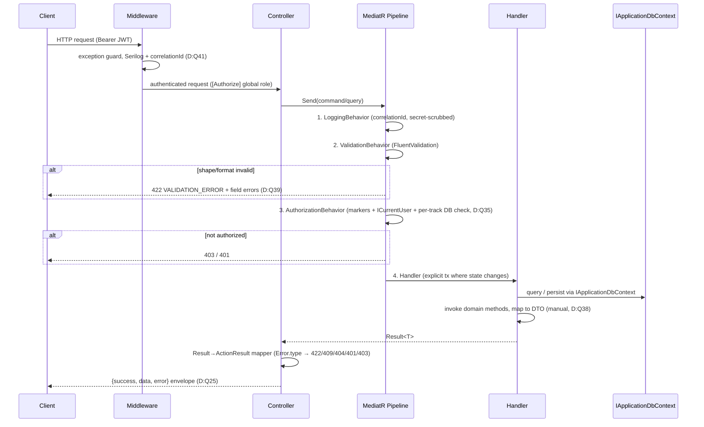
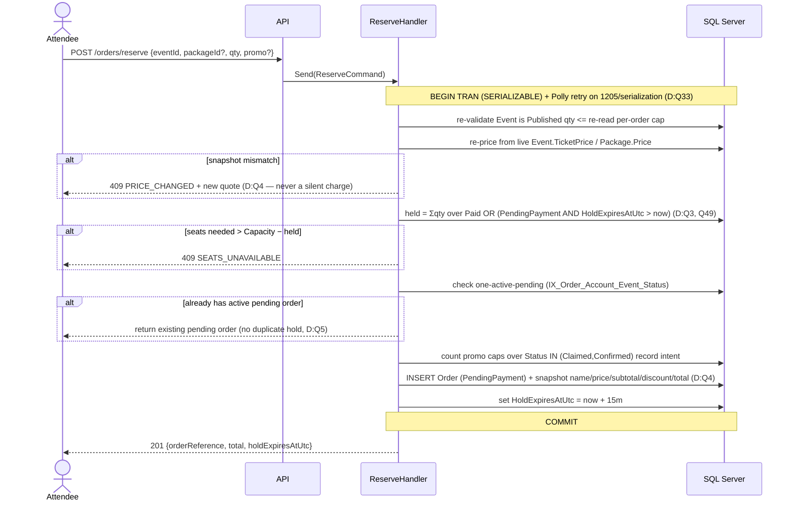
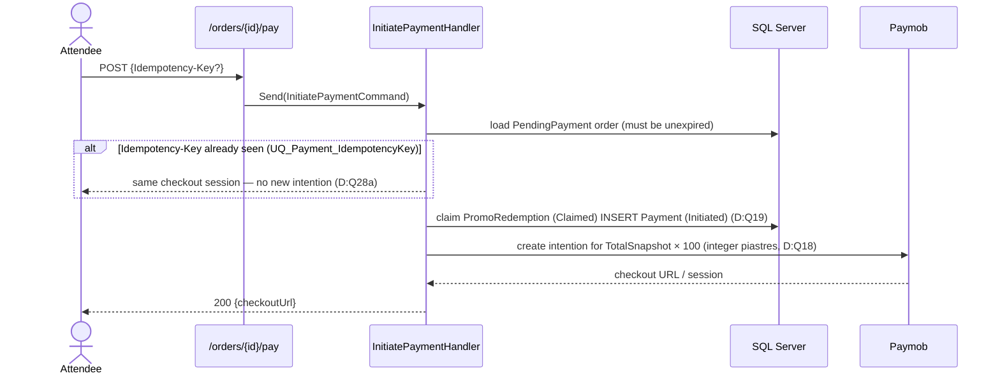
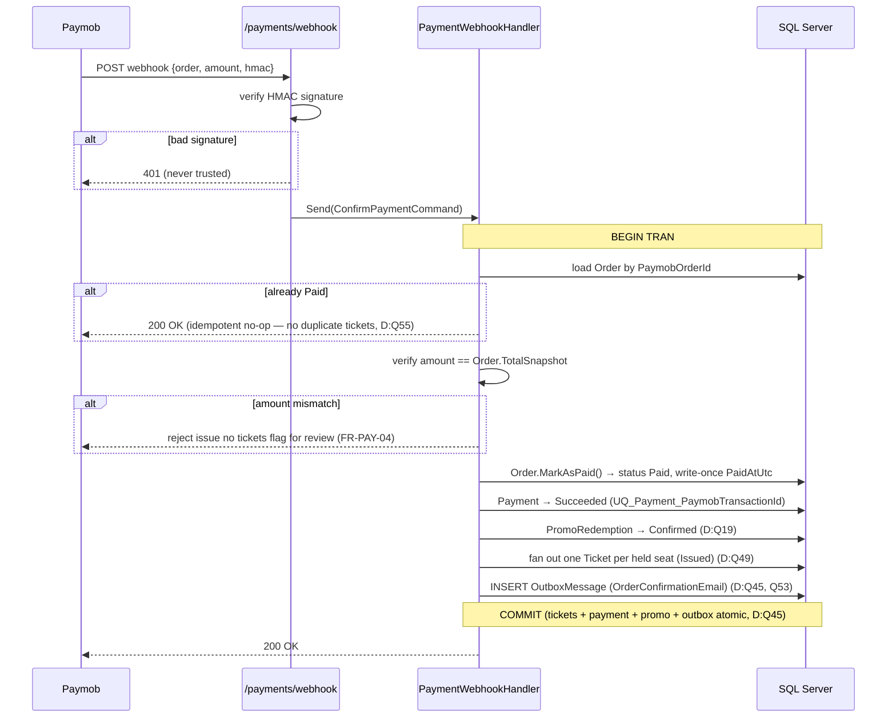
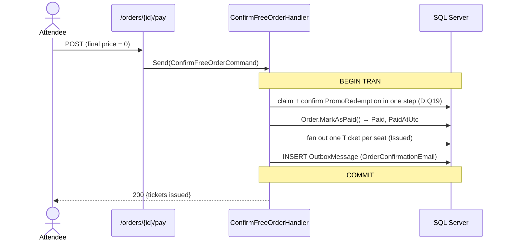
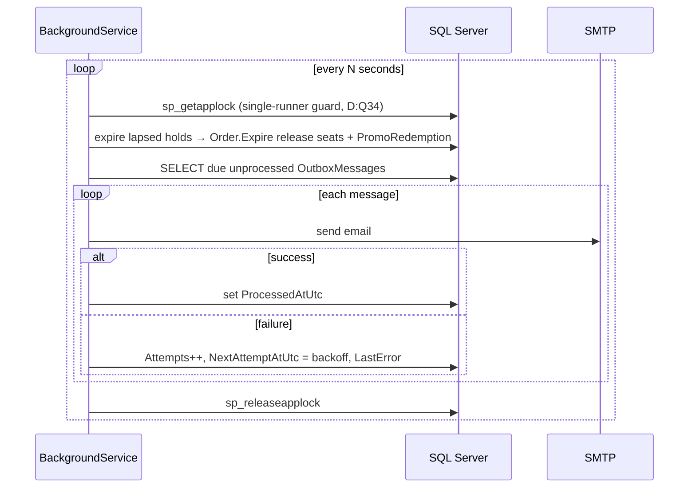
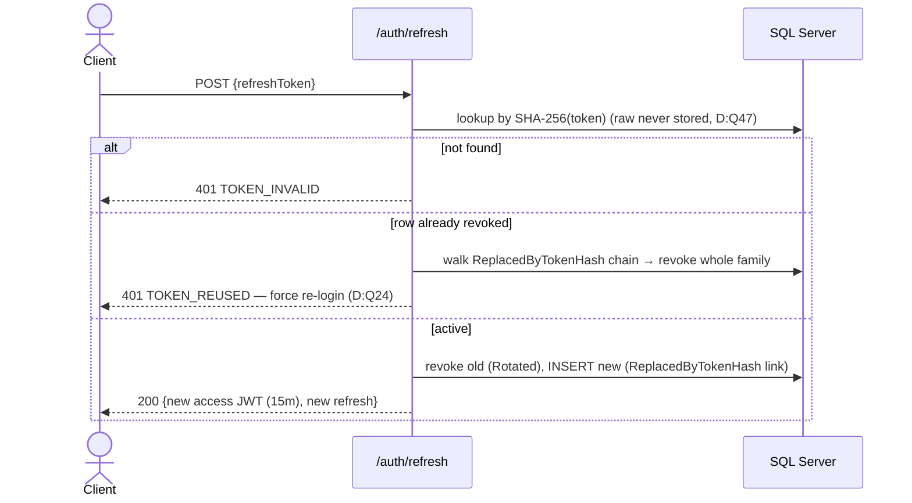
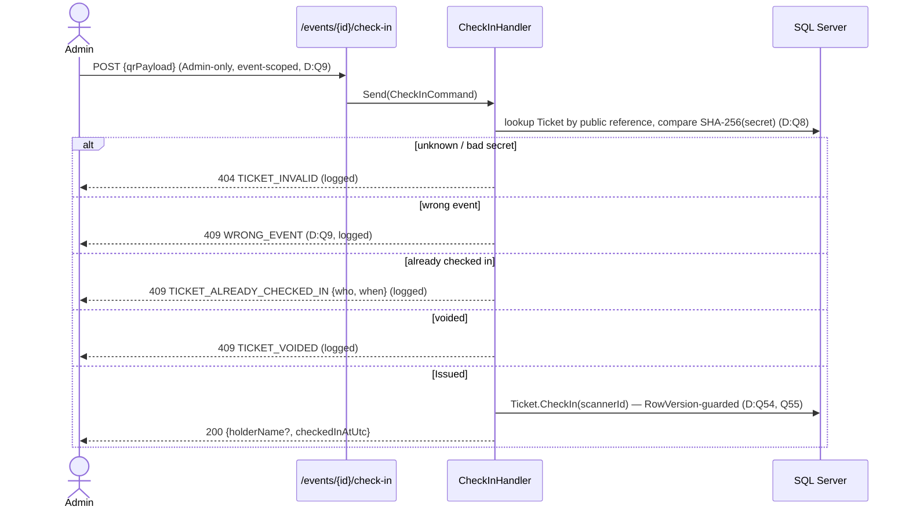
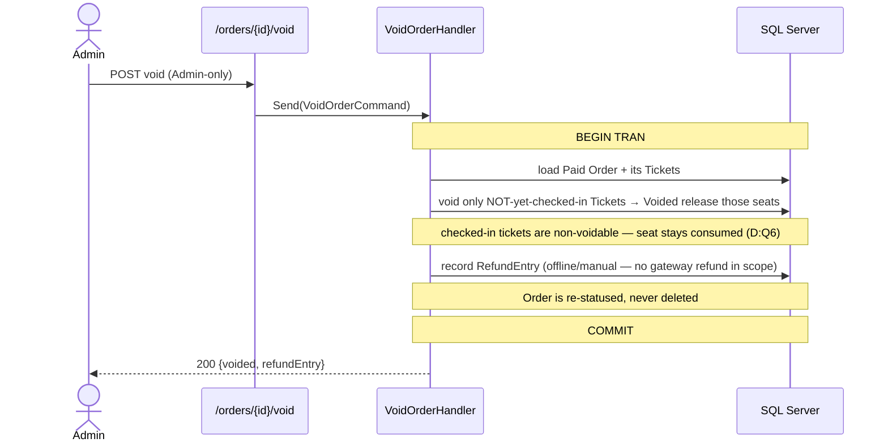
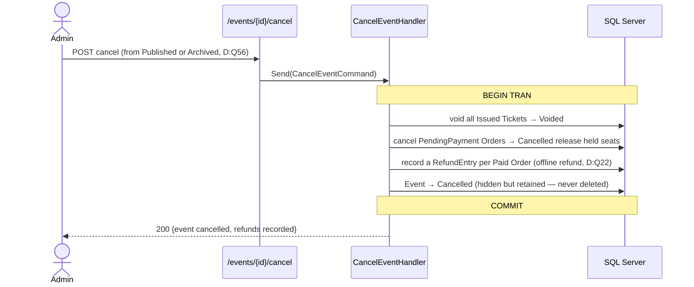

# TEDxAlkawmia Platform — Sequence Diagrams (Key Runtime Flows)

> **Version:** 2.0
> **Date:** 2026-07-23
> **Status:** Canonical — the single authority for all cross-subsystem **runtime flow** (sequence) diagrams. Other docs link here rather than re-drawing them.
> **Reads from:** [[08-DecisionLog|08 — Decision Log]] · [[10-DataModel|10 — Data Model]] · [[03-UserFlows|03 — User Flows]]
> **Companion:** [[09-SystemDesign|09 — System Design]] (implementation architecture that these flows run through) · [[11-StateMachines|11 — State Machines]] (the entity *states* these flows move between)
> **Decisions:** D:Q2, Q3, Q4, Q5, Q6, Q7, Q8, Q9, Q18, Q19, Q22, Q24, Q25, Q28a, Q30, Q33, Q34, Q35, Q39, Q41, Q45, Q47, Q49, Q50, Q53, Q54, Q55, Q56 — cited inline as **(D:Qn)**.

---

## Purpose & authority

This document owns the flows where **the ordering of steps *is* the design**: the request pipeline, reserve-and-hold, payment initiation and confirmation (the only path that issues tickets), the free-order shortcut, the outbox drain, refresh-token rotation, door check-in, and the two cancellation ripples.

- It **defers to** [[11-StateMachines]] for the *states* each entity occupies (this doc shows *transitions in time*, not the state graph) and to [[09-SystemDesign]] for the *layered structure* the steps execute in.
- It **re-decides nothing.** Every step traces to an accepted decision in [[08-DecisionLog]] (Q1–Q56) or a fact in [[10-DataModel]] / [[03-UserFlows]]. Where it adds detail, that detail is mechanical elaboration of an existing decision.
- **Conflict rule:** on a resolved design question the Decision Log wins; on schema the Data Model wins; on user-facing behavior the User Flows win. This document is corrected to match them, never the reverse.

---

## 1. Request pipeline (every authenticated call) (D:Q25, Q30, Q35, Q39, Q41)

The layered path every command/query travels: middleware → controller → the four MediatR pipeline behaviors → handler, and back out as the `{success, data, error}` envelope. The behavior *order* is load-bearing — cheap structural rejections happen before the DB-touching authorization step, and logging wraps everything.

- **Global role** is gated at the controller by `[Authorize]`; **per-track Member/Board scope** is resolved against live `TrackAssignment` rows inside `AuthorizationBehavior`, never from the JWT (D:Q35). Validation runs first because it is free in-memory; authorization hits the DB, so it runs second.
- Unexpected exceptions bypass all four steps and are caught by `ExceptionHandlingMiddleware` → **500 + correlationId**. Expected business failures are typed `Result` codes, never exceptions.

## 2. Reserve → hold — the concurrency-critical write (D:Q2, Q3, Q4, Q5, Q33, Q49, Q50)

- **Seats and promo caps are checked *inside* the SERIALIZABLE transaction** so two concurrent buyers can't both slip under the limit; Polly retries the serialization abort as a correct re-run (D:Q33). This — not the sweeper — is the anti-oversell guarantee.
- **Held seats are computed, never stored**, and the predicate is **clock-aware**: a lapsed hold stops counting the instant `HoldExpiresAtUtc` passes, so availability is correct even if the sweeper (§6) is delayed (D:Q3).

## 3. Payment initiation (paid orders) (D:Q18, Q19, Q28a)

For a non-zero final price, the reserved order is taken to the gateway. The promo slot is **atomically claimed** here, and an optional `Idempotency-Key` collapses a repeated initiation onto the **same** checkout session.

- Money crosses the gateway boundary as **integer piastres (×100)**; internally it is always `decimal(18,2)` EGP. Piastres never appear outside the Paymob boundary (D:Q18).
- Claiming the promo at initiation (not at reserve) means an abandoned checkout releases the slot via the sweeper (§6) without ever confirming it (D:Q19, Q50).

## 4. Payment confirmation — the only ticket-issuing path (D:Q45, Q49, Q53, Q55)

- **Tickets are issued only here** — a browser returning "success" is never trusted; issuance requires a signature-verified webhook whose amount matches the snapshot (D:Q49; FR-PAY-02/04).
- The **confirmation email is enqueued to the outbox inside the same transaction** and delivered *after* commit (§6), so a slow SMTP can't fail the money path (D:Q45, Q53).
- **Idempotent:** Paymob may redeliver; a second call on a Paid order is a `200` no-op (D:Q55; FR-PAY-03).

## 5. Free-order path — gateway bypass (D:Q18, Q19)

When the final price is `0` (free package, `event.TicketPrice = 0`, or a 100%-off promo) the gateway is skipped entirely.

- Same atomic issuance guarantee as §4, minus the Paymob round-trip. The promo is **claimed and confirmed in a single step** because there is no pending gateway leg that could abandon (D:Q18, Q19; FR-PAY-06).

## 6. Outbox drain + hold expiry (D:Q3, Q34, Q45, Q53)

- **At-least-once** delivery; consumers are idempotent (D:Q53). `sp_getapplock` makes concurrent sweeps mutually exclusive even if a second instance appears.
- Hold-expiry here is **cleanup only** — held seats are already clock-aware (D:Q3, §2), so a delayed sweep never oversells; it only tidies state and frees promo slots.

## 7. Refresh-token rotation + reuse detection (D:Q24, Q47)

The token *state* lifecycle (Active → Revoked{Rotated|Logout|Expired|Reuse}) is owned by [[11-StateMachines#8. RefreshToken (D:Q24, Q47)|11 — State Machines §8]]; the *sequence* below shows the refresh interaction.

- Raw tokens are **never stored** — only their SHA-256 (D:Q47). Presenting an already-rotated token trips **reuse detection**, which revokes the entire rotation family (D:Q24).

## 8. Door check-in scan (D:Q7, Q8, Q9, Q54, Q55)

- The scan is **Admin-only and event-scoped** — a ticket for another event is a distinct rejection, not a generic failure (D:Q9). Lookup is by public reference, then the presented secret is compared to the stored **SHA-256 hash** (D:Q8); the raw secret is never stored.
- **`RowVersion` guards the transition** so two simultaneous scanners can't both check the same seat in (D:Q7, Q54, Q55). All four reject outcomes are logged (`FR-TKT-06`). Full scan decision tree: [[09-SystemDesign#8.1 Scan validation algorithm|09 §8.1]].

## 9. Cancellation ripples (D:Q6, Q22, Q56)

Two distinct cancellation paths share a ripple but start from different triggers. The *entity states* are owned by [[11-StateMachines#3. Event (D:Q22, Q23, Q55, Q56)|11 §3]] (Event) and [[11-StateMachines#1. Order (D:Q3, Q6, Q55)|11 §1]] / [[11-StateMachines#2. Ticket (D:Q6, Q7, Q55)|11 §2]].

### 9.1 Paid-order void + offline refund (Admin-only, D:Q6)

- An **unpaid** order needs no ripple: the Attendee self-cancels and `Cancel()` releases held seats immediately (D:Q6; User Flows §4.1).
- A voided **Paid** order is distinguished by the presence of a `RefundEntry`, never by status alone (DataModel §2.3).

### 9.2 Event cancel ripple (D:Q22, Q56)

Triggered from **`Published → Cancelled`** or **`Archived → Cancelled`** (the latter added by **D:Q56**). `Draft → Cancelled` is **not** legal — a Draft event has no orders and is disposed of by soft-delete (D:Q22, Q56).

- The ripple is identical whether the event was `Published` or `Archived` when cancelled (D:Q56). `Cancelled` is terminal; the event is hidden but retained for audit/refund records (D:Q22; User Flows §6.3).

---

*Sequence diagrams v2.0 — 2026-07-23. Canonical owner of runtime flow diagrams. The layered request path these run through is [[09-SystemDesign]]; the entity states they move between are [[11-StateMachines]]; the schema is [[10-DataModel]]; the decisions are [[08-DecisionLog]].*

