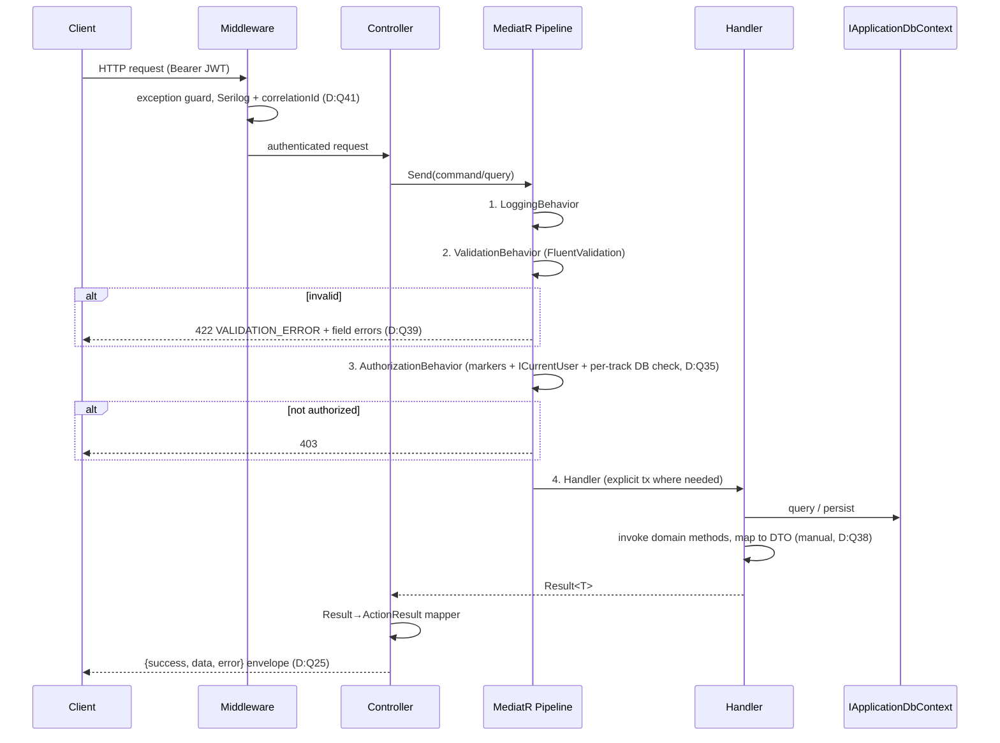

# API Architecture — Request Path & Layering

> **Version:** 1.0 · **Date:** 2026-07-22 · Part of [Architecture Overview](./Architecture.md)
> **Decisions:** D:Q29–Q41, Q44 · **Reads from:** [C4/Component.md](./C4/Component.md)

---

## Purpose

How a single HTTP request travels through the layers — middleware, controller, the MediatR pipeline, the handler, and back out as the `{success, data, error}` envelope. This is the runtime companion to [Component.md](./C4/Component.md)'s static "how the code is organized" view.

## The layers (Clean Architecture, D:Q29)

```
Api            Controllers, middleware, Result→ActionResult mapper, DI composition root
   ↓ depends on
Application    Handlers, validators, behaviors, IApplicationDbContext, ICurrentUser, Result<T>, Errors
   ↓ depends on
Domain         Aggregates, enums, invariants, transition methods — depends on nothing
   ↑ implemented by
Infrastructure AppDbContext (impl IApplicationDbContext), Identity, JWT, Paymob/Cloudinary/SMTP, Sweeper
```

Dependencies point **inward**; Infrastructure is wired to Application interfaces at the composition root (D:Q29, Q31). Each layer repeats the three context folders `Identity / Ticketing / Training` (D:Q29a).

## Request lifecycle (happy path)



## The pipeline order (D:Q30, Q35, Q39, Q41)

1. **`LoggingBehavior`** — assigns/propagates `correlationId`, structured start/finish logs; never logs secret-bearing payloads (secret-scrubbing destructuring policy, D:Q41).
2. **`ValidationBehavior`** — runs FluentValidation validators; failure **short-circuits** to a `Validation` `Result` → `422` + field errors. The handler never runs.
3. **`AuthorizationBehavior`** — reads marker interfaces (`IRequireAdmin`, `ITrackScopedRequest`), resolves the caller via `ICurrentUser`, checks **per-track scope against current DB state** (D:Q35). Global role was already gated by `[Authorize]` at the controller.
4. **Handler** — the use-case: opens an explicit transaction where needed (always for reserve/pay), invokes domain aggregate methods for invariant-bearing writes (D:Q32), reads/writes via `IApplicationDbContext` (D:Q31), maps to DTO manually (D:Q38), returns `Result<T>` (D:Q37).

## Cross-cutting rules on the path

| Concern | Where | Decision |
|---------|-------|----------|
| **Response envelope** | mapper in Api | every response is `{success, data, error}` (D:Q25) |
| **Error → HTTP status** | Result→ActionResult mapper | Validation/Business→422, Conflict→409, NotFound→404, Unauthorized→401/403 (D:Q37) |
| **Unexpected exceptions** | `ExceptionHandlingMiddleware` | → 500 + correlationId; the *only* thing that produces a 500 (D:Q39, Q41) |
| **AuthN** | `[Authorize]` + JWT bearer | access JWT 15 min; refresh via `/auth/refresh` (D:Q24) |
| **AuthZ (global role)** | `[Authorize(Roles=…)]`-style gate | Attendee/Admin at the controller |
| **AuthZ (track scope)** | `AuthorizationBehavior` | resolved per-request vs DB (D:Q35) |
| **Transactions** | handler | explicit; SERIALIZABLE for reserve/pay (D:Q33) |
| **Routing** | literal `/api/v1` prefix | no versioning machinery, prefix kept for a future need (D:Q44) |

## What the controller does *not* do

Controllers are thin (D:Q30): route, apply `[Authorize]`, `Send()` the command/query, hand the `Result<T>` to the mapper. **No business logic, no EF access, no DTO shaping** in the controller — all of that is in the Application layer. This keeps the HTTP edge swappable and the use-cases testable in isolation (when tests are eventually authored — deferred per D:Q43).

---

*API architecture v1.0 — 2026-07-22. Static component view in [C4/Component.md](./C4/Component.md); the flows in [SequenceDiagrams.md](./SequenceDiagrams.md). Back to [Architecture Overview](./Architecture.md).*
