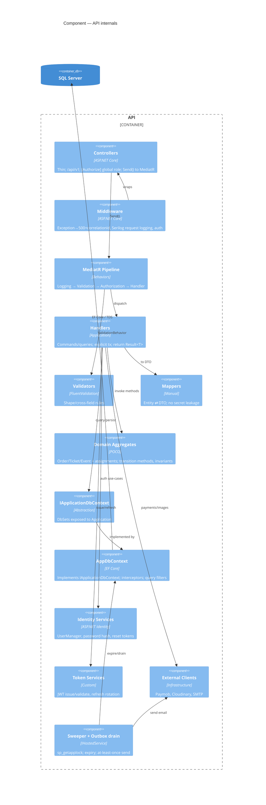

# C4 Level 3 — Component (inside the API)

> **Version:** 1.0 · **Date:** 2026-07-22 · Part of [Architecture Overview](../Architecture.md)
> **Decisions:** D:Q29–Q41, Q45 · **Reads from:** [APIArchitecture.md](../APIArchitecture.md)

---

## Purpose

Inside the API container: the four Clean-Architecture layers, the MediatR pipeline, and the three bounded contexts as folders. This is the "how the code is organized" view; the runtime request flow is in [APIArchitecture.md](../APIArchitecture.md).

## Component diagram



## The MediatR pipeline (D:Q30, Q35, Q39, Q41)

Order matters — each request passes through the behaviors in this sequence before the handler:

1. **`LoggingBehavior`** — assigns/propagates the **correlationId**, logs request start/finish structurally (D:Q41). Never logs secret-bearing payloads.
2. **`ValidationBehavior`** — runs the request's FluentValidation validators; on failure **short-circuits** to `Result` with `type = Validation` → `422 VALIDATION_ERROR` + field errors (D:Q39). The handler never runs.
3. **`AuthorizationBehavior`** — inspects marker interfaces on the request (`IRequireAdmin`, `ITrackScopedRequest`, …), resolves the caller via **`ICurrentUser`**, and checks **per-track scope against current DB state** (D:Q35). Failure → `403`. Global role was already gated by `[Authorize]` at the controller.
4. **Handler** — the use-case. Opens an **explicit transaction** where needed (always for the reserve/pay paths), invokes **domain aggregate methods** for invariant-bearing writes (D:Q32), reads/writes through **`IApplicationDbContext`** (D:Q31), maps to a DTO **manually** (D:Q38), and returns **`Result<T>`** (D:Q37).

## The three contexts as folders (D:Q29a)

Each layer repeats the same three folders. Illustrative Application-layer layout:

```
Application/
  Common/            IApplicationDbContext, ICurrentUser, IClock, Result<T>, Errors, behaviors
  Identity/          Auth (register/login/refresh/reset), account queries
  Ticketing/         Events, Packages, Orders (quote/reserve), Payments (webhook), Tickets, Promo
  Training/          Tracks, Assignments, Sessions, Attendance, Evaluations
```

Domain, Infrastructure, and Api mirror the same `Identity / Ticketing / Training` split. **No cross-context navigation** between these folders (D:Q51 revision, [Architecture §4](../Architecture.md)) — they reference each other by `AccountId` GUID only.

## Component responsibilities

| Component | Layer | Responsibility |
|-----------|-------|----------------|
| Controllers | Api | Route, apply `[Authorize]`, `Send()` the command/query, hand `Result<T>` to the mapper. No logic. |
| Middleware | Api | `ExceptionHandlingMiddleware` (unexpected → 500 + correlationId), Serilog request logging. |
| Behaviors | Application | Logging, Validation, Authorization (above). |
| Handlers | Application | Use-cases; explicit tx; return `Result<T>`. |
| Validators | Application | FluentValidation shape/cross-field rules (individual-vs-package XOR, qty caps). |
| Mappers | Application | Manual entity⇄DTO; the only place a field reaches the wire. |
| Domain aggregates | Domain | Invariants + transition methods (`MarkAsPaid`, `CheckIn`, `Publish`…). |
| `IApplicationDbContext` | Application | The `DbSet<>` surface handlers use. |
| `AppDbContext` | Infrastructure | EF Core; audit interceptor; global soft-delete filters; `RowVersion` config; cross-context FKs with `Restrict`. |
| Identity/Token services | Infrastructure | Password hashing, reset tokens, JWT issue/validate, refresh rotation. |
| External clients | Infrastructure | Paymob (piastres, HMAC verify), Cloudinary, SMTP. |
| Sweeper + outbox drain | Infrastructure | `sp_getapplock` single-instance; hold expiry, promo release, at-least-once outbox send. |

---

*C4 Level 3. Next: [Deployment.md](./Deployment.md).*
