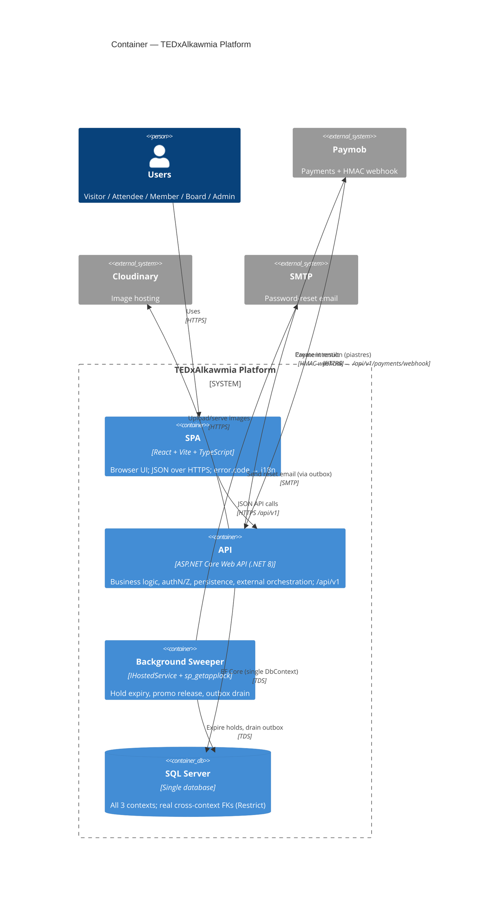

# C4 Level 2 — Container

> **Version:** 1.0 · **Date:** 2026-07-22 · Part of [Architecture Overview](../Architecture.md)
> **Decisions:** D:Q29, Q29b, Q34, Q36, Q40, Q41 · **Reads from:** [02 — SRS](../../02-SRS.md)

---

## Purpose

The deployable pieces and how they talk. Still no code-level internals (those are in [Component.md](./Component.md)) — this is the "boxes you can point at in production" view.

## Containers

| Container | Tech | Responsibility |
|-----------|------|----------------|
| **SPA** | React + Vite + TypeScript, static hosting | The entire user interface (public + authenticated). Talks only to the API over HTTPS/JSON. Maps `error.code` → i18n (D:Q25). Holds the access JWT in memory, refresh token per D:Q24. |
| **API** | ASP.NET Core Web API (.NET 8), single process | All business logic, authN/authZ, persistence, external-service orchestration. Hosts the **in-process background sweeper** (D:Q34). Exposes `/api/v1/**`. |
| **Database** | SQL Server, single instance | The single `DbContext`'s store (D:Q29b). All three contexts' tables live here; cross-context FKs are real (D:Q51 revision). |
| *(within API)* **Background sweeper** | `BackgroundService` + `sp_getapplock` | Expires lapsed holds, releases promo redemptions, drains the outbox (D:Q34, Q45, Q53). Not a separate deployable — a hosted service inside the API process. |

## Container diagram

> **Note on email + the outbox:** password-reset and any notification email is enqueued to the **outbox** inside the business transaction and sent by the sweeper *after commit* (D:Q45). The API process never blocks a request on SMTP.

## Connection facts

- **SPA ↔ API:** stateless JSON over HTTPS. Every response is the `{success, data, error}` envelope (D:Q25). Auth is a Bearer access JWT (15 min); refresh via the refresh-token endpoint (D:Q24).
- **API ↔ DB:** a single `DbContext` (D:Q29b) over one SQL Server. The reserve path runs at `SERIALIZABLE` with Polly retry (D:Q33); everything else at the default isolation.
- **Paymob webhook:** a dedicated endpoint verifies the **HMAC signature** before doing anything; this is the only path that issues tickets (D:Q49). Idempotent on repeat delivery (D:Q55).
- **Single-instance assumption:** the sweeper guards itself with `sp_getapplock` so it's safe even if two API instances run, but the current deployment target is **single-instance** (see [Deployment.md](./Deployment.md)).

## Configuration & secrets (D:Q40)

- Non-secret config in `appsettings.json` (hold minutes, page sizes, token lifetimes, Paymob base URL).
- Secrets (DB connection string, JWT signing key, Paymob HMAC + API key, Cloudinary secret, SMTP password) come from **User Secrets** locally and **environment variables** in production — never committed. Startup **fails fast** if any required secret is missing.

---

*C4 Level 2. Next: [Component.md](./Component.md).*
