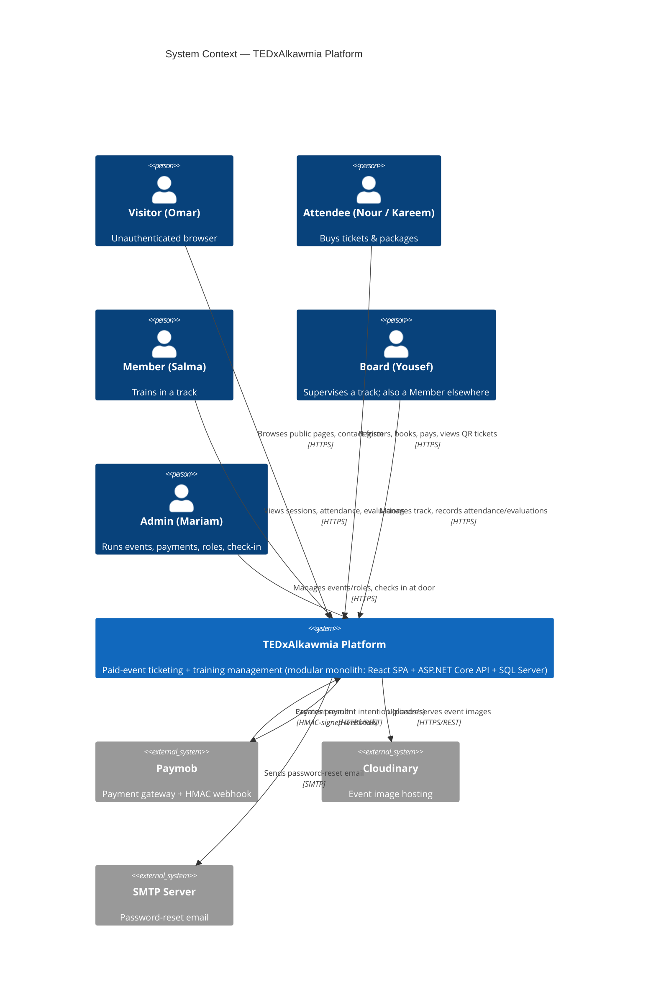

# C4 Level 1 — System Context

> **Version:** 1.0 · **Date:** 2026-07-22 · Part of [Architecture Overview](../Architecture.md)
> **Decisions:** D:Q29, Q36, Q45 · **Reads from:** [01 — PRD](../../01-PRD.md), [04 — Personas](../../04-Personas.md)

---

## Purpose

The widest view: the TEDxAlkawmia platform as a single box, the **people** who use it, and the **external systems** it depends on. No internals here — those are in [Container.md](./Container.md).

## Actors (from [04 — Personas](../../04-Personas.md))

| Actor | Role | Uses the platform to |
|-------|------|----------------------|
| **Omar — Visitor** | unauthenticated | Browse public pages, view events, submit the contact form |
| **Nour — Attendee** | Attendee | Register, buy an individual ticket, pay, hold a QR ticket |
| **Kareem — Group Buyer** | Attendee | Buy a multi-seat package, one QR per seat |
| **Salma — Member** | Attendee + Member@X | See her track's sessions, attendance %, private evaluations |
| **Yousef — Board (dual-role)** | Board@Y + Member@X | Supervise one track (sessions/attendance/evaluations), train in another |
| **Mariam — Admin** | Admin | Run events/packages/promos, view orders/payments, assign roles, check tickets in at the door |

## External systems

| System | Direction | Purpose | Notes |
|--------|-----------|---------|-------|
| **Paymob** | out (API) + in (webhook) | Card / wallet payment; the **HMAC-signed webhook** is the sole trigger for issuing tickets | Amounts sent in **integer piastres** at the boundary (D:Q18); webhook signature verified; idempotent (D:Q49, Q55) |
| **Cloudinary** | out (API) | Event image hosting | Public image URLs stored on `Event` |
| **SMTP server** | out | **Password-reset email only** (D:Q28c scope) | No marketing/other transactional mail in scope |

## Context diagram

## Key context-level facts

- **One platform, one deployable** (modular monolith, D:Q29) — the SPA and API are separate containers (§Container) but a single logical system.
- **Payment authority is external and asymmetric:** the platform *requests* a payment but only *issues tickets* when Paymob calls back with a **verified** signature. A user's browser returning "success" is never trusted (SequenceDiagrams §2).
- **No other external consumers** — no third-party API clients, no mobile app in scope. This is why no API versioning machinery exists (D:Q44).

---

*C4 Level 1. Next: [Container.md](./Container.md).*
