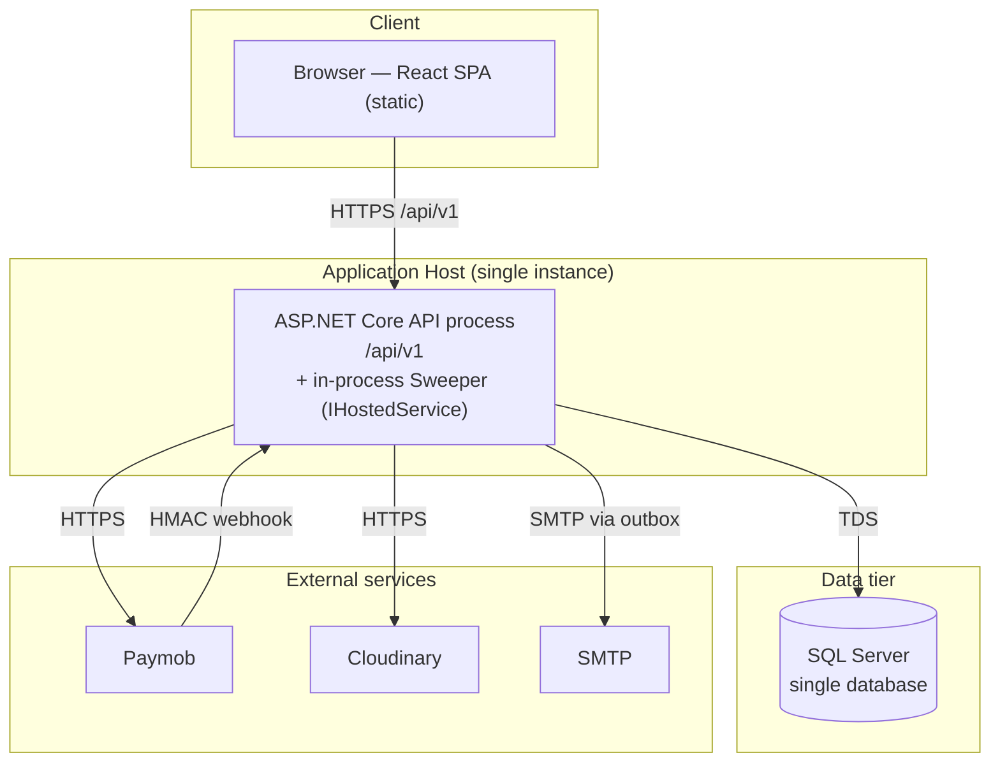

# C4 Level 4 — Deployment

> **Version:** 1.0 · **Date:** 2026-07-22 · Part of [Architecture Overview](../Architecture.md)
> **Decisions:** D:Q29b, Q34, Q40, Q42 · **Reads from:** [Container.md](./Container.md)

---

## Purpose

The runtime topology: what runs where, the single-instance assumption and how the design tolerates it, and how config/secrets and migrations land in production.

## Topology (current target — single instance)

## Runtime facts

| Aspect | Decision | Detail |
|--------|----------|--------|
| **API instances** | single (current) | One process hosts both the web API and the sweeper. |
| **Sweeper safety** | D:Q34 | Guarded by **`sp_getapplock`**, so even if a second instance is ever added, only one sweep runs at a time. **Correctness never depends on the sweeper** (held-seats are clock-aware, D:Q3) — it is cleanup only. |
| **DB** | D:Q29b | One SQL Server, one `DbContext`. |
| **Reserve isolation** | D:Q33 | `SERIALIZABLE` + Polly retry on 1205 / serialization failure — the anti-oversell guarantee holds on a single DB. |
| **Static SPA** | scope | Served as static assets (CDN/static host); no server-side rendering. |

## Why single-instance is safe here

The two things that usually force careful multi-instance design are handled independently of instance count:

1. **Oversell** — prevented by the `SERIALIZABLE` reserve transaction at the DB, not by app-level coordination. Adding instances doesn't weaken it.
2. **Duplicate background work** — the sweeper's `sp_getapplock` makes concurrent sweeps mutually exclusive; the outbox drain is **at-least-once** and its consumers are idempotent (D:Q53).

Scaling out later is therefore a deployment change, not a redesign. Until then, single-instance keeps operations simple for a two-dev team.

## Configuration & secrets in production (D:Q40)

- **Non-secret** settings: `appsettings.json` + `appsettings.Production.json` (hold minutes, page sizes, token lifetimes, Paymob base URL, Cloudinary cloud name).
- **Secrets** (env vars only, never committed): `ConnectionStrings__Default`, `Jwt__SigningKey`, `Paymob__ApiKey`, `Paymob__HmacSecret`, `Cloudinary__ApiSecret`, `Smtp__Password`, plus the **one-time first-Admin bootstrap** `Seed__AdminEmail` / `Seed__AdminPassword` (D:Q42).
- **Fail-fast:** every options class is validated at startup (`ValidateOnStart`); a missing required secret **stops the boot** with a clear message — never a null surfacing at the first Paymob call.
- **Future:** a cloud secret manager (Key Vault / Secrets Manager) drops in as an `IConfiguration` provider with **zero consumer changes** — deferred, not designed out.

Document the exact variable names in `appsettings.example` / the deployment README so the operator sets them deliberately.

## Database migrations & seeding (D:Q42)

- **Code-first EF migrations**, applied as an **explicit, auditable deploy step** — a generated **migration bundle** run against the target DB. **No `Database.Migrate()` on app boot** in production (avoids multi-instance migration races and boot-time schema surprises).
- **Idempotent seeder** runs on demand: inserts fixed reference data and **bootstraps the first Admin create-if-none** (email from config, password from the one-time env secret, Identity-hashed, never committed).
- **Local dev** may apply migrations by hand or via a guarded `if (env.IsDevelopment())` call — the rule is only *production doesn't auto-migrate on boot*.

## Deferred operational choices

- Multi-instance / horizontal scale (design already tolerates it; not deployed).
- Hangfire / external scheduler (in-process sweeper suffices, D:Q34).
- Cloud secret manager (env vars now, D:Q40).
- Container orchestration specifics — out of scope for this doc; the API is a standard .NET process and containerizes conventionally.

---

*C4 Level 4. Back to [Architecture Overview](../Architecture.md) · data model in [Database.md](../Database.md).*
