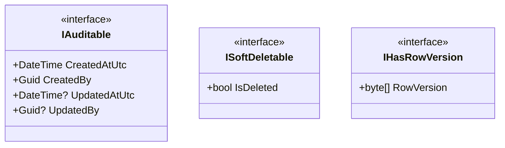
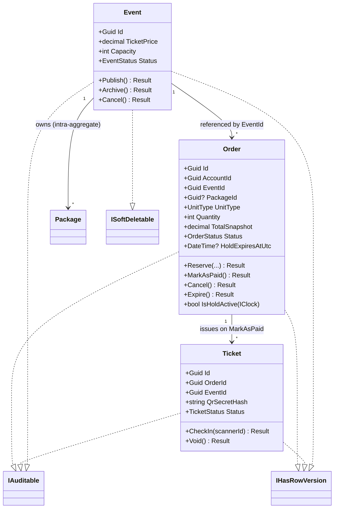
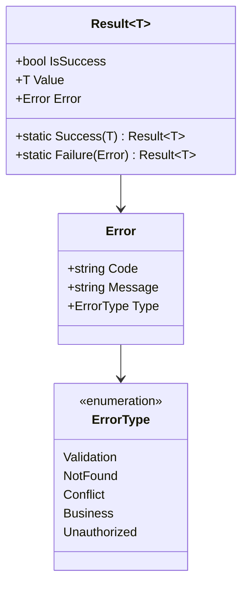

# Class Diagrams — Domain Aggregates

> **Version:** 1.0 · **Date:** 2026-07-22 · Part of [Architecture Overview](./Architecture.md)
> **Decisions:** D:Q31, Q32, Q37, Q54, Q55 · **Reads from:** [Database.md](./Database.md), [StateMachines.md](./StateMachines.md)

---

## Purpose

The code-shape of the domain: which entities are **rich** (own invariants + transition methods) versus **CRUD-simple** (plain data), the shared marker interfaces, and the `Result<T>` type every handler returns. This is proportional richness (D:Q32) — behavior only where invariants actually live.

## Marker interfaces (D:Q54)

- `IAuditable` — stamped by the `SaveChanges` **audit interceptor** from `ICurrentUser` + `IClock` (D:Q54). Handlers never set audit columns.
- `ISoftDeletable` — a **global query filter** hides `IsDeleted` rows; **catalog tables only**.
- `IHasRowVersion` — optimistic concurrency where concurrent writers exist.

## Rich aggregates (behavior-bearing)

- **`Order`** is the transactional heart: `Reserve` / `MarkAsPaid` / `Cancel` / `Expire` (D:Q55), `IsHoldActive` makes hold-expiry **clock-aware** so correctness doesn't depend on the sweeper (D:Q3).
- **`Ticket`** — `CheckIn` / `Void`, `RowVersion`-guarded idempotent scan.
- **`Event`** — `Publish` / `Archive` / `Cancel`; publish has **no package precondition** (Model B).
- **`TrackAssignment`** (not drawn) holds the dual-role invariant enforcement in-method alongside its two filtered unique indexes (D:Q51).

## CRUD-simple entities (data, minimal behavior)

`Package`, `PromoCode`, `PromoRedemption`, `Track`, `Session`, `Attendance`, `Evaluation`, `RefreshToken`, `OutboxMessage`, `ApplicationUser`. These are largely plain data shaped by validators + handlers; they carry marker interfaces per [Database.md §0](./Database.md) but expose no rich transition methods. Adding aggregate behavior here would be abstraction without an invariant to protect (D:Q32).

## The `Result<T>` contract (D:Q37)

- Every handler returns `Result<T>` (D:Q37). One **Result→ActionResult mapper** turns `Error.Type` into the HTTP status: `Validation`/`Business` → **422**, `Conflict` → **409**, `NotFound` → **404**, `Unauthorized` → **401/403**. Unexpected exceptions → **500** via `ExceptionHandlingMiddleware` (D:Q39, Q41).
- `Error.Code` is the flat string the SPA maps to i18n (D:Q25) — e.g. `SEATS_UNAVAILABLE`, `PROMO_EXPIRED`, `TOKEN_REUSED`.
- A central **`Errors` catalog** holds the code/message/type constants so codes never drift between handlers.

---

*Class diagrams v1.0 — 2026-07-22. Lifecycles in [StateMachines.md](./StateMachines.md); the request path that invokes these in [APIArchitecture.md](./APIArchitecture.md).*
