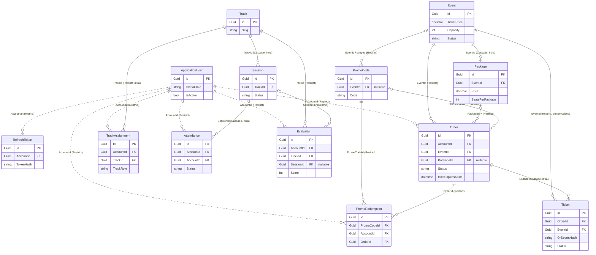

# ERD — Entity Relationships

> **Version:** 1.0 · **Date:** 2026-07-22 · Part of [Architecture Overview](./Architecture.md)
> **Decisions:** D:Q46–Q55 + the FK revision · **Companion:** [Database.md](./Database.md) (columns + indexes)

---

## Purpose

The relationship view of the schema: which tables reference which, the delete behavior on each edge, and the one rule that shapes the whole diagram — **cross-context edges are real FKs but carry no navigation property in code** (D:Q51 revision).

## Reading the diagram

- **Solid intra-context edges** — normal EF relationships *with* navigation properties (e.g. `Event ↔ Package`, `Track ↔ Session`).
- **Dashed cross-context edges** — real DB FKs to `ApplicationUser.Id` with `DeleteBehavior.Restrict`, **but no C# navigation property**; the owning entity holds only an `AccountId` GUID (D:Q51 revision, [Architecture §4](./Architecture.md)).

*(`OutboxMessage` has no FKs — it's a standalone cross-cutting table; omitted from the diagram.)*

## Delete-behavior rules

| Edge kind | Behavior | Why |
|-----------|----------|-----|
| **Cross-context → ApplicationUser** | `Restrict` | Never cascade-delete a user's orders/records; accounts are soft-deleted anyway (D:Q54). Restrict makes an accidental hard-delete fail loudly. |
| **Intra-aggregate** (`Event→Package`, `Order→Ticket`, `Track→Session`, `Session→Attendance`) | `Cascade` OK | Child has no meaning without its parent, same context, same aggregate. |
| **Intra-context reference** (`Event→Order`, `Track→Assignment`, `PromoCode→…`) | `Restrict` | These are catalog rows referenced by transactional history; deleting them out from under a paid order must fail. Catalog rows use soft-delete instead. |

## The cross-context rule, restated

Every dashed edge above is enforced by a real `FOREIGN KEY` constraint in SQL Server — referential integrity is **on**. What's absent is the C# side: `Order` has an `AccountId` property, **not** an `ApplicationUser Account { get; set; }` navigation. A handler that needs buyer details queries the Identity context by `AccountId`; it cannot lazy-walk from `Order` into `ApplicationUser`. This keeps the contexts decoupled in code (D:Q51 revision) without giving up the database's integrity guarantees — the proportional resolution recorded in [Architecture §4](./Architecture.md).

---

*ERD v1.0 — 2026-07-22. Columns + indexes in [Database.md](./Database.md).*
