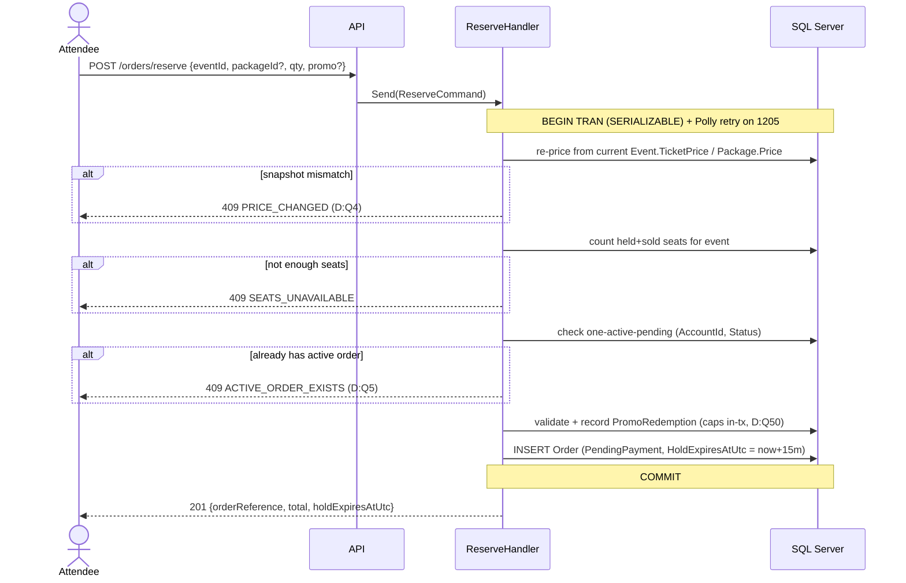
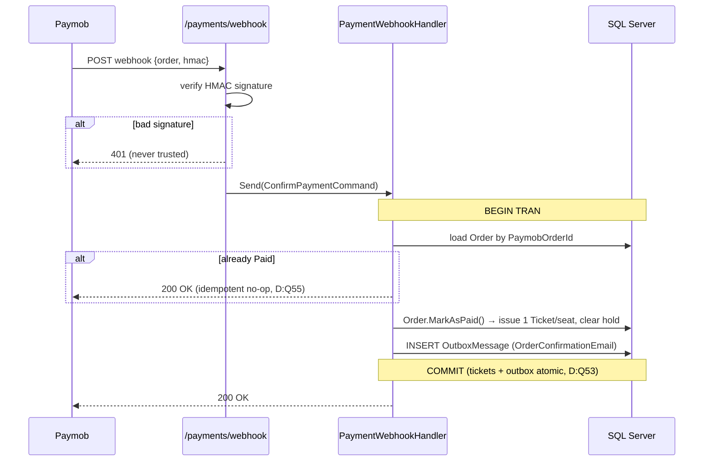
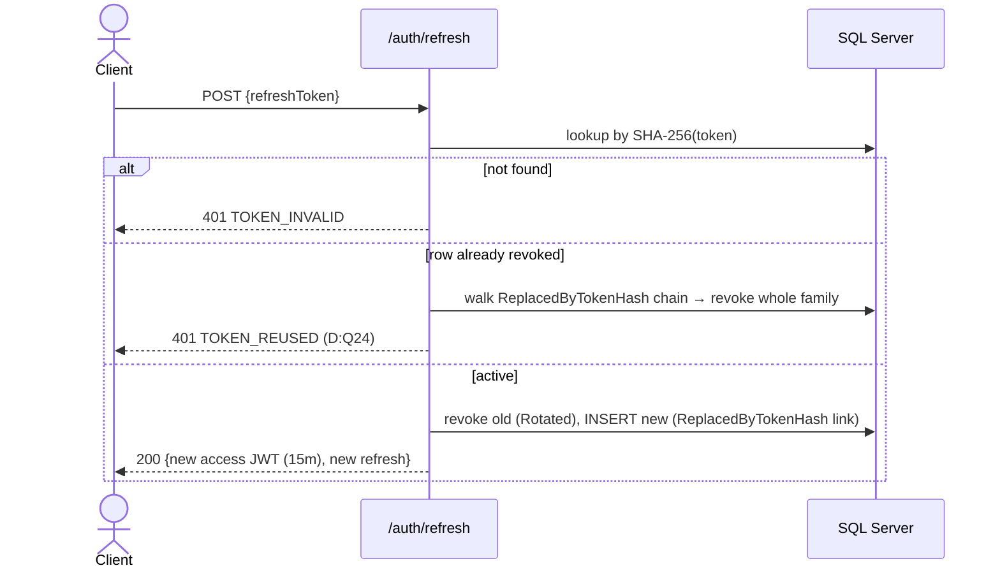
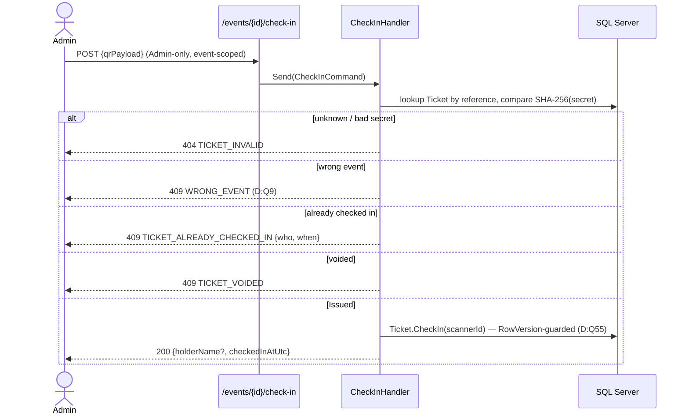

# Sequence Diagrams — Key Flows

> **Version:** 1.0 · **Date:** 2026-07-22 · Part of [Architecture Overview](./Architecture.md)
> **Decisions:** D:Q3, Q4, Q24, Q33, Q34, Q45, Q49, Q53, Q55 · **Reads from:** [APIArchitecture.md](./APIArchitecture.md)

---

## Purpose

The runtime behavior of the flows where the ordering of steps *is* the design: reserve-and-hold, payment confirmation (the only path that issues tickets), the outbox drain, and refresh-token rotation. Each is driven by the locked decisions cited above.

## 1. Reserve → hold (D:Q3, Q4, Q33)



- **Seats and promo caps are checked *inside* the SERIALIZABLE transaction** so two concurrent buyers can't both slip under the limit; Polly retries on deadlock/serialization failure (D:Q33). This — not the sweeper — is the anti-oversell guarantee.

## 2. Payment confirmation — the only ticket-issuing path (D:Q49, Q53, Q55)



- **Tickets are issued only here** — a browser returning "success" is never trusted ([Context.md](./C4/Context.md)).
- The **confirmation email is enqueued to the outbox inside the same transaction** (D:Q45/Q53); it is *not* sent synchronously, so a slow SMTP can't fail the webhook.
- **Idempotent:** Paymob may redeliver; a second call on a Paid order is a `200` no-op (D:Q49, Q55).

## 3. Outbox drain (D:Q34, Q45, Q53)

```mermaid
sequenceDiagram
    participant Sweeper as BackgroundService
    participant DB as SQL Server
    participant SMTP

    loop every N seconds
        Sweeper->>DB: sp_getapplock (single-runner guard, D:Q34)
        Sweeper->>DB: expire lapsed holds; release promo redemptions
        Sweeper->>DB: SELECT due unprocessed OutboxMessages
        loop each message
            Sweeper->>SMTP: send email
            alt success
                Sweeper->>DB: set ProcessedAtUtc
            else failure
                Sweeper->>DB: Attempts++, NextAttemptAtUtc = backoff, LastError
            end
        end
        Sweeper->>DB: sp_releaseapplock
    end
```

- **At-least-once** delivery; consumers are idempotent (D:Q53). The lock makes concurrent sweeps mutually exclusive even if a second instance appears ([Deployment.md](./C4/Deployment.md)).
- Hold-expiry here is **cleanup only** — held seats are already clock-aware (D:Q3), so an unfired sweep never oversells.

## 4. Refresh-token rotation + reuse detection (D:Q24, Q47)



- Raw tokens are **never stored** — only their SHA-256 (D:Q47). Presenting an already-rotated token trips **reuse detection**, which revokes the entire rotation family.

## 5. Door check-in scan (D:Q7, Q9, Q55)



- The scan is **Admin-only and event-scoped** — a ticket for another event is a distinct rejection, not a generic failure (D:Q9). Lookup is by public reference, then the presented secret is compared to the stored **SHA-256 hash** (D:Q8); the raw secret is never stored.
- **`RowVersion` guards the transition** so two simultaneous scanners can't both check the same seat in (D:Q7, Q55). All four reject outcomes are logged (`FR-TKT-06`).

---

*Sequence diagrams v1.0 — 2026-07-22. The layered request path these run through is in [APIArchitecture.md](./APIArchitecture.md); the states they move entities between are in [StateMachines.md](./StateMachines.md).*
