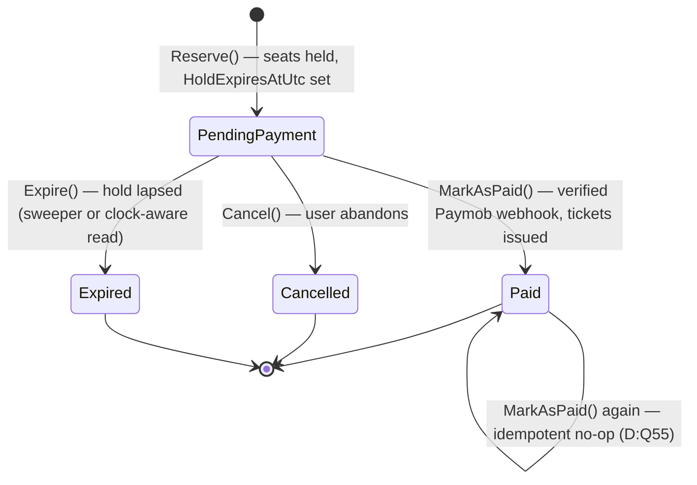
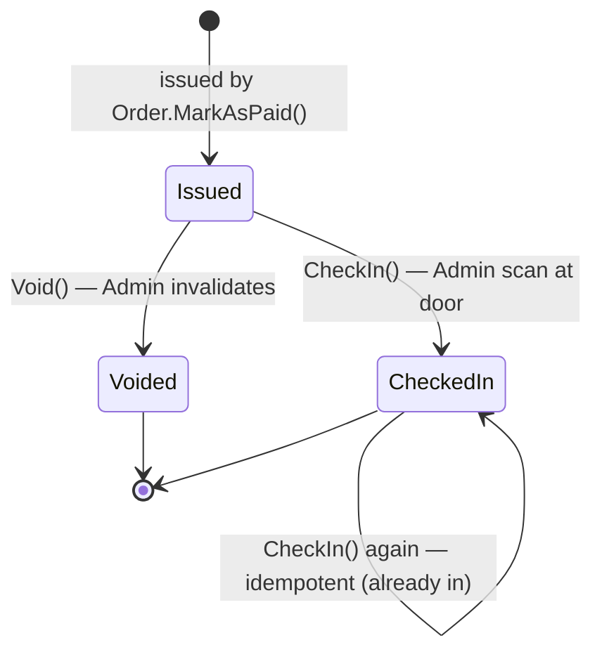
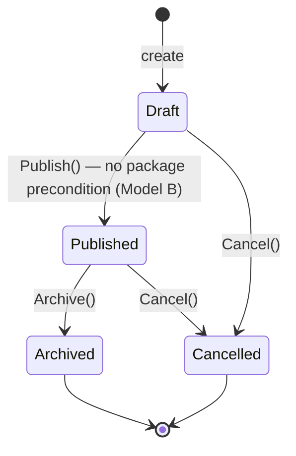

# State Machines — Entity Lifecycles

> **Version:** 1.0 · **Date:** 2026-07-22 · Part of [Architecture Overview](./Architecture.md)
> **Decisions:** D:Q3, Q7, Q23, Q55 · **Reads from:** [Database.md](./Database.md), [08 — Decision Log](../08-DecisionLog.md)

---

## Purpose

The legal state transitions for the three lifecycle-bearing entities — `Order`, `Ticket`, `Event` — and the rule that every transition is an **explicit named method on the aggregate** (D:Q55), never a raw `entity.Status = X` assignment. Illegal transitions are rejected in the method, not caught later.

## 1. Order (D:Q3, Q55)

| Method | From → To | Guard / effect |
|--------|-----------|----------------|
| `Reserve` | (new) → PendingPayment | SERIALIZABLE seat check; sets `HoldExpiresAtUtc = now + 15m`; records promo redemption (D:Q3, Q33, Q50). |
| `MarkAsPaid` | PendingPayment → Paid | Only from a **verified HMAC webhook** (D:Q49); issues one `Ticket` per seat; clears hold. **Idempotent:** a second call on an already-Paid order is a **no-op success** (D:Q55) — Paymob may redeliver. |
| `Cancel` | PendingPayment → Cancelled | User-initiated; releases held seats + promo redemption. |
| `Expire` | PendingPayment → Expired | Hold lapsed. **Held-seats are clock-aware** (D:Q3) so correctness never depends on the sweeper firing — the sweeper just tidies the row. |

- **Terminal states** (Paid/Cancelled/Expired) reject every transition except the idempotent `MarkAsPaid`-on-Paid.
- Append-only: cancellation is a **status**, not a delete (no `IsDeleted` on Order, D:Q54).

## 2. Ticket (D:Q7, Q55)

| Method | From → To | Guard / effect |
|--------|-----------|----------------|
| `CheckIn` | Issued → CheckedIn | Admin-only door scan; sets `CheckedInAtUtc`, `CheckedInBy`. **`RowVersion` guards concurrent scans** so a double-scan can't double-count. A second scan of an already-checked-in ticket returns `TICKET_ALREADY_CHECKED_IN` (D:Q7). |
| `Void` | Issued → Voided | Admin invalidates a ticket (e.g. refund/fraud). A scan of a voided ticket → `TICKET_VOIDED`. |

- Tickets are **only** created by `Order.MarkAsPaid` — never independently (D:Q49).

## 3. Event (D:Q23, Q55)

| Method | From → To | Guard / effect |
|--------|-----------|----------------|
| `Publish` | Draft → Published | Requires a valid `TicketPrice (≥ 0)` and capacity. **No "must have a package" precondition** — an event with zero packages sells individual tickets and is publishable (Model B, D:Q1/Q48). |
| `Archive` | Published → Archived | Hides from public listings; existing tickets stay valid. |
| `Cancel` | Draft/Published → Cancelled | Stops new sales. |

## The transition-method convention (D:Q55)

Every table above stores `Status` as an `int` enum, but **no handler writes `Status` directly**. The handler loads the aggregate, calls the named method, and the method:

1. Validates the current state allows the transition (else returns a `Business`/`Conflict` `Error`).
2. Applies the state change **plus its side effects atomically** (issue tickets, release seats, stamp timestamps).
3. Leaves an append-only trail — terminal states are never deleted, only recorded.

This is the "rich domain only where invariants live" rule from [Architecture §3](./Architecture.md): `Order`, `Ticket`, `Event`, and the track assignments get behavior; catalog tables stay CRUD-simple.

---

*State machines v1.0 — 2026-07-22. Aggregate structure in [ClassDiagrams.md](./ClassDiagrams.md); the flows that drive these transitions in [SequenceDiagrams.md](./SequenceDiagrams.md).*
